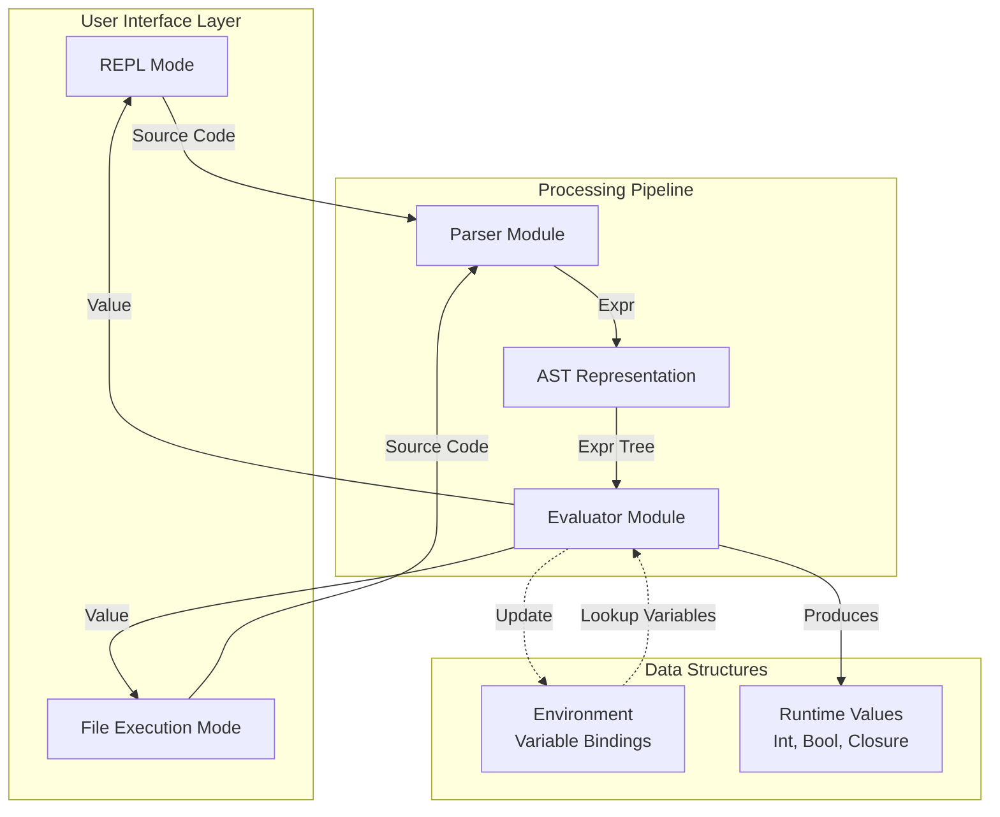
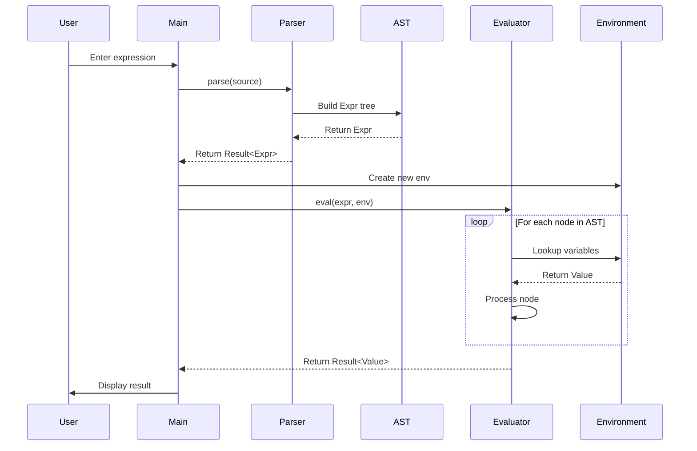
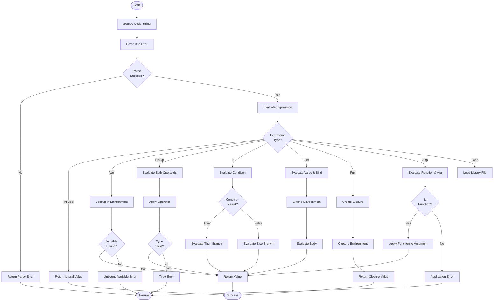
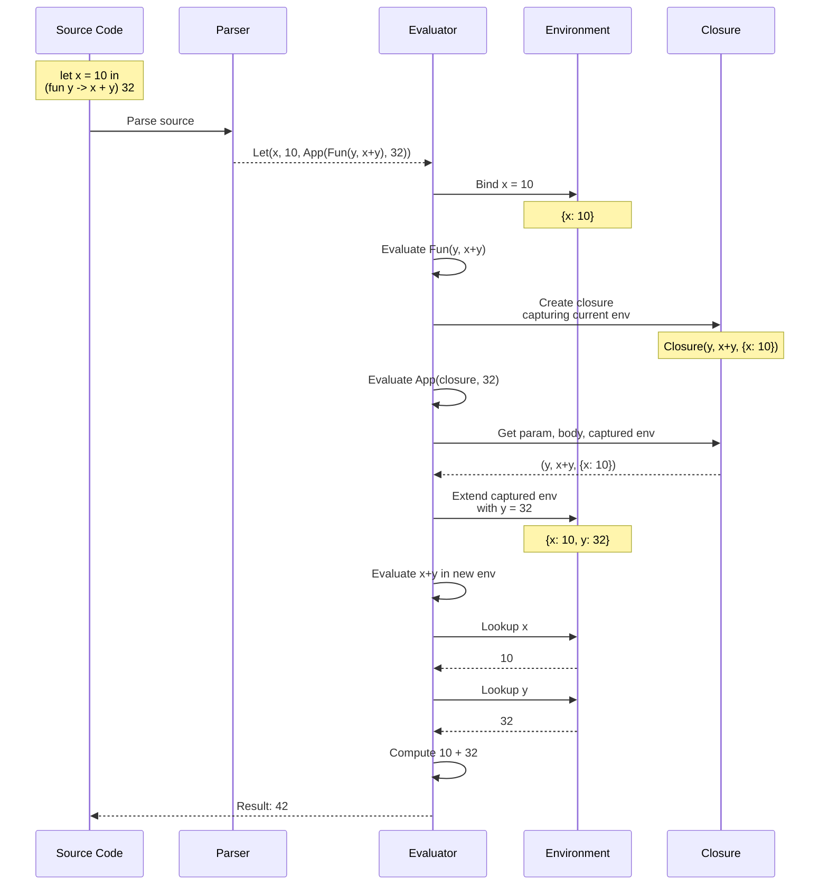
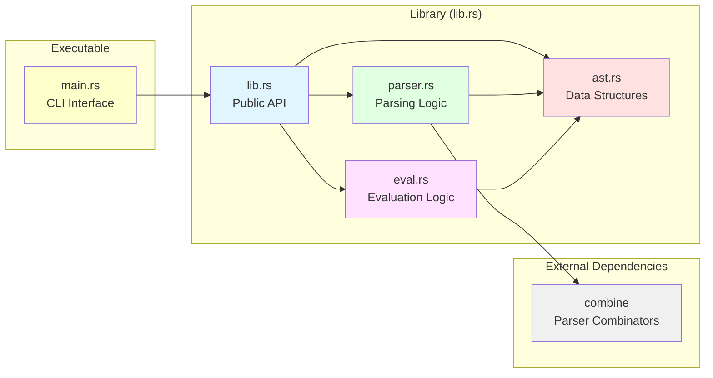
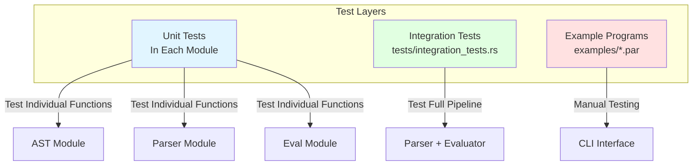

# ParLang Architecture

This document describes the architecture of the ParLang interpreter, a small ML-alike functional language implemented in Rust.

## Table of Contents

1. [Overview](#overview)
2. [System Architecture](#system-architecture)
3. [Component Interaction](#component-interaction)
4. [Data Flow](#data-flow)
5. [Module Structure](#module-structure)

## Overview

ParLang is a functional programming language interpreter that follows a traditional compiler pipeline architecture:

```
Source Code → Parser → AST → Evaluator → Result
```

The interpreter consists of four main components:

1. **AST Module** (`src/ast.rs`): Defines the Abstract Syntax Tree structure
2. **Parser Module** (`src/parser.rs`): Transforms source code into AST
3. **Evaluator Module** (`src/eval.rs`): Interprets and executes AST nodes
4. **Main Module** (`src/main.rs`): Provides CLI interface (REPL and file execution)

## System Architecture



### Component Descriptions

#### AST Module
- **Purpose**: Define the structure of programs in ParLang
- **Key Types**: `Expr` (expression variants), `BinOp` (binary operators)
- **Responsibilities**: 
  - Represent program structure
  - Provide Display trait for pretty-printing
  - Support pattern matching for evaluation

#### Parser Module
- **Purpose**: Transform textual source code into AST
- **Technology**: Uses the `combine` parser combinator library
- **Responsibilities**:
  - Tokenize input
  - Build AST from tokens
  - Handle operator precedence
  - Report syntax errors
  - Support all language constructs

#### Evaluator Module
- **Purpose**: Execute AST nodes and produce results
- **Key Types**: `Value` (runtime values), `Environment` (variable bindings), `EvalError`
- **Responsibilities**:
  - Interpret expressions
  - Manage variable scope
  - Handle closures
  - Perform type checking at runtime
  - Execute binary operations
  - Load and integrate external library files

#### Main Module
- **Purpose**: Provide user interface for the interpreter
- **Modes**: REPL (interactive), File execution
- **Responsibilities**:
  - Parse command-line arguments
  - Read source files
  - Drive the parse-eval pipeline
  - Display results and errors

## Component Interaction

The following sequence diagram shows how components interact when evaluating an expression:



## Data Flow

### Expression Evaluation Flow



### Closure Evaluation

Closures are a key feature of ParLang. The following diagram shows how closures capture and use their environment:



## Module Structure

### Module Dependency Graph



### Code Organization

```
parlang/
├── src/
│   ├── lib.rs          # Library root, public API exports
│   ├── ast.rs          # AST definitions, ~365 lines
│   ├── parser.rs       # Parser implementation, ~718 lines
│   ├── eval.rs         # Evaluator implementation, ~856 lines
│   └── main.rs         # CLI interface, ~86 lines
├── examples/           # Example .par programs
│   ├── simple.par      # Basic let and function application
│   ├── conditional.par # If-then-else examples
│   └── currying.par    # Currying and partial application
├── tests/              # Integration tests
│   └── integration_tests.rs
├── docs/              # Documentation (this directory)
└── Cargo.toml         # Package configuration
```

## Key Design Decisions

### 1. Immutable Environment

The `Environment` uses an immutable extend pattern. When a new variable is bound, a new environment is created with the binding, leaving the original unchanged. This supports:
- Proper lexical scoping
- Closure capture semantics
- Safe concurrent evaluation (future extension)

### 2. Closure Representation

Closures capture the entire environment at creation time:
```rust
Value::Closure(String, Expr, Environment)
```
This ensures that:
- Functions can access variables from their definition scope
- Currying works correctly
- Partial application maintains proper semantics

### 3. Parser Combinator Approach

Using the `combine` library allows:
- Composable parser building blocks
- Clear separation of parsing concerns
- Easy extension with new language features
- Good error messages

### 4. Direct AST Interpretation

ParLang uses direct AST interpretation (tree-walking) rather than compilation to bytecode:
- **Advantages**: Simple implementation, easy debugging, good for learning
- **Trade-offs**: Slower than bytecode interpretation, suitable for small programs

## Performance Characteristics

### Time Complexity

| Operation | Complexity | Notes |
|-----------|-----------|-------|
| Parsing | O(n) | Linear in source code length |
| Variable Lookup | O(d) | Linear in environment depth |
| Function Application | O(1) | Constant time for closure creation |
| Binary Operation | O(1) | Constant time for primitives |

### Space Complexity

| Structure | Space Usage | Notes |
|-----------|-------------|-------|
| AST | O(n) | Proportional to program size |
| Environment | O(v) | One entry per variable in scope |
| Closure | O(e) | Captures entire environment |
| Call Stack | O(d) | Proportional to call depth |

## Extension Points

The architecture supports several potential extensions:

1. **Type System**: Add static type checking before evaluation
2. **Optimization**: Add AST optimization passes before evaluation
3. **More Data Types**: Lists, records, variants
4. **Pattern Matching**: Enhanced `match` expressions
5. **~~Module System~~**: **✓ Implemented** - Load expression for importing libraries
6. **Standard Library**: **✓ Implemented** - Example libraries in `examples/` directory
7. **Garbage Collection**: Explicit memory management (currently uses Rust's ownership)

### Load Expression Implementation

The load expression feature provides a simple module system:

**Key Components:**
- **AST Extension**: `Load(String, Box<Expr>)` variant in `Expr` enum
- **Parser Support**: Parses `load "filepath" in expression` syntax
- **Evaluator Logic**: 
  1. Read and parse library file
  2. Extract bindings from nested `let` expressions
  3. Merge library bindings with current environment
  4. Evaluate body in extended environment

**Design Properties:**
- **Referential Transparency**: Same file always produces same bindings
- **Pure Functional**: No side effects, file I/O happens during evaluation
- **Composable**: Libraries can load other libraries
- **Environment Extension**: Library bindings extend (not replace) current scope

**Example:**
```parlang
load "stdlib.par" in double 21  # => 42
```

**Library File Structure:**
```parlang
let func1 = fun x -> ...
in let func2 = fun y -> ...
in 0
```

## Testing Strategy

The project uses a multi-layered testing approach:



- **Unit Tests**: Test individual functions and types (142 tests total)
- **Integration Tests**: Test the complete parse-eval pipeline (45 tests)
- **Example Programs**: Manual verification of real-world usage

## Conclusion

ParLang's architecture follows a clean, modular design that separates concerns effectively. The use of Rust's type system and the parser combinator pattern results in a safe, maintainable interpreter that is easy to understand and extend.
