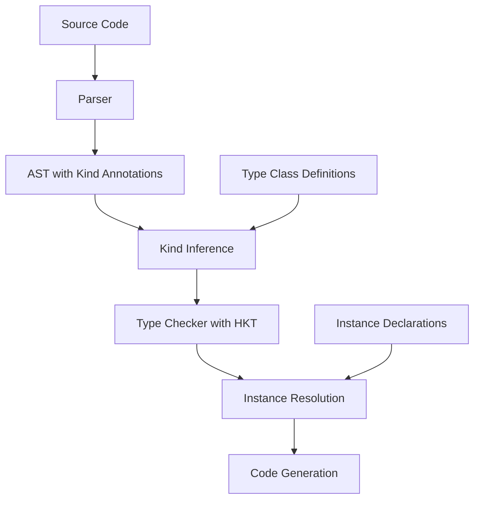

# Higher-Kinded Types and Type Classes: Design Document

## Table of Contents
1. Executive Summary
2. Motivation and Use Cases
3. Architecture Overview
4. Implementation Phases
5. Technical Specifications
6. Migration Path
7. Testing Strategy
8. Performance Considerations
9. Future Extensions
10. References

## 1. Executive Summary

This document outlines a phased approach to implementing higher-kinded types (HKT) and type classes in ParLang, transforming it from a rank-1 polymorphic language to a language supporting abstraction over type constructors.

**Timeline**: 6-12 months
**Complexity**: High
**Impact**: Enables Functor, Monad, Traversable, and other powerful abstractions

## 2. Motivation and Use Cases

### Current Limitations

ParLang currently supports generic types but requires fully applied type constructors:

```parlang
# ✅ Works - fully applied
type Option a = Some a | None in Some 42
# Type: Option Int

# ❌ Doesn't work - unapplied constructor
let map_functor : forall f a b. (a -> b) -> f a -> f b
```

### Use Cases Enabled by HKT

#### 2.1 Generic Mapping (Functor)

```parlang
typeclass Functor f where
  fmap : forall a b. (a -> b) -> f a -> f b
end

# One implementation works for all functors
let double = fun x -> x * 2 in
fmap double (Some 21)           # Some 42
fmap double [1, 2, 3]           # [2, 4, 6]
fmap double (Right 21)          # Right 42
```

#### 2.2 Monadic Composition

```parlang
typeclass Monad m where
  return : forall a. a -> m a
  bind : forall a b. m a -> (a -> m b) -> m b
end

# Generic do-notation
let result = do
  x <- Some 10
  y <- Some 32
  return (x + y)
# Result: Some 42
```

#### 2.3 Generic Container Operations

```parlang
typeclass Traversable t where
  traverse : forall f a b. Applicative f => (a -> f b) -> t a -> f (t b)
end

# Validate all elements in any traversable container
let validate_all = fun validator -> fun container ->
  traverse validator container
```

## 3. Architecture Overview

### 3.1 Components



### 3.2 Type System Layers

```
Layer 1: Terms (values)          42, true, fun x -> x
   ↓ has type
Layer 2: Types                   Int, Bool, a -> a
   ↓ has kind
Layer 3: Kinds                   *, * -> *, * -> * -> *
   ↓ (future: has sort)
Layer 4: Sorts                   ⊡, ⊡ -> ⊡
```

## 4. Implementation Phases

### Phase 1: Kind System (2 months)

Add kinds to the type system without changing user-facing syntax.

#### 4.1.1 Add Kind Type

```rust
// src/kinds.rs (NEW FILE)

/// Kinds - types of types
#[derive(Debug, Clone, PartialEq, Eq, Hash)]
pub enum Kind {
    /// Concrete type kind: *
    Star,
    
    /// Type constructor kind: k1 -> k2
    /// E.g., * -> * for List, * -> * -> * for Either
    Arrow(Box<Kind>, Box<Kind>),
    
    /// Kind variable for kind polymorphism
    KVar(KindVar),
}

/// Kind variable identifier
#[derive(Debug, Clone, PartialEq, Eq, Hash, PartialOrd, Ord)]
pub struct KindVar(pub usize);

impl fmt::Display for Kind {
    fn fmt(&self, f: &mut fmt::Formatter) -> fmt::Result {
        match self {
            Kind::Star => write!(f, "*"),
            Kind::Arrow(k1, k2) => {
                match k1.as_ref() {
                    Kind::Arrow(_, _) => write!(f, "({}) -> {}", k1, k2),
                    _ => write!(f, "{} -> {}", k1, k2),
                }
            }
            Kind::KVar(v) => write!(f, "k{}", v.0),
        }
    }
}
```

#### 4.1.2 Update Type Representation

```rust
// src/types.rs

pub enum Type {
    Int,
    Bool,
    Char,
    Float,
    Unit,
    
    /// Type variable with optional kind annotation
    Var(TypeVar, Option<Kind>),
    
    /// Function type: T1 -> T2
    Fun(Box<Type>, Box<Type>),
    
    /// NEW: Type constructor (unapplied)
    /// E.g., List (kind: * -> *), Either (kind: * -> * -> *)
    Constructor(String, Kind),
    
    /// NEW: Type application (apply constructor to argument)
    /// E.g., List Int (List applied to Int)
    App(Box<Type>, Box<Type>),
    
    /// Record types (existing)
    Record(HashMap<String, Type>),
    RecordRow(HashMap<String, Type>, RowVar),
    Row(RowVar),
    
    /// Legacy: SumType becomes sugar for Constructor + Apps
    /// Will be deprecated after migration
    SumType(String, Vec<Type>),
    
    Array(Box<Type>, usize),
}

impl Type {
    /// Compute the kind of a type
    pub fn kind(&self, env: &KindEnv) -> Result<Kind, KindError> {
        match self {
            Type::Int | Type::Bool | Type::Char | Type::Float | Type::Unit => {
                Ok(Kind::Star)
            }
            Type::Var(_, Some(k)) => Ok(k.clone()),
            Type::Var(_, None) => Ok(Kind::Star), // Default to *
            Type::Fun(_, _) => Ok(Kind::Star),
            Type::Constructor(name, kind) => Ok(kind.clone()),
            Type::App(f, arg) => {
                let f_kind = f.kind(env)?;
                let arg_kind = arg.kind(env)?;
                match f_kind {
                    Kind::Arrow(expected, result) => {
                        if *expected == arg_kind {
                            Ok(*result)
                        } else {
                            Err(KindError::KindMismatch {
                                expected: *expected,
                                found: arg_kind,
                            })
                        }
                    }
                    _ => Err(KindError::NotAConstructor),
                }
            }
            Type::SumType(name, args) => {
                // Legacy: compute kind based on number of args
                let arity = args.len();
                if arity == 0 {
                    Ok(Kind::Star)
                } else {
                    // Fully applied constructor
                    Ok(Kind::Star)
                }
            }
            // ... other cases
        }
    }
}
```

#### 4.1.3 Kind Environment

```rust
// src/kinds.rs

pub struct KindEnv {
    /// Map type constructor names to their kinds
    kinds: HashMap<String, Kind>,
    
    /// Kind variable counter for fresh kind variables
    next_kvar: usize,
}

impl KindEnv {
    pub fn new() -> Self {
        let mut env = Self {
            kinds: HashMap::new(),
            next_kvar: 0,
        };        
        // Register built-in type constructors
        env.register("List", Kind::arrow(Kind::Star, Kind::Star));
        env.register("Option", Kind::arrow(Kind::Star, Kind::Star));
        env.register("Either", Kind::arrow(
            Kind::Star,
            Kind::arrow(Kind::Star, Kind::Star)
        ));
        
        env
    }
    
    pub fn register(&mut self, name: impl Into<String>, kind: Kind) {
        self.kinds.insert(name.into(), kind);
    }
    
    pub fn lookup(&self, name: &str) -> Option<&Kind> {
        self.kinds.get(name)
    }
    
    pub fn fresh_kvar(&mut self) -> KindVar {
        let kvar = KindVar(self.next_kvar);
        self.next_kvar += 1;
        kvar
    }
}

impl Kind {
    /// Helper to construct arrow kinds
    pub fn arrow(from: Kind, to: Kind) -> Kind {
        Kind::Arrow(Box::new(from), Box::new(to))
    }
}
```

#### 4.1.4 Kind Inference

```rust
// src/kind_inference.rs (NEW FILE)

use crate::kinds::{Kind, KindVar, KindEnv};
use crate::types::Type;
use std::collections::HashMap;

pub type KindSubstitution = HashMap<KindVar, Kind>;

pub struct KindInferencer {
    env: KindEnv,
    constraints: Vec<(Kind, Kind)>,
}

impl KindInferencer {
    pub fn new(env: KindEnv) -> Self {
        Self {
            env,
            constraints: Vec::new(),
        }
    }
    
    /// Infer the kind of a type
    pub fn infer(&mut self, ty: &Type) -> Result<Kind, KindError> {
        match ty {
            Type::Int | Type::Bool | Type::Char | Type::Float | Type::Unit => {
                Ok(Kind::Star)
            }
            
            Type::Var(_, Some(k)) => Ok(k.clone()),
            Type::Var(_, None) => Ok(Kind::Star),
            
            Type::Fun(arg, ret) => {
                let arg_kind = self.infer(arg)?;
                let ret_kind = self.infer(ret)?;
                self.constraints.push((arg_kind, Kind::Star));
                self.constraints.push((ret_kind, Kind::Star));
                Ok(Kind::Star)
            }
            
            Type::Constructor(name, kind) => Ok(kind.clone()),
            
            Type::App(f, arg) => {
                let f_kind = self.infer(f)?;
                let arg_kind = self.infer(arg)?;
                
                // Create fresh kind variable for result
                let result_kind = Kind::KVar(self.env.fresh_kvar());
                
                // f must have kind: arg_kind -> result_kind
                let expected_f_kind = Kind::arrow(arg_kind.clone(), result_kind.clone());
                self.constraints.push((f_kind, expected_f_kind));
                
                Ok(result_kind)
            }
            
            // ... other cases
        }
    }
    
    /// Solve kind constraints using unification
    pub fn solve(&self) -> Result<KindSubstitution, KindError> {
        let mut subst = KindSubstitution::new();
        
        for (k1, k2) in &self.constraints {
            let unified = unify_kinds(&subst, k1, k2)?;
            subst.extend(unified);
        }
        
        Ok(subst)
    }
}

/// Unify two kinds
fn unify_kinds(
    subst: &KindSubstitution,
    k1: &Kind,
    k2: &Kind,
) -> Result<KindSubstitution, KindError> {
    let k1 = apply_kind_subst(subst, k1);
    let k2 = apply_kind_subst(subst, k2);
    
    match (k1, k2) {
        (Kind::Star, Kind::Star) => Ok(KindSubstitution::new()),
        
        (Kind::KVar(v1), Kind::KVar(v2)) if v1 == v2 => Ok(KindSubstitution::new()),
        
        (Kind::KVar(v), k) | (k, Kind::KVar(v)) => {
            if occurs_in_kind(&v, &k) {
                Err(KindError::InfiniteKind)
            } else {
                let mut s = KindSubstitution::new();
                s.insert(v, k);
                Ok(s)
            }
        }
        
        (Kind::Arrow(a1, r1), Kind::Arrow(a2, r2)) => {
            let s1 = unify_kinds(subst, &a1, &a2)?;
            let s2 = unify_kinds(&s1, &r1, &r2)?;
            Ok(compose_kind_subst(s1, s2))
        }
        
        _ => Err(KindError::KindMismatch {
            expected: k1.clone(),
            found: k2.clone(),
        }),
    }
}

/// Apply kind substitution to a kind
fn apply_kind_subst(subst: &KindSubstitution, kind: &Kind) -> Kind {
    match kind {
        Kind::Star => Kind::Star,
        Kind::KVar(v) => subst.get(v).cloned().unwrap_or_else(|| kind.clone()),
        Kind::Arrow(k1, k2) => Kind::arrow(
            apply_kind_subst(subst, k1),
            apply_kind_subst(subst, k2),
        ),
    }
}

/// Check if kind variable occurs in kind (for occurs check)
fn occurs_in_kind(v: &KindVar, kind: &Kind) -> bool {
    match kind {
        Kind::Star => false,
        Kind::KVar(v2) => v == v2,
        Kind::Arrow(k1, k2) => occurs_in_kind(v, k1) || occurs_in_kind(v, k2),
    }
}

/// Compose two kind substitutions
fn compose_kind_subst(s1: KindSubstitution, s2: KindSubstitution) -> KindSubstitution {
    let mut result = s1.clone();
    for (v, k) in s2 {
        result.insert(v, apply_kind_subst(&s1, &k));
    }
    result
}

#[derive(Debug, Clone)]
pub enum KindError {
    KindMismatch { expected: Kind, found: Kind },
    NotAConstructor,
    InfiniteKind,
    UnboundConstructor(String),
}
```

#### 4.1.5 Testing Phase 1

```rust
// tests/kind_inference_tests.rs

#[test]
fn test_kind_inference_list() {
    let mut inferencer = KindInferencer::new(KindEnv::new());
    
    // List has kind * -> *
    let list = Type::Constructor("List".to_string(), 
        Kind::arrow(Kind::Star, Kind::Star));
    let kind = inferencer.infer(&list).unwrap();
    assert_eq!(kind, Kind::arrow(Kind::Star, Kind::Star));
}

#[test]
fn test_kind_inference_list_int() {
    let mut inferencer = KindInferencer::new(KindEnv::new());
    
    // List Int has kind *
    let list_int = Type::App(
        Box::new(Type::Constructor("List".to_string(), 
            Kind::arrow(Kind::Star, Kind::Star))),
        Box::new(Type::Int),
    );
    let kind = inferencer.infer(&list_int).unwrap();
    assert_eq!(kind, Kind::Star);
}

#[test]
fn test_kind_inference_either() {
    let mut inferencer = KindInferencer::new(KindEnv::new());
    
    // Either has kind * -> * -> *
    let either = Type::Constructor("Either".to_string(), 
        Kind::arrow(Kind::Star, Kind::arrow(Kind::Star, Kind::Star)));
    let kind = inferencer.infer(&either).unwrap();
    assert_eq!(kind, Kind::arrow(Kind::Star, Kind::arrow(Kind::Star, Kind::Star)));
}

#[test]
fn test_kind_error_mismatched_application() {
    let mut inferencer = KindInferencer::new(KindEnv::new());
    
    // Try to apply Int (kind *) to Int (kind *) - should fail
    let invalid = Type::App(
        Box::new(Type::Int),
        Box::new(Type::Int),
    );
    let result = inferencer.infer(&invalid);
    assert!(matches!(result, Err(KindError::NotAConstructor)));
}
```

**Deliverables Phase 1:**
- [ ] Kind type and representation
- [ ] Kind environment
- [ ] Kind inference algorithm
- [ ] Kind unification
- [ ] Comprehensive tests (50+ tests)
- [ ] Documentation in `docs/KINDS.md`

---

### Phase 2: Type Classes (3 months)

Add type class declarations and basic instance resolution.

#### 4.2.1 AST Extensions

```rust
// src/ast.rs

pub enum Expr {
    // ... existing variants
    
    /// Type class declaration
    TypeClass {
        name: String,
        /// Type variable with kind annotation
        type_var: (String, Kind),
        /// Method signatures: (name, type)
        methods: Vec<(String, TypeAnnotation)>,
        /// Body expression where this class is in scope
        body: Box<Expr>,
    },
    
    /// Instance declaration
    Instance {
        class_name: String,
        /// Type being instantiated (e.g., Option, List)
        instance_type: TypeAnnotation,
        /// Method implementations: (name, implementation)
        methods: Vec<(String, Expr)>,
        /// Body expression where this instance is in scope
        body: Box<Expr>,
    },
}
```

#### 4.2.2 Type Class Environment

```rust
// src/typeclasses.rs (NEW FILE)

use crate::types::{Type, TypeScheme};
use crate::kinds::Kind;
use std::collections::HashMap;

/// Type class definition
#[derive(Debug, Clone)]
pub struct TypeClass {
    /// Name of the type class
    pub name: String,
    
    /// Type variable and its kind
    pub type_var: (String, Kind),
    
    /// Method signatures
    pub methods: HashMap<String, TypeScheme>,
    
    /// Superclasses (for future: Monad => Applicative => Functor)
    pub superclasses: Vec<String>,
}

/// Instance of a type class
#[derive(Debug, Clone)]
pub struct Instance {
    /// Class name
    pub class_name: String,
    
    /// Type being instantiated
    pub instance_type: Type,
    
    /// Method implementations (name -> term)
    pub methods: HashMap<String, Expr>,
}

/// Type class environment
pub struct TypeClassEnv {
    /// All defined type classes
    classes: HashMap<String, TypeClass>,
    
    /// All instances: class_name -> [instances]
    instances: HashMap<String, Vec<Instance>>, 
}

impl TypeClassEnv {
    pub fn new() -> Self {
        Self {
            classes: HashMap::new(),
            instances: HashMap::new(),
        }
    }
    
    /// Register a type class
    pub fn register_class(&mut self, class: TypeClass) {
        self.classes.insert(class.name.clone(), class);
    }
    
    /// Register an instance
    pub fn register_instance(&mut self, instance: Instance) {
        self.instances
            .entry(instance.class_name.clone())
            .or_insert_with(Vec::new)
            .push(instance);
    }
    
    /// Look up a type class
    pub fn lookup_class(&self, name: &str) -> Option<&TypeClass> {
        self.classes.get(name)
    }
    
    /// Find instance for a type
    pub fn find_instance(&self, class_name: &str, ty: &Type) -> Option<&Instance> {
        let instances = self.instances.get(class_name)?;
        instances.iter().find(|inst| {
            // Check if instance type matches (with unification)
            types_match(&inst.instance_type, ty)
        })
    }
    
    /// Get all instances of a class
    pub fn get_instances(&self, class_name: &str) -> Option<&[Instance]> {
        self.instances.get(class_name).map(|v| v.as_slice())
    }
}

/// Check if two types match for instance resolution
fn types_match(ty1: &Type, ty2: &Type) -> bool {
    // Simplified matching - in real implementation, use unification
    match (ty1, ty2) {
        (Type::Constructor(n1, _), Type::Constructor(n2, _)) => n1 == n2,
        (Type::App(f1, a1), Type::App(f2, a2)) => {
            types_match(f1, f2) && types_match(a1, a2)
        }
        _ => ty1 == ty2,
    }
}
```

#### 4.2.3 Parser Extensions

```rust
// src/parser.rs

/// Parse type class declaration
fn typeclass_expr() -> impl Parser<Input = &str, Output = Expr> {
    (
        string("typeclass")
            .skip(spaces1())
            .with(identifier())
            .skip(spaces1()),
        identifier(), // type variable
        spaces()
            .skip(string("where"))
            .skip(spaces())
            .with(many1(method_sig())),
        spaces()
            .skip(string("end"))
            .skip(spaces())
            .skip(string("in"))
            .skip(spaces())
            .with(expr()),
    )
        .map(|(class_name, type_var, methods, body)| {
            Expr::TypeClass {
                name: class_name,
                type_var: (type_var, Kind::Star), // Default kind, infer later
                methods,
                body: Box::new(body),
            }
        })
}

/// Parse method signature
fn method_sig() -> impl Parser<Input = &str, Output = (String, TypeAnnotation)> {
    (
        identifier(),
        spaces()
            .skip(token(':'))
            .skip(spaces())
            .with(type_annotation()),
    )
}

/// Parse instance declaration
fn instance_expr() -> impl Parser<Input = &str, Output = Expr> {
    (
        string("instance")
            .skip(spaces1())
            .with(identifier()), // class name
        spaces1()
            .with(type_annotation()), // instance type
        spaces()
            .skip(string("where"))
            .skip(spaces())
            .with(many1(method_impl())),
        spaces()
            .skip(string("end"))
            .skip(spaces())
            .skip(string("in"))
            .skip(spaces())
            .with(expr()),
    )
        .map(|(class_name, instance_type, methods, body)| {
            Expr::Instance {
                class_name,
                instance_type,
                methods,
                body: Box::new(body),
            }
        })
}

/// Parse method implementation
fn method_impl() -> impl Parser<Input = &str, Output = (String, Expr)> {
    (
        identifier(),
        spaces()
            .skip(token('='))
            .skip(spaces())
            .with(expr()),
    )
}
```

#### 4.2.4 Type Checking Type Classes

```rust
// src/typechecker.rs

impl TypeChecker {
    /// Type check a type class declaration
    fn check_typeclass(
        &mut self,
        env: &TypeEnv,
        name: String,
        type_var: (String, Kind),
        methods: Vec<(String, TypeAnnotation)>,
        body: &Expr,
    ) -> Result<Type, TypeError> {
        // 1. Register the type class
        let mut method_types = HashMap::new();
        for (method_name, method_type_ann) in methods {
            let method_type = self.type_annotation_to_type(env, &method_type_ann)?;
            let scheme = self.generalize(env, &method_type);
            method_types.insert(method_name, scheme);
        }
        
        let type_class = TypeClass {
            name: name.clone(),
            type_var: type_var.clone(),
            methods: method_types,
            superclasses: Vec::new(),
        };
        
        self.typeclass_env.register_class(type_class);
        
        // 2. Type check the body with the class in scope
        self.infer(env, body)
    }
    
    /// Type check an instance declaration
    fn check_instance(
        &mut self,
        env: &TypeEnv,
        class_name: String,
        instance_type: TypeAnnotation,
        methods: Vec<(String, Expr)>,
        body: &Expr,
    ) -> Result<Type, TypeError> {
        // 1. Look up the type class
        let class = self.typeclass_env
            .lookup_class(&class_name)
            .ok_or_else(|| TypeError::UnboundTypeClass(class_name.clone()))?;
        
        // 2. Convert instance type annotation to Type
        let inst_type = self.type_annotation_to_type(env, &instance_type)?;
        
        // 3. Check that instance type has correct kind
        let inst_kind = inst_type.kind(&self.kind_env)?;
        if inst_kind != class.type_var.1 {
            return Err(TypeError::KindMismatch {
                expected: class.type_var.1.clone(),
                found: inst_kind,
            });
        }
        
        // 4. Type check each method implementation
        let mut checked_methods = HashMap::new();
        for (method_name, method_impl) in methods {
            // Get expected type from class definition
            let expected_scheme = class.methods.get(&method_name)
                .ok_or_else(|| TypeError::UnknownMethod {
                    class: class_name.clone(),
                    method: method_name.clone(),
                })?;
            
            // Instantiate expected type with instance type
            let expected_type = self.instantiate_with(&expected_scheme, &inst_type);
            
            // Infer actual type
            let actual_type = self.infer(env, &method_impl)?;
            
            // Unify
            let subst = unify(&expected_type, &actual_type)?;
            self.apply_substitution(&subst);
            
            checked_methods.insert(method_name, method_impl);
        }
        
        // 5. Register the instance
        let instance = Instance {
            class_name: class_name.clone(),
            instance_type: inst_type,
            methods: checked_methods,
        };
        
        self.typeclass_env.register_instance(instance);
        
        // 6. Type check body
        self.infer(env, body)
    }
    
    /// Instantiate a type scheme with a specific type for the class variable
    fn instantiate_with(&mut self, scheme: &TypeScheme, inst_type: &Type) -> Type {
        // Replace class type variable with instance type
        let mut subst = Substitution::new();
        if let Some(var) = scheme.vars.first() {
            subst.insert(var.clone(), inst_type.clone());
        }
        apply_subst(&subst, &scheme.ty)
    }
}
```

#### 4.2.5 Example: Functor Type Class

```parlang
# Define Functor type class
typeclass Functor f where
  fmap : forall a b. (a -> b) -> f a -> f b
end in

# Instance for Option
instance Functor Option where
  fmap = fun f -> fun opt ->
    match opt with
    | Some x -> Some (f x)
    | None -> None
    end
end in

# Instance for List
instance Functor List where
  fmap = rec map -> fun f -> fun lst ->
    match lst with
    | Nil -> Nil
    | Cons x xs -> Cons (f x) (map f xs)
    end
end in

# Use fmap polymorphically
let double = fun x -> x * 2 in
let opt_result = fmap double (Some 21) in
let list_result = fmap double (Cons 1 (Cons 2 Nil)) in
opt_result  # Some 42
```

#### 4.2.6 Testing Phase 2

```rust
// tests/typeclass_tests.rs

#[test]
fn test_functor_option_instance() {
    let code = r#"
        typeclass Functor f where
          fmap : forall a b. (a -> b) -> f a -> f b
        end in
        
        instance Functor Option where
          fmap = fun f -> fun opt ->
            match opt with
            | Some x -> Some (f x)
            | None -> None
            end
        end in
        
        fmap (fun x -> x + 1) (Some 41)
    "#;
    
    let expr = parse(code).unwrap();
    let result = eval(&expr, &Environment::new()).unwrap();
    assert_eq!(result, Value::Variant("Some".to_string(), vec![Value::Int(42)]));
}

#[test]
fn test_multiple_instances() {
    let code = r#"
        typeclass Show a where
          show : a -> String
        end in
        
        instance Show Int where
          show = int_to_string
        end in
        
        instance Show Bool where
          show = fun b -> if b then "true" else "false"
        end in
        
        show 42  # "42"
    "#;
    
    // Test instance resolution
    let expr = parse(code).unwrap();
    let ty = typecheck(&expr).unwrap();
    // Should resolve to String
}

#[test]
fn test_kind_error_in_instance() {
    let code = r#"
        typeclass Functor f where
          fmap : forall a b. (a -> b) -> f a -> f b
        end in
        
        # Int has kind *, but Functor expects * -> *
        instance Functor Int where
          fmap = fun f -> fun x -> f x
        end in
        ()
    "#;
    
    let expr = parse(code).unwrap();
    let result = typecheck(&expr);
    assert!(matches!(result, Err(TypeError::KindMismatch { .. }))); 
}
```

**Deliverables Phase 2:**
- [ ] Type class AST nodes
- [ ] Type class environment
- [ ] Instance resolution
- [ ] Type checking for classes and instances
- [ ] Parser support for `typeclass` and `instance`
- [ ] 100+ comprehensive tests
- [ ] Documentation in `docs/TYPE_CLASSES.md`
- [ ] Examples: Functor, Show, Eq

---

### Phase 3: Method Resolution (2 months)

Implement compile-time method resolution and dictionary passing.

#### 4.3.1 Dictionary Representation

```rust
// src/typeclasses.rs

/// Runtime dictionary for type class methods
#[derive(Debug, Clone)]
pub struct Dictionary {
    /// Class name
    class_name: String,
    
    /// Instance type
    instance_type: Type,
    
    /// Method implementations (name -> closure)
    methods: HashMap<String, Value>,
}

impl Dictionary {
    pub fn new(class_name: String, instance_type: Type) -> Self {
        Self {
            class_name,
            instance_type,
            methods: HashMap::new(),
        }
    }
    
    pub fn add_method(&mut self, name: String, value: Value) {
        self.methods.insert(name, value);
    }
    
    pub fn get_method(&self, name: &str) -> Option<&Value> {
        self.methods.get(name)
    }
}
```

#### 4.3.2 Evidence Passing

```rust
// src/eval.rs

pub enum Value {
    Int(i64),
    Bool(bool),
    // ... existing variants
    
    /// Type class dictionary
    Dict(Dictionary),
}

impl Evaluator {
    /// Resolve method call with dictionary passing
    fn eval_method_call(
        &mut self,
        env: &Environment,
        class_name: &str,
        method_name: &str,
        ty: &Type,
        args: &[Expr],
    ) -> Result<Value, EvalError> {
        // 1. Find instance for type
        let instance = self.typeclass_env
            .find_instance(class_name, ty)
            .ok_or_else(|| EvalError::NoInstance {
                class: class_name.to_string(),
                ty: ty.clone(),
            })?;
        
        // 2. Get method implementation
        let method_impl = instance.methods.get(method_name)
            .ok_or_else(|| EvalError::MethodNotFound {
                class: class_name.to_string(),
                method: method_name.to_string(),
            })?;
        
        // 3. Evaluate method with arguments
        let method_value = self.eval(env, method_impl)?;
        
        // 4. Apply to arguments
        let mut result = method_value;
        for arg in args {
            let arg_value = self.eval(env, arg)?;
            result = self.apply(result, arg_value)?;
        }
        
        Ok(result)
    }
}
```

#### 4.3.3 Constraint Solving

```rust
// src/constraint_solver.rs (NEW FILE)

use crate::types::Type;
use crate::typeclasses::{TypeClassEnv, Instance};

/// Type class constraint: Class Type
#[derive(Debug, Clone, PartialEq)]
pub struct Constraint {
    pub class: String,
    pub ty: Type,
}

/// Constraint solver
pub struct ConstraintSolver<'a> {
    env: &'a TypeClassEnv,
}

impl<'a> ConstraintSolver<'a> {
    pub fn new(env: &'a TypeClassEnv) -> Self {
        Self { env }
    }
    
    /// Solve a set of constraints
    pub fn solve(&self, constraints: &[Constraint]) -> Result<Vec<Instance>, ConstraintError> {
        let mut solutions = Vec::new();
        
        for constraint in constraints {
            let instance = self.solve_single(constraint)?;
            solutions.push(instance.clone());
        }
        
        Ok(solutions)
    }
    
    /// Solve a single constraint
    fn solve_single(&self, constraint: &Constraint) -> Result<&Instance, ConstraintError> {
        // Find matching instance
        let instance = self.env
            .find_instance(&constraint.class, &constraint.ty)
            .ok_or_else(|| ConstraintError::NoInstance {
                class: constraint.class.clone(),
                ty: constraint.ty.clone(),
            })?;
        
        Ok(instance)
    }
}

#[derive(Debug, Clone)]
pub enum ConstraintError {
    NoInstance { class: String, ty: Type },
    AmbiguousInstance { class: String, ty: Type },
    OverlappingInstances { class: String, ty: Type },
}
```

**Deliverables Phase 3:**
- [ ] Dictionary representation
- [ ] Evidence passing in evaluator
- [ ] Constraint solver
- [ ] Method resolution algorithm
- [ ] 75+ tests
- [ ] Documentation on method resolution
- [ ] Performance benchmarks

---

### Phase 4: Advanced Features (3 months)

Add superclasses, multi-parameter type classes, and functional dependencies.

#### 4.4.1 Superclass Constraints

```parlang
# Monad requires Applicative, which requires Functor
typeclass Functor f where
  fmap : forall a b. (a -> b) -> f a -> f b
end in

typeclass Functor f => Applicative f where
  pure : forall a. a -> f a
  ap : forall a b. f (a -> b) -> f a -> f b
end in

# Will require extra constraints in instances
# Type class declaration must specify superclasses

typeclass Applicative m => Monad m where
  return : forall a. a -> m a
  bind : forall a b. m a -> (a -> m b) -> m b
end in

# Instance must satisfy superclass constraints
instance Functor Option where
  fmap = fun f -> fun opt ->
    match opt with
    | Some x -> Some (f x)
    | None -> None
    end
end in

instance Applicative Option where
  pure = fun x -> Some x
  ap = fun fopt -> fun xopt ->
    match (fopt, xopt) with
    | (Some f, Some x) -> Some (f x)
    | _ -> None
    end
end in

instance Monad Option where
  return = pure
  bind = fun opt -> fun f ->
    match opt with
    | Some x -> f x
    | None -> None
    end
end
```

#### 4.4.2 Multi-Parameter Type Classes

```parlang
# Type classes with multiple parameters
typeclass Convert a b where
  convert : a -> b
end in

instance Convert Int Float where
  convert = int_to_float
end in

instance Convert Float Int where
  convert = float_to_int
end in

let x : Float = convert 42 in  # Int -> Float
x  # 42.0
```

#### 4.4.3 Functional Dependencies

```parlang
# Functional dependencies to guide type inference
typeclass Collection c e | c -> e where
  empty : c
  insert : e -> c -> c
  member : e -> c -> Bool
end in

instance Collection (List a) a where
  empty = Nil
  insert = fun x -> fun xs -> Cons x xs
  member = rec mem -> fun x -> fun xs ->
    match xs with
    | Nil -> false
    | Cons y ys -> if x == y then true else mem x ys
    end
end in

# Type inference works: c determines e via functional dependency
let add_to_collection = fun x -> insert x empty
```

**Deliverables Phase 4:**
- [ ] Superclass constraint checking
- [ ] Multi-parameter type classes
- [ ] Functional dependencies
- [ ] Associated types (optional)
- [ ] 100+ advanced tests
- [ ] Complete standard library with type classes
- [ ] Comprehensive documentation

---

## 5. Technical Specifications

### 5.1 Syntax

```ebnf
(* Type Class Declaration *)
typeclass_decl ::= "typeclass" type_class_name type_var "where"
                   method_sig+
                   "end" "in" expr

type_class_name ::= UpperIdent
type_var ::= LowerIdent
method_sig ::= method_name ":" type_annotation

(* Instance Declaration *)
instance_decl ::= "instance" type_class_name type_annotation "where"
                  method_impl+
                  "end" "in" expr

method_impl ::= method_name "=" expr

(* Superclass Constraints *)
disjunction ::= type_class_name type_var
constraints ::= disjunction | disjunction "," constraints

typeclass_with_super ::= "typeclass" constraints "=>"
                         type_class_name type_var "where"
                         method_sig+
                         "end" "in" expr
```

### 5.2 Type System Rules

#### Rule: Type Class Declaration

```
Γ ⊢ body : τ
methods : { m₁ : σ₁, ..., mₙ : σₙ }
─────────────────────────────────────────
Γ ⊢ typeclass C a where methods end in body : τ
```

#### Rule: Instance Declaration

```
C defined with kind k
T has kind k
Γ ⊢ method_i : instantiate(σᵢ, T)  for all i
Γ ⊢ body : τ
─────────────────────────────────────────
Γ ⊢ instance C T where methods end in body : τ
```

#### Rule: Method Call

```
instance C T exists
method m : σ in C
Γ ⊢ e : T
─────────────────────────────
Γ ⊢ m e : instantiate(σ, T)
```

### 5.3 Kind System Rules

#### Rule: Constructor

```
C defined with kind k
─────────────────
Γ ⊢ C :: k
```

#### Rule: Application

```
Γ ⊢ F :: k₁ -> k₂
Γ ⊢ A :: k₁
─────────────────
Γ ⊢ F A :: k₂
```

### 5.4 Constraint Solving Algorithm

```
Algorithm: Solve(Γ, C, constraints)
Input: Environment Γ, type class env C, constraints [C₁ T₁, ..., Cₙ Tₙ]
Output: Dictionaries [d₁, ..., dₙ] or Error

1. For each constraint Cᵢ Tᵢ:
   a. Find all instances of Cᵢ: [I₁, ..., Iₘ]
   b. For each instance Iⱼ:
      - Attempt unification of Iⱼ.type with Tᵢ
      - If successful, create dictionary dⱼ
   c. If exactly one instance matches: add dictionary to result
   d. If no instances match: error NoInstance
   e. If multiple instances match: error AmbiguousInstance

2. Check superclass constraints for each dictionary

3. Return all dictionaries
```

## 6. Migration Path

### 6.1 Backward Compatibility

**Phase 1-2**: Fully backward compatible
- Existing code continues to work
- Kind annotations optional
- Type classes optional

**Phase 3-4**: Minor breaking changes
- Some type inference ambiguities may require annotations
- Method names may conflict with existing functions

### 6.2 Migration Strategy

#### Step 1: Add Kind Annotations (Optional)

```parlang
# Before (still works)
type Option a = Some a | None

# After (with explicit kinds)
type Option (a :: *) = Some a | None
# Kind: * -> *
```

#### Step 2: Define Type Classes

```parlang
# Extract common patterns into type classes
typeclass Functor f where
  fmap : forall a b. (a -> b) -> f a -> f b
end
```

#### Step 3: Migrate Instances

```parlang
# Before: separate functions
let map_option = fun f -> fun opt -> ...
let map_list = fun f -> fun lst -> ...

# After: unified under Functor
instance Functor Option where
  fmap = fun f -> fun opt -> ...
end

instance Functor List where
  fmap = fun f -> fun lst -> ...
end
```

#### Step 4: Update Call Sites

```parlang
# Before
map_option (fun x -> x + 1) (Some 41)
map_list (fun x -> x + 1) [1, 2, 3]

# After
fmap (fun x -> x + 1) (Some 41)
fmap (fun x -> x + 1) [1, 2, 3]
```

### 6.3 Deprecation Timeline

- **Month 6**: Release with kind system (Phase 1)
- **Month 9**: Release with type classes (Phase 2)
- **Month 12**: Release with method resolution (Phase 3)
- **Month 18**: Release with advanced features (Phase 4)
- **Month 24**: Deprecate old-style SumType in favor of Constructor + App
- **Month 30**: Remove deprecated features

## 7. Testing Strategy

### 7.1 Unit Tests

- **Kind System**: 50+ tests
  - Basic kind inference
  - Kind unification
  - Kind errors
  - Complex kinds (higher-order)

- **Type Classes**: 100+ tests
  - Declaration and registration
  - Instance checking
  - Method type checking
  - Superclass constraints

- **Method Resolution**: 75+ tests
  - Instance resolution
  - Ambiguous instances
  - Overlapping instances
  - No instance errors

- **Advanced Features**: 100+ tests
  - Multi-parameter type classes
  - Functional dependencies
  - Complex constraint solving

### 7.2 Integration Tests

```parlang
# Test 1: Functor, Applicative, Monad hierarchy
typeclass Functor f where
  fmap : forall a b. (a -> b) -> f a -> f b
end in

typeclass Functor f => Applicative f where
  pure : forall a. a -> f a
  ap : forall a b. f (a -> b) -> f a -> f b
end in

typeclass Applicative m => Monad m where
  return : forall a. a -> m a
  bind : forall a b. m a -> (a -> m b) -> m b
end in

# Instances for Option
instance Functor Option where
  fmap = fun f -> fun opt ->
    match opt with
    | Some x -> Some (f x)
    | None -> None
    end
end in

instance Applicative Option where
  pure = fun x -> Some x
  ap = fun fopt -> fun xopt ->
    match (fopt, xopt) with
    | (Some f, Some x) -> Some (f x)
    | _ -> None
    end
end in

instance Monad Option where
  return = pure
  bind = fun opt -> fun f ->
    match opt with
    | Some x -> f x
    | None -> None
    end
end in

# Test monad laws
let left_identity = fun x -> fun f ->
  bind (return x) f == f x
in

let right_identity = fun m ->
  bind m return == m
in

let associativity = fun m -> fun f -> fun g ->
  bind (bind m f) g == bind m (fun x -> bind (f x) g)
in

# All should be true
(left_identity 42 (fun x -> Some (x + 1)),
 right_identity (Some 42),
 associativity (Some 10) (fun x -> Some (x + 1)) (fun y -> Some (y * 2)))
```

### 7.3 Property-Based Testing

```rust
use proptest::prelude::*;

proptest! {
    #[test]
    fn test_kind_inference_soundness(ty: Type) {
        let mut inferencer = KindInferencer::new(KindEnv::new());
        let kind_result = inferencer.infer(&ty);
        
        if let Ok(kind) = kind_result {
            // If kind inference succeeds, type should be well-kinded
            assert!(is_well_kinded(&ty, &kind));
        }
    }
    
    #[test]
    fn test_instance_resolution_deterministic(
        class in "[A-Z][a-z]+",
        ty in arb_type()
    ) {
        let env = TypeClassEnv::new();
        let resolver = ConstraintSolver::new(&env);
        
        let constraint = Constraint { class, ty };
        let result1 = resolver.solve_single(&constraint);
        let result2 = resolver.solve_single(&constraint);
        
        // Resolution should be deterministic
        assert_eq!(result1, result2);
    }
}
```

### 7.4 Performance Benchmarks

```rust
use criterion::{black_box, criterion_group, criterion_main, Criterion};

fn bench_kind_inference(c: &mut Criterion) {
    c.bench_function("kind inference complex", |b| {
        let complex_type = /* nested type with 100+ constructors */;
        b.iter(|| {
            let mut inferencer = KindInferencer::new(KindEnv::new());
            inferencer.infer(black_box(&complex_type))
        });
    });
}

fn bench_instance_resolution(c: &mut Criterion) {
    c.bench_function("instance resolution 1000 instances", |b| {
        let env = /* setup with 1000 instances */;
        b.iter(|| {
            env.find_instance(black_box("Functor"), black_box(&test_type))
        });
    });
}

criterion_group!(benches, bench_kind_inference, bench_instance_resolution);
criterion_main!(benches);
```

## 8. Performance Considerations

### 8.1 Compile-Time Performance

**Kind Inference**:
- Complexity: O(n) where n = size of type expression
- Optimization: Cache inferred kinds
- Expected: < 1ms for typical types

**Instance Resolution**:
- Complexity: O(i × m) where i = # instances, m = matching cost
- Optimization: 
  - Index instances by head constructor
  - Use discrimination trees for fast matching
- Expected: < 10ms for 1000 instances

**Constraint Solving**:
- Complexity: O(c × i) where c = # constraints, i = # instances
- Optimization:
  - Early pruning of impossible instances
  - Constraint canonicalization
- Expected: < 50ms for complex programs

### 8.2 Runtime Performance

**Dictionary Passing**:
- No runtime overhead for monomorphic calls
- One dictionary parameter per type class constraint
- Dictionaries are first-class values (can be stored, passed)

**Method Dispatch**:
- Direct call (no virtual dispatch)
- Inlined at call site when possible
- Expected: 0-1 indirect call per method invocation

### 8.3 Memory Usage

**Type Representation**:
- Kind annotations: +8 bytes per type constructor
- Type class dictionaries: +24 bytes per constraint
- Expected: < 5% increase in memory usage

### 8.4 Optimization Strategies

#### Strategy 1: Specialization

```rust
// Monomorphize instances at compile time
// Before (generic):
fn fmap<F: Functor>(f: impl Fn(A) -> B, fa: F<A>) -> F<B>

// After (specialized):
fn fmap_option(f: impl Fn(A) -> B, fa: Option<A>) -> Option<B>
fn fmap_list(f: impl Fn(A) -> B, fa: List<A>) -> List<B>
```

#### Strategy 2: Dictionary Inlining

```rust
// Inline dictionary methods when known at compile time
// Before:
let dict = resolve_instance("Functor", "Option");
dict.fmap(f, opt)

// After:
fmap_option(f, opt)  // Direct call
```

#### Strategy 3: Constraint Caching

```rust
// Cache resolved constraints per function
static CONSTRAINT_CACHE: Cache<(String, Type), Dictionary> = ...;
```

## 9. Future Extensions

### 9.1 Associated Types

```parlang
# Typeclass with associated types
typeclass Collection c where
  type Elem c  # Associated type
  ...
```

### 9.2 Type Families

```parlang
# Type-level functions
type family Append (xs :: [*]) (ys :: [*]) :: [*] where
  Append '[] ys = ys
  Append (x ': xs) ys = x ': Append xs ys
end
```

### 9.3 Existential Types

```parlang
# Existential types (future feature)
type ShowBox = exists a. Show a => { value : a }
```

### 9.4 Rank-N Types

```parlang
# Rank-N types to enable more flexibility
let apply_twice : forall a. (forall b. b -> b) -> a -> a =
    fun f -> fun x -> f (f x)
```

### 9.5 Kind Polymorphism

```parlang
# Polymorphic over kinds
typeclass Category (cat :: k -> k -> *) where
  id : forall a. cat a a
  compose : forall a b c. cat b c -> cat a b -> cat a c
end
```

## 10. References

### 10.1 Academic Papers

1. **Type Classes: Exploring the Design Space** (Wadler & Blott, 1989)
2. **A Theory of Qualified Types** (Mark P. Jones, 1994)
3. **Type Classes with Functional Dependencies** (Mark P. Jones, 2000)
4. **System Fc with Explicit Kind Equality** (Weirich et al., 2013)
5. **Elaborating Haskell Type Classes** (Peyton Jones et al., 1993)

### 10.2 Existing Implementations
- **GHC (Haskell)**: Most complete implementation
- **Rust Traits**: Similar mechanism, different trade-offs
- **Scala Implicits**: Type class-like resolution
- **Purescript**: Type classes with better inference
- **Idris**: Type classes with dependent types

### 10.3 Books
1. **Types and Programming Languages** (Benjamin Pierce)
2. **Advanced Topics in Types and Programming Languages** (Pierce, ed.)
3. **Thinking with Types** (Sandy Maguire)

### Appendices

### Appendix A: Complete Example Standard Library

```parlang
# Core type classes

typeclass Eq a where
  eq : a -> a -> Bool
end

typeclass Show a where
  show : a -> String
end

# Instances for common types
instance Eq Int where
  eq = int_eq
end

instance Show Int where
  show = int_to_string
end

# More examples... 
```

### Appendix B: Error Messages

```text
Error: No instance for (Functor Int)
  arising from a use of 'fmap'
  ...
Error: Ambiguous type variable 'a' in constraint (Show a)
```

### Appendix C: FAQ
- **Q: How does this compare to Rust traits?**
- **Q: Can I define orphan instances?**
- **Q: How does method resolution handle overlapping instances?**

---

**Document Version**: 1.0
**Last Updated**: 2025-02-14
**Status**: DRAFT
**Authors**: ParLang Design Team
**Reviewers**: TBD
