# ParLang Language Specification

**Version:** 1.0  
**Last Updated:** 2026-02-13  
**Author:** ParLang Project

---

## Table of Contents

1. [Language Overview](#1-language-overview)
2. [Lexical Structure](#2-lexical-structure)
3. [Syntax in EBNF Notation](#3-syntax-in-ebnf-notation)
4. [Type System](#4-type-system)
5. [Semantics](#5-semantics)
6. [Operator Precedence and Associativity](#6-operator-precedence-and-associativity)
7. [Scoping Rules](#7-scoping-rules)
8. [Evaluation Order](#8-evaluation-order)
9. [Formal Grammar](#9-formal-grammar)
10. [Visual Specifications](#10-visual-specifications)

---

## 1. Language Overview

ParLang is a minimalist functional programming language in the ML family, featuring:

- **Pure functional semantics** with immutable bindings
- **First-class functions** with full closure support
- **Lexical scoping** with environment-based variable resolution
- **Dynamic typing** with runtime type checking
- **Expression-oriented** syntax (no statements)
- **Eager evaluation** (call-by-value semantics)

### 1.1 Design Philosophy

ParLang emphasizes simplicity and clarity:
- Single-parameter functions encourage currying
- Immutable environments ensure referential transparency
- Minimal syntax reduces cognitive overhead
- Explicit control flow without implicit coercions

### 1.2 Intended Use Cases

- Educational tool for teaching functional programming concepts
- Prototyping functional algorithms
- Exploring closure and scoping semantics
- Embedding as a configuration/scripting language

---

## 2. Lexical Structure

### 2.1 Character Set

ParLang source files are encoded in UTF-8. The language uses ASCII characters for all syntactic elements.

### 2.2 Tokens

The lexical structure consists of the following token categories:

#### 2.2.1 Keywords

Keywords are reserved identifiers with special syntactic meaning:

```
let     in      if      then    else    fun     true    false   load
```

**Formal Definition:**
```
keyword ::= "let" | "in" | "if" | "then" | "else" | "fun" | "true" | "false" | "load"
```

#### 2.2.2 Identifiers

Identifiers name variables and function parameters.

**Syntax Rules:**
- Must start with a letter (a-z, A-Z)
- May contain letters, digits (0-9), and underscores (_)
- Must not be a keyword
- Case-sensitive

**Formal Definition:**
```
identifier ::= letter (letter | digit | '_')*
letter     ::= 'a'..'z' | 'A'..'Z'
digit      ::= '0'..'9'
```

**Valid Examples:**
```
x
foo
myVariable
var_name
test123
camelCase
snake_case
```

**Invalid Examples:**
```
123abc      # starts with digit
let         # keyword
_private    # starts with underscore
my-var      # contains hyphen
```

#### 2.2.3 Integer Literals

Integer literals represent signed 64-bit integers.

**Syntax:**
```
integer ::= '-'? digit+
```

**Range:** -9,223,372,036,854,775,808 to 9,223,372,036,854,775,807 (i64)

**Examples:**
```
0
42
-10
1234567890
-999
```

**Note:** No support for hexadecimal, octal, binary, or floating-point literals.

#### 2.2.4 Boolean Literals

Two boolean constants:

```
boolean ::= "true" | "false"
```

#### 2.2.5 Operators

**Arithmetic Operators:**
```
+    Addition
-    Subtraction (binary), Negation (unary, in integer literals)
*    Multiplication
/    Integer division (truncates toward zero)
```

**Comparison Operators:**
```
==   Equality
!=   Inequality
<    Less than
<=   Less than or equal
>    Greater than
>=   Greater than or equal
```

**Function Operators:**
```
->   Function arrow (separates parameter from body)
```

#### 2.2.6 Delimiters

```
(    Left parenthesis
)    Right parenthesis
=    Assignment (in let bindings)
"    String delimiter (for file paths in load expressions)
```

#### 2.2.7 Whitespace

Whitespace characters (space, tab, newline, carriage return) separate tokens but are otherwise ignored.

```
whitespace ::= ' ' | '\t' | '\n' | '\r'
```

Whitespace is **not** significant for expression structure, except to separate keywords and identifiers.

#### 2.2.8 Comments

**Current Version:** ParLang 1.0 does not support comments.

---

## 3. Syntax in EBNF Notation

### 3.1 Complete EBNF Grammar

```ebnf
(* Programs *)
program ::= expression

(* Expressions *)
expression ::= comparison_expr

comparison_expr ::= additive_expr (comparison_op additive_expr)?

additive_expr ::= multiplicative_expr (('+' | '-') multiplicative_expr)*

multiplicative_expr ::= application_expr (('*' | '/') application_expr)*

application_expr ::= primary_expr+

primary_expr ::= atom
              | let_expr
              | load_expr
              | if_expr
              | fun_expr

(* Atomic expressions *)
atom ::= integer
       | boolean
       | identifier
       | '(' expression ')'

(* Compound expressions *)
let_expr ::= "let" identifier '=' expression "in" expression

load_expr ::= "load" string_literal "in" expression

if_expr ::= "if" expression "then" expression "else" expression

fun_expr ::= "fun" identifier "->" expression

(* Operators *)
comparison_op ::= "==" | "!=" | "<=" | ">=" | '<' | '>'

(* Literals *)
integer ::= '-'? digit+
boolean ::= "true" | "false"
string_literal ::= '"' [^"]* '"'
identifier ::= letter (letter | digit | '_')*

(* Character classes *)
letter ::= 'a'..'z' | 'A'..'Z'
digit ::= '0'..'9'
```

### 3.2 Expression Categories

| Category | Productions | Associativity |
|----------|-------------|---------------|
| Comparison | `==`, `!=`, `<`, `<=`, `>`, `>=` | Non-associative |
| Additive | `+`, `-` | Left |
| Multiplicative | `*`, `/` | Left |
| Application | juxtaposition | Left |
| Primary | atoms, let, if, fun | N/A |

---

## 4. Type System

### 4.1 Type Categories

ParLang employs **dynamic typing** with runtime type checking. Values have types, but variables do not have static type annotations.

#### 4.1.1 Value Types

```
τ ::= Int | Bool | (τ → τ)
```

| Type | Description | Runtime Representation |
|------|-------------|------------------------|
| `Int` | 64-bit signed integers | `Value::Int(i64)` |
| `Bool` | Boolean values | `Value::Bool(bool)` |
| `τ₁ → τ₂` | Function from τ₁ to τ₂ | `Value::Closure(param, body, env)` |

#### 4.1.2 Type Judgments

Type checking occurs at runtime. The following operations have implicit type requirements:

**Arithmetic Operations:**
```
⊢ e₁ : Int    ⊢ e₂ : Int
─────────────────────────  [T-ARITH]
⊢ e₁ op e₂ : Int

where op ∈ {+, -, *, /}
```

**Comparison Operations (Integers):**
```
⊢ e₁ : Int    ⊢ e₂ : Int
─────────────────────────  [T-CMP-INT]
⊢ e₁ op e₂ : Bool

where op ∈ {==, !=, <, <=, >, >=}
```

**Comparison Operations (Booleans):**
```
⊢ e₁ : Bool    ⊢ e₂ : Bool
───────────────────────────  [T-CMP-BOOL]
⊢ e₁ op e₂ : Bool

where op ∈ {==, !=}
```

**Conditional:**
```
⊢ e₁ : Bool    ⊢ e₂ : τ    ⊢ e₃ : τ
──────────────────────────────────────  [T-IF]
⊢ if e₁ then e₂ else e₃ : τ
```

**Function Application:**
```
⊢ e₁ : τ₁ → τ₂    ⊢ e₂ : τ₁
──────────────────────────────  [T-APP]
⊢ e₁ e₂ : τ₂
```

### 4.2 Type Errors

Type mismatches are detected at runtime and raise `TypeError` exceptions:

| Operation | Required Types | Error Example |
|-----------|---------------|---------------|
| Arithmetic | Both Int | `true + 5` |
| Comparison | Both Int or both Bool | `5 < true` |
| If condition | Bool | `if 5 then 1 else 2` |
| Application | Function | `42 100` |
| Division by zero | Denominator ≠ 0 | `10 / 0` |

### 4.3 Type Inference

ParLang does not perform static type inference. All type checking is **dynamic** (runtime).

---

## 5. Semantics

### 5.1 Evaluation Model

ParLang uses **big-step operational semantics** (natural semantics) with an environment-based interpreter.

#### 5.1.1 Runtime Values

```rust
Value ::= Int(i64)
        | Bool(bool)
        | Closure(param: String, body: Expr, env: Environment)
```

#### 5.1.2 Environments

An environment Γ is a finite mapping from identifiers to values:

```
Γ ::= ∅                          (empty environment)
    | Γ[x ↦ v]                   (extended environment)
```

**Operations:**
- `lookup(Γ, x)` → `v` if `x ↦ v ∈ Γ`, else error
- `extend(Γ, x, v)` → `Γ' = Γ[x ↦ v]` (shadowing if x exists)

### 5.2 Evaluation Rules

The judgment `Γ ⊢ e ⇓ v` means "expression e evaluates to value v in environment Γ".

#### 5.2.1 Literals

```
────────────────  [E-INT]
Γ ⊢ n ⇓ Int(n)

────────────────  [E-BOOL]
Γ ⊢ b ⇓ Bool(b)
```

**Example:**
```
∅ ⊢ 42 ⇓ Int(42)
∅ ⊢ true ⇓ Bool(true)
```

#### 5.2.2 Variables

```
x ↦ v ∈ Γ
─────────  [E-VAR]
Γ ⊢ x ⇓ v
```

**Example:**
```
[x ↦ Int(10)] ⊢ x ⇓ Int(10)
```

**Error Case:**
If `x ∉ Γ`, evaluation raises `UnboundVariable(x)`.

#### 5.2.3 Binary Operations

```
Γ ⊢ e₁ ⇓ v₁    Γ ⊢ e₂ ⇓ v₂    v₁ ⊕ v₂ = v
──────────────────────────────────────────  [E-BINOP]
Γ ⊢ e₁ op e₂ ⇓ v
```

**Arithmetic Operations:**
- `Int(a) + Int(b) = Int(a + b)`
- `Int(a) - Int(b) = Int(a - b)`
- `Int(a) * Int(b) = Int(a * b)`
- `Int(a) / Int(b) = Int(a / b)` if `b ≠ 0`, else `DivisionByZero`

**Comparison Operations:**
- `Int(a) == Int(b) = Bool(a == b)`
- `Int(a) < Int(b) = Bool(a < b)`
- Similar for `!=`, `<=`, `>`, `>=`
- `Bool(a) == Bool(b) = Bool(a == b)`
- `Bool(a) != Bool(b) = Bool(a != b)`

**Example:**
```
∅ ⊢ 3 + 4 ⇓ Int(7)
∅ ⊢ 10 > 5 ⇓ Bool(true)
```

#### 5.2.4 Conditionals

```
Γ ⊢ e₁ ⇓ Bool(true)    Γ ⊢ e₂ ⇓ v
──────────────────────────────────  [E-IF-TRUE]
Γ ⊢ if e₁ then e₂ else e₃ ⇓ v

Γ ⊢ e₁ ⇓ Bool(false)    Γ ⊢ e₃ ⇓ v
───────────────────────────────────  [E-IF-FALSE]
Γ ⊢ if e₁ then e₂ else e₃ ⇓ v
```

**Properties:**
- Both branches must be present (no dangling else)
- Condition must evaluate to a boolean
- Only the taken branch is evaluated (short-circuit)

**Example:**
```
∅ ⊢ if 5 > 3 then 100 else 0 ⇓ Int(100)
∅ ⊢ if false then 1 else 2 ⇓ Int(2)
```

#### 5.2.5 Let Bindings

```
Γ ⊢ e₁ ⇓ v₁    Γ[x ↦ v₁] ⊢ e₂ ⇓ v₂
────────────────────────────────────  [E-LET]
Γ ⊢ let x = e₁ in e₂ ⇓ v₂
```

**Semantics:**
1. Evaluate the value expression `e₁` in the current environment
2. Extend the environment with the binding `x ↦ v₁`
3. Evaluate the body `e₂` in the extended environment
4. Return the result of `e₂`

**Scoping:** The binding `x` is visible only in `e₂`, not in `e₁`.

**Example:**
```
∅ ⊢ let x = 10 in x + 5 ⇓ Int(15)

∅ ⊢ let x = 3 in let y = 4 in x + y ⇓ Int(7)

∅ ⊢ let x = 5 in let x = 10 in x ⇓ Int(10)  (shadowing)
```

#### 5.2.6 Function Definition

```
──────────────────────────────────────  [E-FUN]
Γ ⊢ fun x -> e ⇓ Closure(x, e, Γ)
```

**Semantics:**
- Creating a function captures the **current environment** Γ
- The function body is not evaluated until application
- Closures enable lexical scoping

**Example:**
```
∅ ⊢ fun x -> x + 1 ⇓ Closure(x, x + 1, ∅)

[y ↦ Int(5)] ⊢ fun x -> x + y ⇓ Closure(x, x + y, [y ↦ Int(5)])
```

#### 5.2.7 Function Application

```
Γ ⊢ e₁ ⇓ Closure(x, body, Γ')    Γ ⊢ e₂ ⇓ v₂    Γ'[x ↦ v₂] ⊢ body ⇓ v
─────────────────────────────────────────────────────────────────────────  [E-APP]
Γ ⊢ e₁ e₂ ⇓ v
```

**Semantics:**
1. Evaluate the function expression `e₁` to get a closure
2. Evaluate the argument expression `e₂` to get a value `v₂`
3. Extend the closure's captured environment with `x ↦ v₂`
4. Evaluate the function body in this extended environment
5. Return the result

**Key Properties:**
- **Call-by-value**: Arguments are fully evaluated before substitution
- **Lexical scoping**: Function body evaluates in the closure's environment, not the caller's

**Example:**
```
∅ ⊢ (fun x -> x + 1) 41 ⇓ Int(42)

∅ ⊢ let f = fun x -> x * 2 in f 21 ⇓ Int(42)

∅ ⊢ (fun x -> fun y -> x + y) 3 4 ⇓ Int(7)  (currying)
```

#### 5.2.8 Load Expression

```
file_contents(filepath) = source
parse(source) = lib_expr
∅ ⊢ lib_expr ⇓ _
extract_bindings(lib_expr) = Γ_lib
Γ ∪ Γ_lib ⊢ e ⇓ v
──────────────────────────────────────  [E-LOAD]
Γ ⊢ load filepath in e ⇓ v
```

**Semantics:**
1. Read the file contents from `filepath`
2. Parse the contents as a ParLang expression
3. Extract bindings from the library by walking nested `let` and `load` expressions
4. Merge the library bindings with the current environment
5. Evaluate the body expression `e` in the extended environment
6. Return the result

**Library File Structure:**
Library files should be structured as nested `let` expressions to export multiple bindings:
```parlang
let func1 = fun x -> x * 2
in let func2 = fun x -> x + 1
in 0
```

**Binding Extraction:**
The `extract_bindings` function recursively walks the AST:
- For `Let(name, value, body)`: Evaluate `value`, bind to `name`, continue with `body`
- For `Load(path, body)`: Load and extract bindings from file, continue with `body`
- For any other expression: Stop extraction and return accumulated bindings

**Properties:**
- **Referential transparency**: Same file always produces same bindings
- **Nested loads**: Libraries can load other libraries
- **Environment extension**: Library bindings extend (not replace) the current environment
- **File paths**: Relative paths resolved from current working directory

**Example:**
```
# File: lib.par
# let double = fun x -> x * 2 in 0

∅ ⊢ load "lib.par" in double 21 ⇓ Int(42)
```

**Error Cases:**
- File not found: `LoadError("Failed to read file...")`
- Parse error: `LoadError("Failed to parse file...")`

### 5.3 Semantic Examples

#### 5.3.1 Simple Arithmetic

```parlang
3 + 4 * 5
```

**Evaluation:**
```
∅ ⊢ 4 ⇓ Int(4)
∅ ⊢ 5 ⇓ Int(5)
∅ ⊢ 4 * 5 ⇓ Int(20)
∅ ⊢ 3 ⇓ Int(3)
∅ ⊢ 3 + 20 ⇓ Int(23)
```

**Result:** `23`

#### 5.3.2 Conditional Expression

```parlang
if 10 > 5 then 1 else 0
```

**Evaluation:**
```
∅ ⊢ 10 ⇓ Int(10)
∅ ⊢ 5 ⇓ Int(5)
∅ ⊢ 10 > 5 ⇓ Bool(true)
∅ ⊢ 1 ⇓ Int(1)
∅ ⊢ if Bool(true) then 1 else 0 ⇓ Int(1)
```

**Result:** `1`

#### 5.3.3 Let Binding with Shadowing

```parlang
let x = 5 in let x = x + 1 in x * 2
```

**Evaluation:**
```
∅ ⊢ 5 ⇓ Int(5)
Γ₁ = [x ↦ Int(5)]
Γ₁ ⊢ x ⇓ Int(5)
Γ₁ ⊢ 1 ⇓ Int(1)
Γ₁ ⊢ x + 1 ⇓ Int(6)
Γ₂ = [x ↦ Int(6)]
Γ₂ ⊢ x ⇓ Int(6)
Γ₂ ⊢ 2 ⇓ Int(2)
Γ₂ ⊢ x * 2 ⇓ Int(12)
```

**Result:** `12`

#### 5.3.4 Function with Closure

```parlang
let y = 10 in let f = fun x -> x + y in let y = 20 in f 5
```

**Evaluation:**
```
∅ ⊢ 10 ⇓ Int(10)
Γ₁ = [y ↦ Int(10)]
Γ₁ ⊢ fun x -> x + y ⇓ Closure(x, x + y, Γ₁)
Γ₂ = [y ↦ Int(10), f ↦ Closure(x, x + y, Γ₁)]
Γ₂ ⊢ 20 ⇓ Int(20)
Γ₃ = [y ↦ Int(20), f ↦ Closure(x, x + y, Γ₁)]
Γ₃ ⊢ f ⇓ Closure(x, x + y, Γ₁)
Γ₃ ⊢ 5 ⇓ Int(5)
Γ₄ = Γ₁[x ↦ Int(5)] = [y ↦ Int(10), x ↦ Int(5)]
Γ₄ ⊢ x + y ⇓ Int(15)
```

**Result:** `15` (uses `y = 10` from closure, not `y = 20` from caller)

#### 5.3.5 Currying

```parlang
let add = fun x -> fun y -> x + y in let add5 = add 5 in add5 10
```

**Evaluation:**
```
∅ ⊢ fun x -> fun y -> x + y ⇓ Closure(x, fun y -> x + y, ∅)
Γ₁ = [add ↦ Closure(x, fun y -> x + y, ∅)]
Γ₁ ⊢ add 5 ⇓ Closure(y, x + y, [x ↦ Int(5)])
Γ₂ = [add ↦ ..., add5 ↦ Closure(y, x + y, [x ↦ Int(5)])]
Γ₂ ⊢ add5 10 ⇓ Int(15)
```

**Result:** `15`

---

## 6. Operator Precedence and Associativity

### 6.1 Precedence Table

Operators are listed from **highest** to **lowest** precedence:

| Level | Operators | Associativity | Description |
|-------|-----------|---------------|-------------|
| 6 | Function application (juxtaposition) | Left | `f x y` = `(f x) y` |
| 5 | `*` `/` | Left | Multiplicative |
| 4 | `+` `-` | Left | Additive |
| 3 | `==` `!=` `<` `<=` `>` `>=` | Non-associative | Comparison |
| 2 | `fun` `->` | Right | Function abstraction |
| 1 | `if` `then` `else` | N/A | Conditional |
| 0 | `let` `=` `in` | N/A | Let binding |

### 6.2 Associativity Rules

#### 6.2.1 Left Associative

Binary operators at the same precedence level associate left-to-right:

```parlang
a + b + c     ≡  (a + b) + c
a * b * c     ≡  (a * b) * c
f x y         ≡  (f x) y
```

#### 6.2.2 Non-Associative

Comparison operators do not chain:

```parlang
a < b < c     ≡  parse error
a == b == c   ≡  parse error
```

To compare multiple values, use explicit conjunctions:

```parlang
(a < b) == (b < c)
```

#### 6.2.3 Right Associative

Function arrows associate right-to-left:

```parlang
fun x -> fun y -> x + y   ≡  fun x -> (fun y -> x + y)
```

### 6.3 Precedence Examples

#### Example 1: Arithmetic and Application

```parlang
f x + 1
```

**Parsed as:** `(f x) + 1`  
**Not:** `f (x + 1)`

Application binds tighter than addition.

#### Example 2: Multiplication and Addition

```parlang
2 + 3 * 4
```

**Parsed as:** `2 + (3 * 4)`  
**Result:** `14`

#### Example 3: Application is Left-Associative

```parlang
f x y
```

**Parsed as:** `(f x) y`

This enables currying: if `f` returns a function, it's applied to `y`.

#### Example 4: Comparison and Arithmetic

```parlang
x + 1 > y * 2
```

**Parsed as:** `(x + 1) > (y * 2)`

Arithmetic has higher precedence than comparison.

#### Example 5: Let and If

```parlang
let x = 5 in if x > 0 then x else 0
```

**Parsed as:** `let x = 5 in (if x > 0 then x else 0)`

Let binding has the lowest precedence.

---

## 7. Scoping Rules

### 7.1 Lexical Scoping

ParLang uses **lexical scoping** (also called static scoping):

- Variable references resolve to the **nearest enclosing** binding in the source code
- Function closures capture their **definition environment**, not call environment

### 7.2 Binding Visibility

#### 7.2.1 Let Bindings

The scope of a variable bound by `let x = e₁ in e₂` is:

- **Visible in:** `e₂` (the body)
- **Not visible in:** `e₁` (the value expression)

**Example:**
```parlang
let x = x + 1 in x   # Error: x not in scope in RHS
```

To reference a previous binding, shadow explicitly:
```parlang
let x = 5 in let x = x + 1 in x   # OK: inner x shadows outer
```

#### 7.2.2 Function Parameters

The parameter `x` in `fun x -> e` is:

- **Visible in:** `e` (the function body)
- **Shadows** any outer binding of `x`

**Example:**
```parlang
let x = 10 in fun x -> x + 1   # Inner x shadows outer x
```

### 7.3 Shadowing

Inner bindings **shadow** (hide) outer bindings of the same name:

```parlang
let x = 1 in
  let x = 2 in
    let x = 3 in
      x   # Refers to the innermost x (3)
```

**Formal Rule:** In environment `Γ[x ↦ v₁][x ↦ v₂]`, lookup of `x` returns `v₂`.

### 7.4 Closure Capture

Functions capture their **lexical environment** at definition time:

```parlang
let x = 10 in
  let f = fun y -> x + y in
    let x = 20 in
      f 5   # Returns 15, not 25
```

**Explanation:**
- `f` is defined when `x = 10`
- `f` captures the environment `[x ↦ 10]`
- When called, `f` uses its captured environment
- The later binding `x = 20` does not affect `f`

### 7.5 Scope Diagrams

#### Example: Nested Let Bindings

```parlang
let a = 1 in
  let b = a + 1 in
    let c = b + 1 in
      a + b + c
```

**Scope nesting:**
```
┌─ a = 1
│  ┌─ b = 2 (uses a)
│  │  ┌─ c = 3 (uses b)
│  │  │  Result: 1 + 2 + 3 = 6
│  │  └─
│  └─
└─
```

#### Example: Function Closure

```parlang
let x = 5 in
  let f = fun y -> x + y in
    let x = 10 in
      f 3
```

**Scope analysis:**
```
┌─ x = 5
│  ┌─ f = Closure(y, x + y, [x ↦ 5])  ← Captures x = 5
│  │  ┌─ x = 10  ← New binding, doesn't affect f
│  │  │  f 3 → evaluates in [x ↦ 5, y ↦ 3]
│  │  │  Result: 5 + 3 = 8
│  │  └─
│  └─
└─
```

---

## 8. Evaluation Order

### 8.1 Evaluation Strategy

ParLang uses **eager evaluation** (also called **strict evaluation** or **call-by-value**):

- Expressions are evaluated as soon as they are bound
- Arguments to functions are fully evaluated before the function is applied
- Subexpressions are evaluated before their containing expressions

### 8.2 Order of Evaluation

#### 8.2.1 Binary Operations

For `e₁ op e₂`:

1. Evaluate `e₁` to `v₁`
2. Evaluate `e₂` to `v₂`
3. Apply operator to `v₁` and `v₂`

**Example:**
```parlang
(print 1) + (print 2)   # If print existed, would print 1, then 2
```

#### 8.2.2 Function Application

For `e₁ e₂`:

1. Evaluate `e₁` to a closure
2. Evaluate `e₂` to `v`
3. Apply closure to `v`

**Example:**
```parlang
let f = fun x -> x + 1 in f (3 + 4)
```

**Evaluation order:**
1. Evaluate `fun x -> x + 1` → `Closure(...)`
2. Bind `f`
3. Evaluate `f` → `Closure(...)`
4. Evaluate `3 + 4` → `Int(7)`  ← Argument evaluated before application
5. Apply closure to `Int(7)`
6. Evaluate `x + 1` in `[x ↦ 7]` → `Int(8)`

#### 8.2.3 Conditionals (Short-Circuit)

For `if e₁ then e₂ else e₃`:

1. Evaluate `e₁` to `v₁`
2. If `v₁` is `true`, evaluate `e₂` (skip `e₃`)
3. If `v₁` is `false`, evaluate `e₃` (skip `e₂`)

**Example:**
```parlang
if true then 1 else (1 / 0)   # OK: else branch not evaluated
if false then (1 / 0) else 2  # OK: then branch not evaluated
```

#### 8.2.4 Let Bindings

For `let x = e₁ in e₂`:

1. Evaluate `e₁` to `v₁`
2. Bind `x` to `v₁`
3. Evaluate `e₂` in extended environment

**Example:**
```parlang
let x = 2 + 3 in x * x   # Evaluates 2 + 3 before binding x
```

### 8.3 Evaluation vs. Binding

- **Function definition** does **not** evaluate the body:
  ```parlang
  fun x -> 1 / 0   # OK: body not evaluated until application
  ```

- **Function application** evaluates the body:
  ```parlang
  (fun x -> 1 / 0) 5   # Error: DivisionByZero
  ```

### 8.4 Evaluation Termination

Evaluation **may not terminate** if:

- Infinite recursion occurs (no tail call optimization):
  ```parlang
  let rec = fun x -> rec x in rec 0   # Infinite loop (if rec were supported)
  ```

- Division by zero raises an error:
  ```parlang
  1 / 0   # EvalError::DivisionByZero
  ```

**Note:** ParLang 1.0 does not have built-in recursion. Recursive functions require fixed-point combinators.

---

## 9. Formal Grammar

### 9.1 Context-Free Grammar

```bnf
<program>     ::= <expr>

<expr>        ::= <cmp-expr>

<cmp-expr>    ::= <add-expr>
                | <add-expr> <cmp-op> <add-expr>

<add-expr>    ::= <mul-expr>
                | <add-expr> "+" <mul-expr>
                | <add-expr> "-" <mul-expr>

<mul-expr>    ::= <app-expr>
                | <mul-expr> "*" <app-expr>
                | <mul-expr> "/" <app-expr>

<app-expr>    ::= <primary-expr>
                | <app-expr> <primary-expr>

<primary-expr> ::= <atom>
                 | <let-expr>
                 | <if-expr>
                 | <fun-expr>

<atom>        ::= <integer>
                | <boolean>
                | <identifier>
                | "(" <expr> ")"

<let-expr>    ::= "let" <identifier> "=" <expr> "in" <expr>

<if-expr>     ::= "if" <expr> "then" <expr> "else" <expr>

<fun-expr>    ::= "fun" <identifier> "->" <expr>

<cmp-op>      ::= "==" | "!=" | "<" | "<=" | ">" | ">="

<integer>     ::= ["-"] <digit>+
<boolean>     ::= "true" | "false"
<identifier>  ::= <letter> (<letter> | <digit> | "_")*
<letter>      ::= "a" | ... | "z" | "A" | ... | "Z"
<digit>       ::= "0" | ... | "9"
```

### 9.2 Operator Precedence Grammar

The grammar encodes precedence through hierarchical nesting:

```
expr          (lowest precedence)
  └─ cmp_expr       (==, !=, <, <=, >, >=)
      └─ add_expr    (+, -)
          └─ mul_expr (*, /)
              └─ app_expr (function application)
                  └─ primary (atoms, let, if, fun)
                                (highest precedence)
```

### 9.3 Abstract Syntax Tree

```rust
Expr ::= Int(i64)
       | Bool(bool)
       | Var(String)
       | BinOp(BinOp, Box<Expr>, Box<Expr>)
       | If(Box<Expr>, Box<Expr>, Box<Expr>)
       | Let(String, Box<Expr>, Box<Expr>)
       | Fun(String, Box<Expr>)
       | App(Box<Expr>, Box<Expr>)

BinOp ::= Add | Sub | Mul | Div
        | Eq | Neq | Lt | Le | Gt | Ge

Value ::= Int(i64)
        | Bool(bool)
        | Closure(String, Expr, Environment)

Environment = HashMap<String, Value>
```

---

## 10. Visual Specifications

### 10.1 Syntax Railroad Diagrams

#### Expression

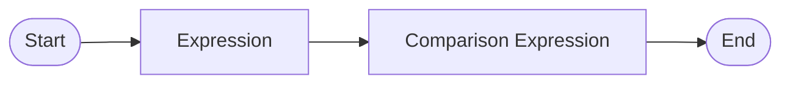

#### Comparison Expression

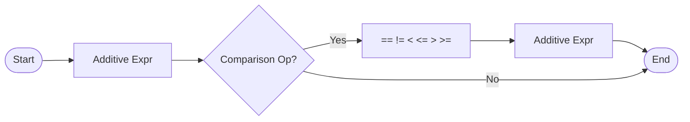

#### Additive Expression

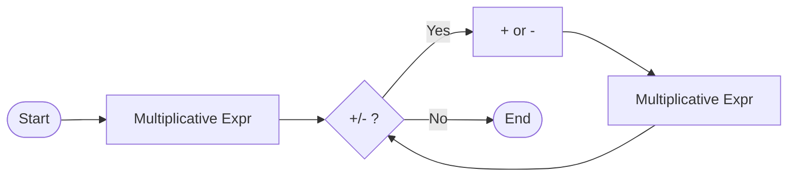

#### Application Expression

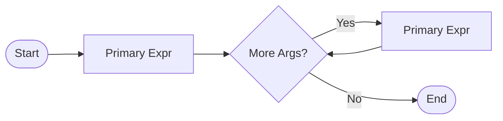

#### Primary Expression

```mermaid
graph LR
    Start([Start]) --> Choice{Expression Type}
    Choice -->|Atom| Atom[Integer/Bool/Var/'(' expr ')']
    Choice -->|Let| Let["let x = e1 in e2"]
    Choice -->|If| If["if e1 then e2 else e3"]
    Choice -->|Fun| Fun["fun x -> e"]
    Atom --> End([End])
    Let --> End
    If --> End
    Fun --> End
```

### 10.2 Type Hierarchy

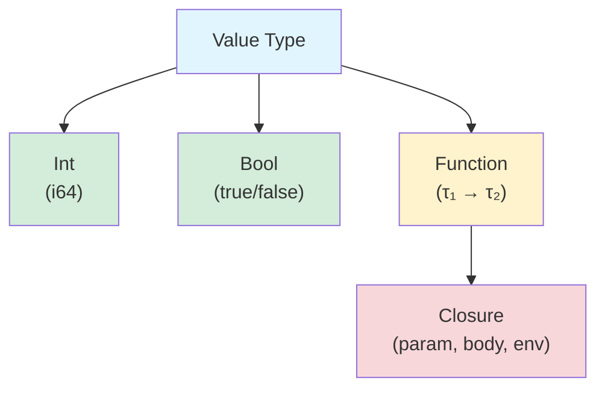

### 10.3 Scoping Visualization

#### Let Binding Scope

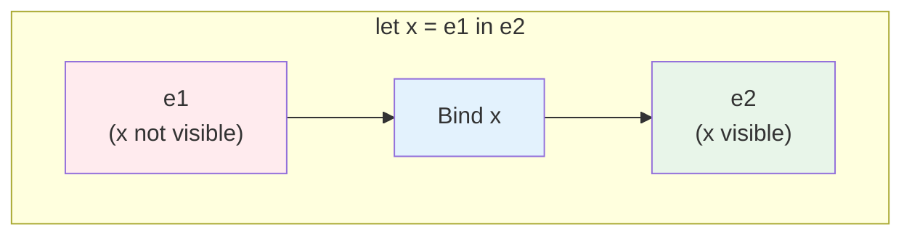

#### Function Closure Scope

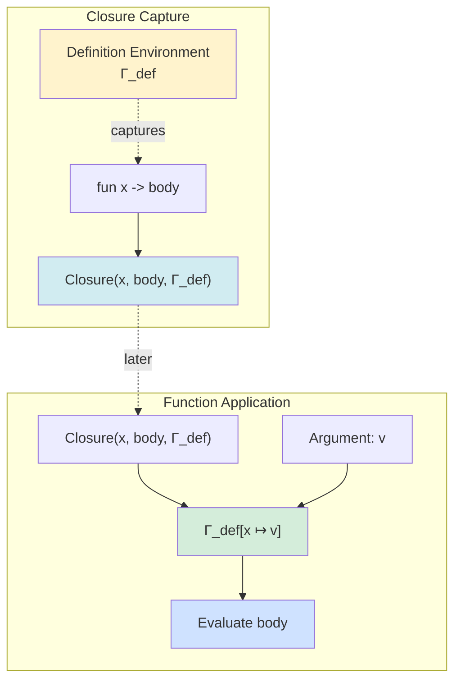

#### Shadowing Example

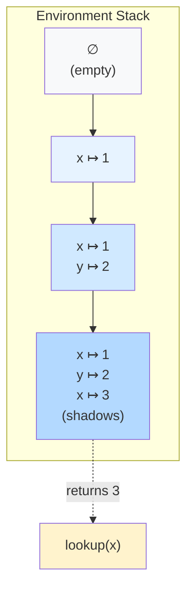

### 10.4 Evaluation Strategy

#### Call-by-Value Evaluation

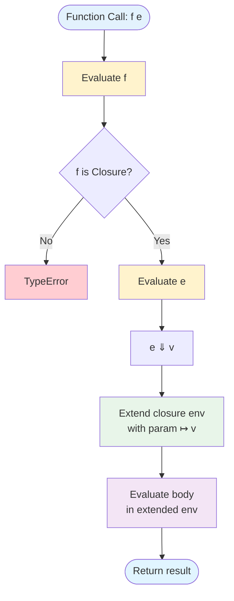

#### Conditional Evaluation (Short-Circuit)

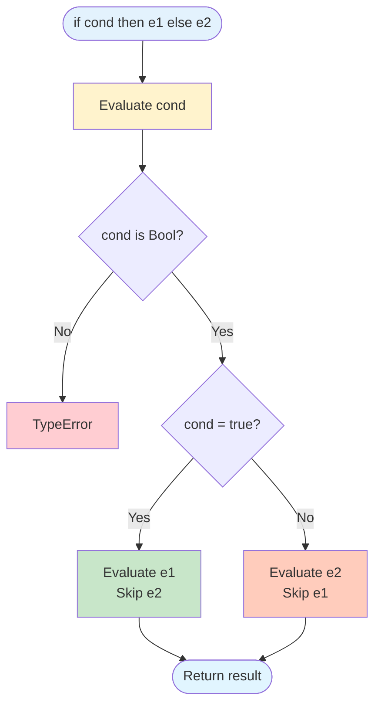

### 10.5 Operator Precedence Diagram

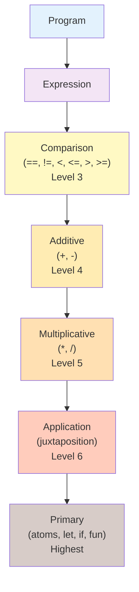

### 10.6 Complete Evaluation Flow

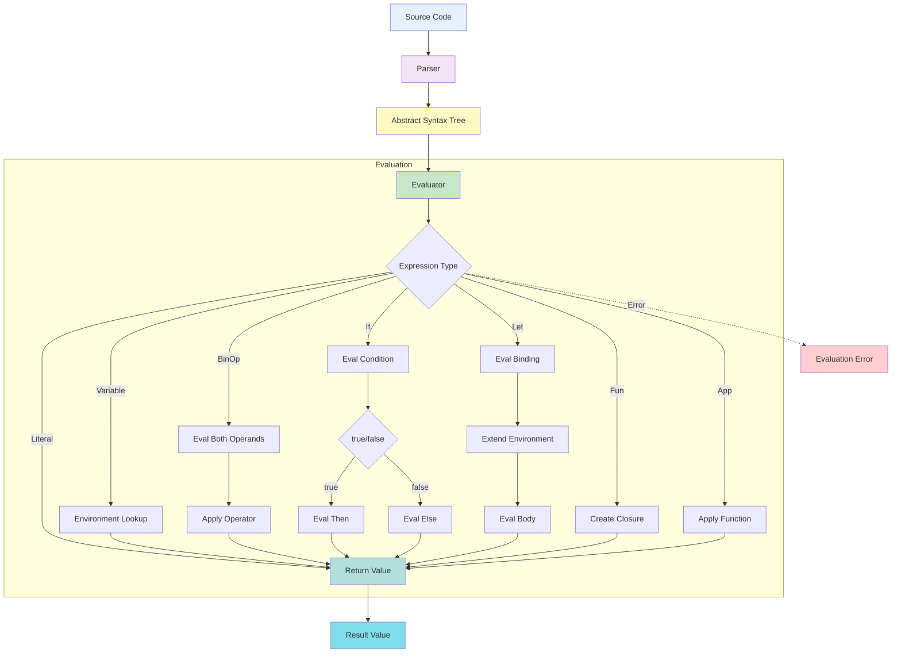

---

## Appendix A: Complete Language Examples

### A.1 Arithmetic

```parlang
# Simple arithmetic
2 + 3 * 4
# Result: 14

# Nested arithmetic
(10 + 20) * (3 - 1)
# Result: 60

# Division
100 / 4
# Result: 25

# Negative numbers
-5 + 10
# Result: 5
```

### A.2 Comparisons

```parlang
# Integer comparison
10 > 5
# Result: true

# Equality
42 == 42
# Result: true

# Compound comparison
(2 + 2 == 4) == true
# Result: true
```

### A.3 Conditionals

```parlang
# Simple conditional
if true then 1 else 2
# Result: 1

# With computation
if 10 > 5 then 100 else 0
# Result: 100

# Nested conditionals
if 5 > 3
then if 2 < 4 then 1 else 2
else 3
# Result: 1
```

### A.4 Let Bindings

```parlang
# Simple binding
let x = 42 in x
# Result: 42

# Multiple bindings
let x = 10 in
let y = 20 in
x + y
# Result: 30

# Shadowing
let x = 5 in
let x = x + 1 in
x * 2
# Result: 12
```

### A.5 Functions

```parlang
# Identity function
let id = fun x -> x in id 42
# Result: 42

# Increment function
let inc = fun x -> x + 1 in inc 41
# Result: 42

# Higher-order function
let twice = fun f -> fun x -> f (f x) in
let inc = fun x -> x + 1 in
twice inc 10
# Result: 12
```

### A.6 Closures

```parlang
# Capturing environment
let x = 10 in
let f = fun y -> x + y in
f 5
# Result: 15

# Closure with shadowing
let x = 5 in
let f = fun y -> x + y in
let x = 10 in
f 3
# Result: 8 (uses captured x = 5)
```

### A.7 Currying

```parlang
# Curried addition
let add = fun x -> fun y -> x + y in
let add5 = add 5 in
add5 10
# Result: 15

# Curried multiplication
let mul = fun x -> fun y -> x * y in
let double = mul 2 in
let quadruple = fun x -> double (double x) in
quadruple 5
# Result: 20
```

### A.8 Complex Examples

```parlang
# Factorial (using recursion emulation would require Y combinator)
# Not directly supported in ParLang 1.0

# Absolute value
let abs = fun x ->
  if x < 0 then -x else x
in abs (-5)
# Result: 5

# Maximum of two numbers
let max = fun x -> fun y ->
  if x > y then x else y
in max 10 20
# Result: 20

# Conditional function selection
let sign = fun x ->
  if x > 0 then 1
  else if x < 0 then -1
  else 0
in sign (-42)
# Result: -1
```

---

## Appendix B: Error Reference

### B.1 Parse Errors

| Error | Cause | Example |
|-------|-------|---------|
| Unexpected token | Invalid syntax | `let x = in 5` |
| Unexpected input after expression | Extra characters | `42 abc` |
| Keyword as identifier | Using reserved word | `let let = 5 in let` |
| Incomplete expression | Missing parts | `if true then 1` |

### B.2 Runtime Errors

| Error | Type | Cause | Example |
|-------|------|-------|---------|
| UnboundVariable(x) | `EvalError` | Variable not in scope | `x + 1` (no binding) |
| TypeError(msg) | `EvalError` | Type mismatch | `true + 5` |
| DivisionByZero | `EvalError` | Divide by zero | `10 / 0` |

### B.3 Type Errors

| Operation | Expected | Actual | Error |
|-----------|----------|--------|-------|
| Arithmetic | Int, Int | Bool, Int | "Type error in binary operation" |
| Comparison | Int, Int or Bool, Bool | Int, Bool | "Type error in binary operation" |
| If condition | Bool | Int | "If condition must be a boolean" |
| Application | Function | Int or Bool | "Application requires a function" |

---

## Appendix C: Implementation Notes

### C.1 Parser Implementation

- Uses **parser combinators** (`combine` crate in Rust)
- **Top-down recursive descent** parsing
- Operator precedence via **stratified grammar**
- No separate lexer (combines tokenization with parsing)

### C.2 Evaluator Implementation

- **Tree-walking interpreter** (direct AST interpretation)
- **Big-step operational semantics**
- Environment represented as `HashMap<String, Value>`
- Immutable environment updates via cloning
- No optimization (naive evaluation)

### C.3 Performance Characteristics

| Operation | Complexity | Notes |
|-----------|-----------|-------|
| Parsing | O(n) | n = source length |
| Variable lookup | O(d) | d = environment depth |
| Function application | O(1) | Plus body evaluation |
| Binary operation | O(1) | Plus operand evaluation |
| Environment extend | O(e) | e = environment size (cloning) |

### C.4 Limitations

- **No tail call optimization**: Deep recursion causes stack overflow
- **No garbage collection**: (Rust manages memory)
- **No memoization**: Repeated computations not cached
- **No parallel execution**: Sequential interpreter only
- **No type inference**: All typing is dynamic

---

## Appendix D: Comparison with Similar Languages

| Feature | ParLang | ML | Scheme | Haskell |
|---------|---------|----|---------| --------|
| Typing | Dynamic | Static | Dynamic | Static |
| Evaluation | Eager | Eager | Eager | Lazy |
| Recursion | Manual (Y-combinator) | Built-in `let rec` | Built-in | Built-in |
| Pattern matching | No | Yes | Limited | Yes |
| Type inference | No | Yes | No | Yes |
| Modules | No | Yes | Yes | Yes |
| Syntax | Minimal | Rich | S-expressions | Indentation |

---

## Appendix E: Grammar Summary

### E.1 Complete EBNF

```ebnf
program         ::= expr

expr            ::= cmp_expr

cmp_expr        ::= add_expr ( cmp_op add_expr )?

add_expr        ::= mul_expr ( ('+' | '-') mul_expr )*

mul_expr        ::= app_expr ( ('*' | '/') app_expr )*

app_expr        ::= primary_expr+

primary_expr    ::= atom | let_expr | if_expr | fun_expr

atom            ::= integer | boolean | identifier | '(' expr ')'

let_expr        ::= 'let' identifier '=' expr 'in' expr

if_expr         ::= 'if' expr 'then' expr 'else' expr

fun_expr        ::= 'fun' identifier '->' expr

cmp_op          ::= '==' | '!=' | '<=' | '>=' | '<' | '>'

integer         ::= '-'? digit+

boolean         ::= 'true' | 'false'

identifier      ::= letter ( letter | digit | '_' )*

letter          ::= [a-zA-Z]

digit           ::= [0-9]
```

### E.2 Operator Tokens

```
Delimiters:  ( ) =
Keywords:    let in if then else fun true false
Arrows:      ->
Arithmetic:  + - * /
Comparison:  == != < <= > >=
```

---

## Appendix F: References

### F.1 Theoretical Background

- **Pierce, Benjamin C.** *Types and Programming Languages*. MIT Press, 2002.
  - Chapter 3: Untyped Arithmetic Expressions
  - Chapter 5: The Untyped Lambda Calculus
  - Chapter 7: ML Implementation

- **Appel, Andrew W.** *Modern Compiler Implementation in ML*. Cambridge University Press, 1998.
  - Chapter 1: Introduction to ML
  - Chapter 5: Semantic Analysis

### F.2 Related Languages

- **OCaml**: https://ocaml.org/
- **Standard ML**: https://www.smlnj.org/
- **Scheme**: https://www.scheme.org/
- **Haskell**: https://www.haskell.org/

### F.3 Implementation References

- **Parser Combinators**: `combine` crate (https://docs.rs/combine/)
- **Rust Programming**: https://www.rust-lang.org/

---

## Revision History

| Version | Date | Changes |
|---------|------|---------|
| 1.0 | 2024 | Initial specification |

---

**End of Specification**
