# ParLang Language Specification

**Version:** 1.0  
**Last Updated:** 2026-02-13  
**Author:** ParLang Project

---

## Table of Contents

1. [Language Overview](#1-language-overview)
2. [Lexical Structure](#2-lexical-structure)
3. [Syntax in EBNF Notation](#3-syntax-in-ebnf-notation)
4. [Type System](#4-type-system)
5. [Semantics](#5-semantics)
6. [Operator Precedence and Associativity](#6-operator-precedence-and-associativity)
7. [Scoping Rules](#7-scoping-rules)
8. [Evaluation Order](#8-evaluation-order)
9. [Formal Grammar](#9-formal-grammar)
10. [Visual Specifications](#10-visual-specifications)

---

## 1. Language Overview

ParLang is a minimalist functional programming language in the ML family, featuring:

- **Pure functional semantics** with immutable bindings
- **First-class functions** with full closure support
- **Lexical scoping** with environment-based variable resolution
- **Dynamic typing** with runtime type checking
- **Expression-oriented** syntax (no statements)
- **Eager evaluation** (call-by-value semantics)

### 1.1 Design Philosophy

ParLang emphasizes simplicity and clarity:
- Single-parameter functions encourage currying
- Immutable environments ensure referential transparency
- Minimal syntax reduces cognitive overhead
- Explicit control flow without implicit coercions

### 1.2 Intended Use Cases

- Educational tool for teaching functional programming concepts
- Prototyping functional algorithms
- Exploring closure and scoping semantics
- Embedding as a configuration/scripting language

---

## 2. Lexical Structure

### 2.1 Character Set

ParLang source files are encoded in UTF-8. The language uses ASCII characters for all syntactic elements.

### 2.2 Tokens

The lexical structure consists of the following token categories:

#### 2.2.1 Keywords

Keywords are reserved identifiers with special syntactic meaning:

```
let     in      if      then    else    fun     true    false   load    rec     match   with    type
```

**Formal Definition:**
```
keyword ::= "let" | "in" | "if" | "then" | "else" | "fun" | "true" | "false" | "load" | "rec" | "match" | "with" | "type"
```

#### 2.2.2 Identifiers

Identifiers name variables and function parameters.

**Syntax Rules:**
- Must start with a letter (a-z, A-Z)
- May contain letters, digits (0-9), and underscores (_)
- Must not be a keyword
- Case-sensitive

**Formal Definition:**
```
identifier ::= letter (letter | digit | '_')*
letter     ::= 'a'..'z' | 'A'..'Z'
digit      ::= '0'..'9'
```

**Valid Examples:**
```
x
foo
myVariable
var_name
test123
camelCase
snake_case
```

**Invalid Examples:**
```
123abc      # starts with digit
let         # keyword
_private    # starts with underscore
my-var      # contains hyphen
```

#### 2.2.3 Integer Literals

Integer literals represent signed 64-bit integers.

**Syntax:**
```
integer ::= '-'? digit+
```

**Range:** -9,223,372,036,854,775,808 to 9,223,372,036,854,775,807 (i64)

**Examples:**
```
0
42
-10
1234567890
-999
```

**Note:** No support for hexadecimal, octal, binary, or floating-point literals.

#### 2.2.4 Boolean Literals

Two boolean constants:

```
boolean ::= "true" | "false"
```

#### 2.2.5 Character Literals

Character literals represent single Unicode characters enclosed in single quotes.

**Syntax:**
```
character ::= "'" (char | escape_sequence) "'"
```

**Escape Sequences:**
- `\n` - newline (U+000A)
- `\t` - tab (U+0009)
- `\r` - carriage return (U+000D)
- `\\` - backslash
- `\'` - single quote
- `\"` - double quote

**Examples:**
```parlang
'a'
'Z'
'0'
'\n'
'\t'
'世'
'🎉'
```

**Type:** All character literals have type `Char`.

#### 2.2.6 String Literals

String literals represent sequences of characters (List Char) and are enclosed in double quotes.

**Syntax:**
```
string ::= '"' (string_char | escape_sequence)* '"'
string_char ::= [^"\\]
```

**Escape Sequences:**
- `\n` - newline (U+000A)
- `\t` - tab (U+0009)
- `\r` - carriage return (U+000D)
- `\\` - backslash
- `\"` - double quote
- `\'` - single quote
- `\0` - null character (U+0000)

**Examples:**
```parlang
"hello"
"world"
""
"hello\nworld"
"tab\there"
"quote\"inside"
```

**Type:** All string literals have type `List Char`.

**Desugaring:**

String literals are syntactic sugar and desugar to `List Char` construction at parse time:

```parlang
"abc"
# Desugars to:
Cons('a', Cons('b', Cons('c', Nil)))

""
# Desugars to:
Nil
```

**Operations:**
- All list operations work on strings
- String-specific operations available in `examples/string.par`
- Pattern matching works as with any list

**Unicode Support:**
String literals support full Unicode (UTF-8 encoding).

#### 2.2.7 Operators

**Arithmetic Operators:**
```
+    Addition
-    Subtraction (binary), Negation (unary, in integer literals)
*    Multiplication
/    Integer division (truncates toward zero)
```

**Comparison Operators:**
```
==   Equality
!=   Inequality
<    Less than
<=   Less than or equal
>    Greater than
>=   Greater than or equal
```

**Function Operators:**
```
->   Function arrow (separates parameter from body)
```

#### 2.2.8 Delimiters

```
(    Left parenthesis
)    Right parenthesis
=    Assignment (in let bindings)
;    Semicolon (separates sequential let bindings)
"    String delimiter (for string literals and file paths in load expressions)
```

#### 2.2.9 Whitespace

Whitespace characters (space, tab, newline, carriage return) separate tokens but are otherwise ignored.

```
whitespace ::= ' ' | '\t' | '\n' | '\r'
```

Whitespace is **not** significant for expression structure, except to separate keywords and identifiers.

#### 2.2.8 Comments

**Current Version:** ParLang 1.0 does not support comments.

---

## 3. Syntax in EBNF Notation

### 3.1 Complete EBNF Grammar

```ebnf
(* Programs *)
program ::= (let_binding)* expression

(* Let bindings (top-level) *)
let_binding ::= "let" identifier '=' expression ';'

(* Expressions *)
expression ::= comparison_expr

comparison_expr ::= additive_expr (comparison_op additive_expr)?

additive_expr ::= multiplicative_expr (('+' | '-') multiplicative_expr)*

multiplicative_expr ::= application_expr (('*' | '/') application_expr)*

application_expr ::= projection_expr+

projection_expr ::= primary_expr ('.' digit+)*

primary_expr ::= atom
              | let_expr
              | load_expr
              | if_expr
              | match_expr
              | rec_expr
              | fun_expr
              | type_alias_expr

(* Atomic expressions *)
atom ::= integer
       | boolean
       | identifier
       | tuple_expr

tuple_expr ::= '(' ')'                                    (* empty tuple *)
             | '(' expression ')'                         (* parenthesized expr *)
             | '(' expression (',' expression)+ ')'       (* tuple with 2+ elements *)

(* Compound expressions *)
let_expr ::= "let" identifier '=' expression "in" expression

load_expr ::= "load" string_literal "in" expression

if_expr ::= "if" expression "then" expression "else" expression

match_expr ::= "match" expression "with" match_arm+

match_arm ::= '|' pattern "->" expression

pattern ::= integer
          | boolean
          | identifier
          | '_'
          | tuple_pattern

tuple_pattern ::= '(' ')'                                 (* empty tuple pattern *)
                | '(' pattern (',' pattern)* ')'          (* tuple pattern *)

rec_expr ::= "rec" identifier "->" expression

fun_expr ::= "fun" identifier "->" expression

type_alias_expr ::= "type" identifier '=' type_expr "in" expression

(* Type expressions *)
type_expr ::= type_atom ("->" type_expr)?

type_atom ::= "Int"
            | "Bool"
            | identifier                (* type alias reference *)
            | '(' type_expr ')'         (* parenthesized type *)

(* Operators *)
comparison_op ::= "==" | "!=" | "<=" | ">=" | '<' | '>'

(* Literals *)
integer ::= '-'? digit+
boolean ::= "true" | "false"
character ::= "'" (char | escape_sequence) "'"
string ::= '"' (string_char | escape_sequence)* '"'
identifier ::= letter (letter | digit | '_')*

(* Escape sequences *)
escape_sequence ::= '\\' ('n' | 't' | 'r' | '\\' | '"' | "'" | '0')

(* Character classes *)
string_char ::= [^"\\]
char ::= [^'\\]
letter ::= 'a'..'z' | 'A'..'Z'
digit ::= '0'..'9'
```

### 3.2 Expression Categories

| Category | Productions | Associativity |
|----------|-------------|---------------|
| Comparison | `==`, `!=`, `<`, `<=`, `>`, `>=` | Non-associative |
| Additive | `+`, `-` | Left |
| Multiplicative | `*`, `/` | Left |
| Application | juxtaposition | Left |
| Primary | atoms, let, if, fun | N/A |

---

## 4. Type System

### 4.1 Type Categories

ParLang employs **dynamic typing** with runtime type checking. Values have types, but variables do not have static type annotations.

#### 4.1.1 Value Types

```
τ ::= Int | Bool | (τ → τ)
```

| Type | Description | Runtime Representation |
|------|-------------|------------------------|
| `Int` | 64-bit signed integers | `Value::Int(i64)` |
| `Bool` | Boolean values | `Value::Bool(bool)` |
| `τ₁ → τ₂` | Function from τ₁ to τ₂ | `Value::Closure(param, body, env)` |

#### 4.1.2 Type Judgments

Type checking occurs at runtime. The following operations have implicit type requirements:

**Arithmetic Operations:**
```
⊢ e₁ : Int    ⊢ e₂ : Int
─────────────────────────  [T-ARITH]
⊢ e₁ op e₂ : Int

where op ∈ {+, -, *, /}
```

**Comparison Operations (Integers):**
```
⊢ e₁ : Int    ⊢ e₂ : Int
─────────────────────────  [T-CMP-INT]
⊢ e₁ op e₂ : Bool

where op ∈ {==, !=, <, <=, >, >=}
```

**Comparison Operations (Booleans):**
```
⊢ e₁ : Bool    ⊢ e₂ : Bool
───────────────────────────  [T-CMP-BOOL]
⊢ e₁ op e₂ : Bool

where op ∈ {==, !=}
```

**Conditional:**
```
⊢ e₁ : Bool    ⊢ e₂ : τ    ⊢ e₃ : τ
──────────────────────────────────────  [T-IF]
⊢ if e₁ then e₂ else e₃ : τ
```

**Function Application:**
```
⊢ e₁ : τ₁ → τ₂    ⊢ e₂ : τ₁
──────────────────────────────  [T-APP]
⊢ e₁ e₂ : τ₂
```

### 4.2 Type Errors

Type mismatches are detected at runtime and raise `TypeError` exceptions:

| Operation | Required Types | Error Example |
|-----------|---------------|---------------|
| Arithmetic | Both Int | `true + 5` |
| Comparison | Both Int or both Bool | `5 < true` |
| If condition | Bool | `if 5 then 1 else 2` |
| Application | Function | `42 100` |
| Division by zero | Denominator ≠ 0 | `10 / 0` |

### 4.3 Type Inference

ParLang does not perform static type inference. All type checking is **dynamic** (runtime).

---

## 5. Semantics

### 5.1 Evaluation Model

ParLang uses **big-step operational semantics** (natural semantics) with an environment-based interpreter.

#### 5.1.1 Runtime Values

```rust
Value ::= Int(i64)
        | Bool(bool)
        | Closure(param: String, body: Expr, env: Environment)
        | RecClosure(name: String, param: String, body: Expr, env: Environment)
```

#### 5.1.2 Environments

An environment Γ is a finite mapping from identifiers to values:

```
Γ ::= ∅                          (empty environment)
    | Γ[x ↦ v]                   (extended environment)
```

**Operations:**
- `lookup(Γ, x)` → `v` if `x ↦ v ∈ Γ`, else error
- `extend(Γ, x, v)` → `Γ' = Γ[x ↦ v]` (shadowing if x exists)

### 5.2 Evaluation Rules

The judgment `Γ ⊢ e ⇓ v` means "expression e evaluates to value v in environment Γ".

#### 5.2.1 Literals

```
────────────────  [E-INT]
Γ ⊢ n ⇓ Int(n)

────────────────  [E-BOOL]
Γ ⊢ b ⇓ Bool(b)
```

**Example:**
```
∅ ⊢ 42 ⇓ Int(42)
∅ ⊢ true ⇓ Bool(true)
```

#### 5.2.2 Variables

```
x ↦ v ∈ Γ
─────────  [E-VAR]
Γ ⊢ x ⇓ v
```

**Example:**
```
[x ↦ Int(10)] ⊢ x ⇓ Int(10)
```

**Error Case:**
If `x ∉ Γ`, evaluation raises `UnboundVariable(x)`.

#### 5.2.3 Binary Operations

```
Γ ⊢ e₁ ⇓ v₁    Γ ⊢ e₂ ⇓ v₂    v₁ ⊕ v₂ = v
──────────────────────────────────────────  [E-BINOP]
Γ ⊢ e₁ op e₂ ⇓ v
```

**Arithmetic Operations:**
- `Int(a) + Int(b) = Int(a + b)`
- `Int(a) - Int(b) = Int(a - b)`
- `Int(a) * Int(b) = Int(a * b)`
- `Int(a) / Int(b) = Int(a / b)` if `b ≠ 0`, else `DivisionByZero`

**Comparison Operations:**
- `Int(a) == Int(b) = Bool(a == b)`
- `Int(a) < Int(b) = Bool(a < b)`
- Similar for `!=`, `<=`, `>`, `>=`
- `Bool(a) == Bool(b) = Bool(a == b)`
- `Bool(a) != Bool(b) = Bool(a != b)`

**Example:**
```
∅ ⊢ 3 + 4 ⇓ Int(7)
∅ ⊢ 10 > 5 ⇓ Bool(true)
```

#### 5.2.4 Conditionals

```
Γ ⊢ e₁ ⇓ Bool(true)    Γ ⊢ e₂ ⇓ v
──────────────────────────────────  [E-IF-TRUE]
Γ ⊢ if e₁ then e₂ else e₃ ⇓ v

Γ ⊢ e₁ ⇓ Bool(false)    Γ ⊢ e₃ ⇓ v
───────────────────────────────────  [E-IF-FALSE]
Γ ⊢ if e₁ then e₂ else e₃ ⇓ v
```

**Properties:**
- Both branches must be present (no dangling else)
- Condition must evaluate to a boolean
- Only the taken branch is evaluated (short-circuit)

**Example:**
```
∅ ⊢ if 5 > 3 then 100 else 0 ⇓ Int(100)
∅ ⊢ if false then 1 else 2 ⇓ Int(2)
```

#### 5.2.5 Pattern Matching

Pattern matching provides structured branching based on value inspection. Patterns are matched sequentially from top to bottom.

```
Γ ⊢ e ⇓ v    match(p₁, v) = Some(Γ')    Γ' ⊢ e₁ ⇓ v₁
─────────────────────────────────────────────────────  [E-MATCH-FIRST]
Γ ⊢ match e with | p₁ -> e₁ | ... ⇓ v₁

Γ ⊢ e ⇓ v    match(p₁, v) = None    
Γ ⊢ match e with | p₂ -> e₂ | ... ⇓ v'
──────────────────────────────────────────────────  [E-MATCH-NEXT]
Γ ⊢ match e with | p₁ -> e₁ | p₂ -> e₂ | ... ⇓ v'
```

**Pattern Matching Rules:**

```
match(n, Int(n)) = Some(Γ)                    [MATCH-INT-LIT]

match(b, Bool(b)) = Some(Γ)                   [MATCH-BOOL-LIT]

match(x, v) = Some(Γ[x ↦ v])                  [MATCH-VAR]

match(_, v) = Some(Γ)                         [MATCH-WILDCARD]
```

**Properties:**
- Patterns are tried in order from top to bottom
- First matching pattern determines the result
- Variable patterns bind the matched value to a name
- Wildcard pattern `_` matches any value without binding
- Literal patterns match exact values (integers and booleans)
- If no pattern matches, a runtime error occurs

**Examples:**
```
∅ ⊢ match 0 with | 0 -> 1 | n -> n ⇓ Int(1)
∅ ⊢ match 42 with | 0 -> 1 | n -> n ⇓ Int(42)
∅ ⊢ match true with | true -> 1 | false -> 0 ⇓ Int(1)
∅ ⊢ match 5 with | 0 -> 10 | _ -> 20 ⇓ Int(20)
```

#### 5.2.6 Let Bindings

```
Γ ⊢ e₁ ⇓ v₁    Γ[x ↦ v₁] ⊢ e₂ ⇓ v₂
────────────────────────────────────  [E-LET]
Γ ⊢ let x = e₁ in e₂ ⇓ v₂
```

**Semantics:**
1. Evaluate the value expression `e₁` in the current environment
2. Extend the environment with the binding `x ↦ v₁`
3. Evaluate the body `e₂` in the extended environment
4. Return the result of `e₂`

**Scoping:** The binding `x` is visible only in `e₂`, not in `e₁`.

**Example:**
```
∅ ⊢ let x = 10 in x + 5 ⇓ Int(15)

∅ ⊢ let x = 3 in let y = 4 in x + y ⇓ Int(7)

∅ ⊢ let x = 5 in let x = 10 in x ⇓ Int(10)  (shadowing)
```

#### 5.2.7 Sequential Let Bindings

```
Γ ⊢ e₁ ⇓ v₁    Γ[x₁ ↦ v₁] ⊢ e₂ ⇓ v₂    ...    Γ[x₁ ↦ v₁, ..., xₙ ↦ vₙ] ⊢ e ⇓ v
──────────────────────────────────────────────────────────────────────────────  [E-SEQ]
Γ ⊢ let x₁ = e₁; ...; let xₙ = eₙ; e ⇓ v
```

**Semantics:**
1. Evaluate each binding expression in sequence
2. Extend the environment with each binding before evaluating the next
3. Each binding can reference previous bindings
4. Evaluate the final expression in the fully extended environment

**Syntax:**
```parlang
let x = 10;
let y = x + 5;
x * y
```

**Example:**
```
∅ ⊢ let x = 10; let y = x + 5; y ⇓ Int(15)

∅ ⊢ let double = fun x -> x * 2; double 21 ⇓ Int(42)
```

**Note:** This is syntactic sugar for nested let-in expressions but with cleaner syntax when defining multiple bindings at the program level.

#### 5.2.7.1 Type Aliases

```
Γ ⊢ e ⇓ v
────────────────────────────────────  [E-TYPE-ALIAS]
Γ ⊢ type T = τ in e ⇓ v
```

**Semantics:**
1. Type aliases are transparent at runtime - they don't affect evaluation
2. The type `τ` is recorded for type checking purposes only
3. The body expression `e` is evaluated in the current environment
4. Type aliases have **no runtime overhead** - they are purely a type-level construct

**Scoping:** The type alias `T` is visible only in the expression `e`.

**Example:**
```
∅ ⊢ type MyInt = Int in 42 ⇓ Int(42)

∅ ⊢ type IntFunc = Int -> Int in fun x -> x + 1 ⇓ Closure(...)

∅ ⊢ type A = Int in type B = Bool in 10 ⇓ Int(10)
```

**Type-Level Behavior:**
While type aliases don't affect runtime evaluation, they are used during type checking:
- `type MyInt = Int` defines `MyInt` as an alias for `Int`
- References to `MyInt` in type expressions resolve to `Int`
- Type aliases can be nested and shadowed like let bindings

**Transparency:**
```parlang
# These two expressions are semantically identical:
42                          # evaluates to Int(42)
type MyInt = Int in 42      # evaluates to Int(42)

# The type alias is stripped during evaluation
```

#### 5.2.8 Function Definition

```
──────────────────────────────────────  [E-FUN]
Γ ⊢ fun x -> e ⇓ Closure(x, e, Γ)
```

**Semantics:**
- Creating a function captures the **current environment** Γ
- The function body is not evaluated until application
- Closures enable lexical scoping

**Example:**
```
∅ ⊢ fun x -> x + 1 ⇓ Closure(x, x + 1, ∅)

[y ↦ Int(5)] ⊢ fun x -> x + y ⇓ Closure(x, x + y, [y ↦ Int(5)])
```

#### 5.2.9 Function Application

```
Γ ⊢ e₁ ⇓ Closure(x, body, Γ')    Γ ⊢ e₂ ⇓ v₂    Γ'[x ↦ v₂] ⊢ body ⇓ v
─────────────────────────────────────────────────────────────────────────  [E-APP]
Γ ⊢ e₁ e₂ ⇓ v
```

**Semantics:**
1. Evaluate the function expression `e₁` to get a closure
2. Evaluate the argument expression `e₂` to get a value `v₂`
3. Extend the closure's captured environment with `x ↦ v₂`
4. Evaluate the function body in this extended environment
5. Return the result

**Key Properties:**
- **Call-by-value**: Arguments are fully evaluated before substitution
- **Lexical scoping**: Function body evaluates in the closure's environment, not the caller's

**Example:**
```
∅ ⊢ (fun x -> x + 1) 41 ⇓ Int(42)

∅ ⊢ let f = fun x -> x * 2 in f 21 ⇓ Int(42)

∅ ⊢ (fun x -> fun y -> x + y) 3 4 ⇓ Int(7)  (currying)
```

#### 5.2.10 Recursive Functions

```
body = fun param -> expr
──────────────────────────────────────────────────  [E-REC]
Γ ⊢ rec name -> body ⇓ RecClosure(name, param, expr, Γ)
```

**Semantics:**
- A `rec` expression creates a **recursive closure** that can reference itself
- The body of a `rec` expression must be a function definition
- The recursive function name is bound in its own body, enabling self-reference
- Tail call optimization is applied to prevent stack overflow for tail-recursive functions

**Runtime Value:**
```rust
RecClosure(name: String, param: String, body: Expr, env: Environment)
```

**Application of Recursive Closures:**
```
Γ ⊢ e₁ ⇓ RecClosure(name, param, body, Γ')
Γ ⊢ e₂ ⇓ v₂
Γ''  = Γ'[name ↦ RecClosure(name, param, body, Γ')]
Γ''' = Γ''[param ↦ v₂]
eval_with_tco(body, Γ''', name, param, Γ') ⇓ v
───────────────────────────────────────────────────────  [E-APP-REC]
Γ ⊢ e₁ e₂ ⇓ v
```

**Tail Call Optimization:**
When the function body is a direct tail call to itself (i.e., the last operation is a call to the recursive function), the evaluator uses iteration instead of recursion to prevent stack overflow.

**Example:**
```
∅ ⊢ rec factorial -> fun n -> if n == 0 then 1 else n * factorial (n - 1)
  ⇓ RecClosure(factorial, n, if n == 0 then 1 else n * factorial (n - 1), ∅)

∅ ⊢ (rec factorial -> fun n -> if n == 0 then 1 else n * factorial (n - 1)) 5
  ⇓ Int(120)

# Tail-recursive sum with accumulator
∅ ⊢ (rec sum -> fun acc -> fun n -> if n == 0 then acc else sum (acc + n) (n - 1)) 0 100
  ⇓ Int(5050)
```

**Properties:**
- **Self-reference**: The function can call itself by name
- **TCO for direct tail calls**: Prevents stack overflow for tail-recursive patterns
- **Currying support**: Recursive functions can be curried like regular functions
- **Lexical scoping**: Recursive closures capture their definition environment

#### 5.2.11 Load Expression

```
file_contents(filepath) = source
parse(source) = lib_expr
∅ ⊢ lib_expr ⇓ _
extract_bindings(lib_expr) = Γ_lib
Γ ∪ Γ_lib ⊢ e ⇓ v
──────────────────────────────────────  [E-LOAD]
Γ ⊢ load filepath in e ⇓ v
```

**Semantics:**
1. Read the file contents from `filepath`
2. Parse the contents as a ParLang expression
3. Extract bindings from the library by walking nested `let` and `load` expressions
4. Merge the library bindings with the current environment
5. Evaluate the body expression `e` in the extended environment
6. Return the result

**Library File Structure:**
Library files should be structured as nested `let` expressions to export multiple bindings:
```parlang
let func1 = fun x -> x * 2
in let func2 = fun x -> x + 1
in 0
```

**Binding Extraction:**
The `extract_bindings` function recursively walks the AST:
- For `Let(name, value, body)`: Evaluate `value`, bind to `name`, continue with `body`
- For `Load(path, body)`: Load and extract bindings from file, continue with `body`
- For any other expression: Stop extraction and return accumulated bindings

**Properties:**
- **Referential transparency**: Same file always produces same bindings
- **Nested loads**: Libraries can load other libraries
- **Environment extension**: Library bindings extend (not replace) the current environment
- **File paths**: Relative paths resolved from current working directory

**Example:**
```
# File: lib.par
# let double = fun x -> x * 2 in 0

∅ ⊢ load "lib.par" in double 21 ⇓ Int(42)
```

**Error Cases:**
- File not found: `LoadError("Failed to read file...")`
- Parse error: `LoadError("Failed to parse file...")`

### 5.3 Semantic Examples

#### 5.3.1 Simple Arithmetic

```parlang
3 + 4 * 5
```

**Evaluation:**
```
∅ ⊢ 4 ⇓ Int(4)
∅ ⊢ 5 ⇓ Int(5)
∅ ⊢ 4 * 5 ⇓ Int(20)
∅ ⊢ 3 ⇓ Int(3)
∅ ⊢ 3 + 20 ⇓ Int(23)
```

**Result:** `23`

#### 5.3.2 Conditional Expression

```parlang
if 10 > 5 then 1 else 0
```

**Evaluation:**
```
∅ ⊢ 10 ⇓ Int(10)
∅ ⊢ 5 ⇓ Int(5)
∅ ⊢ 10 > 5 ⇓ Bool(true)
∅ ⊢ 1 ⇓ Int(1)
∅ ⊢ if Bool(true) then 1 else 0 ⇓ Int(1)
```

**Result:** `1`

#### 5.3.3 Let Binding with Shadowing

```parlang
let x = 5 in let x = x + 1 in x * 2
```

**Evaluation:**
```
∅ ⊢ 5 ⇓ Int(5)
Γ₁ = [x ↦ Int(5)]
Γ₁ ⊢ x ⇓ Int(5)
Γ₁ ⊢ 1 ⇓ Int(1)
Γ₁ ⊢ x + 1 ⇓ Int(6)
Γ₂ = [x ↦ Int(6)]
Γ₂ ⊢ x ⇓ Int(6)
Γ₂ ⊢ 2 ⇓ Int(2)
Γ₂ ⊢ x * 2 ⇓ Int(12)
```

**Result:** `12`

#### 5.3.4 Function with Closure

```parlang
let y = 10 in let f = fun x -> x + y in let y = 20 in f 5
```

**Evaluation:**
```
∅ ⊢ 10 ⇓ Int(10)
Γ₁ = [y ↦ Int(10)]
Γ₁ ⊢ fun x -> x + y ⇓ Closure(x, x + y, Γ₁)
Γ₂ = [y ↦ Int(10), f ↦ Closure(x, x + y, Γ₁)]
Γ₂ ⊢ 20 ⇓ Int(20)
Γ₃ = [y ↦ Int(20), f ↦ Closure(x, x + y, Γ₁)]
Γ₃ ⊢ f ⇓ Closure(x, x + y, Γ₁)
Γ₃ ⊢ 5 ⇓ Int(5)
Γ₄ = Γ₁[x ↦ Int(5)] = [y ↦ Int(10), x ↦ Int(5)]
Γ₄ ⊢ x + y ⇓ Int(15)
```

**Result:** `15` (uses `y = 10` from closure, not `y = 20` from caller)

#### 5.3.5 Currying

```parlang
let add = fun x -> fun y -> x + y in let add5 = add 5 in add5 10
```

**Evaluation:**
```
∅ ⊢ fun x -> fun y -> x + y ⇓ Closure(x, fun y -> x + y, ∅)
Γ₁ = [add ↦ Closure(x, fun y -> x + y, ∅)]
Γ₁ ⊢ add 5 ⇓ Closure(y, x + y, [x ↦ Int(5)])
Γ₂ = [add ↦ ..., add5 ↦ Closure(y, x + y, [x ↦ Int(5)])]
Γ₂ ⊢ add5 10 ⇓ Int(15)
```

**Result:** `15`

#### 5.3.6 Tuples

**Tuple Construction:**

```parlang
(1, 2, 3)
```

**Evaluation:**
```
∅ ⊢ 1 ⇓ Int(1)
∅ ⊢ 2 ⇓ Int(2)
∅ ⊢ 3 ⇓ Int(3)
────────────────────────────────
∅ ⊢ (1, 2, 3) ⇓ Tuple([Int(1), Int(2), Int(3)])
```

**Result:** `(1, 2, 3)`

**Tuple Projection:**

```parlang
(10, 20).0
```

**Evaluation:**
```
∅ ⊢ (10, 20) ⇓ Tuple([Int(10), Int(20)])
0 < 2 (bounds check)
───────────────────────────────────────
∅ ⊢ (10, 20).0 ⇓ Int(10)
```

**Result:** `10`

**Chained Projection:**

```parlang
((1, 2), (3, 4)).0.1
```

**Evaluation:**
```
∅ ⊢ ((1, 2), (3, 4)) ⇓ Tuple([Tuple([Int(1), Int(2)]), Tuple([Int(3), Int(4)])])
∅ ⊢ ((1, 2), (3, 4)).0 ⇓ Tuple([Int(1), Int(2)])
∅ ⊢ ((1, 2), (3, 4)).0.1 ⇓ Int(2)
```

**Result:** `2`

**Tuple Pattern Matching:**

```parlang
match (10, 20) with
| (0, 0) -> 0
| (x, y) -> x + y
```

**Evaluation:**
```
∅ ⊢ (10, 20) ⇓ Tuple([Int(10), Int(20)])
Pattern (0, 0) does not match Tuple([Int(10), Int(20)])
Pattern (x, y) matches: Γ₁ = [x ↦ Int(10), y ↦ Int(20)]
Γ₁ ⊢ x + y ⇓ Int(30)
──────────────────────────────────────────
∅ ⊢ match (10, 20) with ... ⇓ Int(30)
```

**Result:** `30`

### 5.4 Tuple Evaluation Rules

#### 5.4.1 Tuple Construction

```
Γ ⊢ e₁ ⇓ v₁    Γ ⊢ e₂ ⇓ v₂    ...    Γ ⊢ eₙ ⇓ vₙ
───────────────────────────────────────────────  [E-TUPLE]
Γ ⊢ (e₁, e₂, ..., eₙ) ⇓ Tuple([v₁, v₂, ..., vₙ])
```

**Empty Tuple:**
```
─────────────────  [E-TUPLE-EMPTY]
Γ ⊢ () ⇓ Tuple([])
```

#### 5.4.2 Tuple Projection

```
Γ ⊢ e ⇓ Tuple([v₀, v₁, ..., vₙ])    i < n
──────────────────────────────────────────  [E-PROJ]
Γ ⊢ e.i ⇓ vᵢ
```

**Error Cases:**
- If `e` does not evaluate to a tuple: `TypeError("Tuple projection requires a tuple")`
- If `i >= n`: `IndexOutOfBounds("Tuple index i out of bounds for tuple of size n")`

#### 5.4.3 Tuple Pattern Matching

```
Γ ⊢ e ⇓ Tuple([v₁, v₂, ..., vₙ])
match_pattern((p₁, p₂, ..., pₙ), Tuple([v₁, v₂, ..., vₙ]), Γ) = Γ'
Γ' ⊢ e_result ⇓ v
───────────────────────────────────────────────────────────────  [E-MATCH-TUPLE]
Γ ⊢ match e with | (p₁, p₂, ..., pₙ) -> e_result ⇓ v
```

**Pattern Matching Algorithm:**
```
match_pattern((p₁, ..., pₙ), Tuple([v₁, ..., vₙ]), Γ):
  1. Check length: n_patterns == n_values, else fail
  2. For each (pᵢ, vᵢ):
     - If pᵢ is literal: check vᵢ == pᵢ, else fail
     - If pᵢ is variable x: extend Γ with x ↦ vᵢ
     - If pᵢ is wildcard _: continue
     - If pᵢ is tuple pattern: recurse
  3. Return extended environment Γ'
```

---

## 6. Operator Precedence and Associativity

### 6.1 Precedence Table

Operators are listed from **highest** to **lowest** precedence:

| Level | Operators | Associativity | Description |
|-------|-----------|---------------|-------------|
| 7 | `.` (tuple projection) | Left | `t.0.1` = `(t.0).1` |
| 6 | Function application (juxtaposition) | Left | `f x y` = `(f x) y` |
| 5 | `*` `/` | Left | Multiplicative |
| 4 | `+` `-` | Left | Additive |
| 3 | `==` `!=` `<` `<=` `>` `>=` | Non-associative | Comparison |
| 2 | `fun` `->` | Right | Function abstraction |
| 1 | `if` `then` `else` | N/A | Conditional |
| 0 | `let` `=` `in` | N/A | Let binding |

### 6.2 Associativity Rules

#### 6.2.1 Left Associative

Binary operators at the same precedence level associate left-to-right:

```parlang
a + b + c     ≡  (a + b) + c
a * b * c     ≡  (a * b) * c
t.0.1         ≡  (t.0).1
f x y         ≡  (f x) y
```

#### 6.2.2 Non-Associative

Comparison operators do not chain:

```parlang
a < b < c     ≡  parse error
a == b == c   ≡  parse error
```

To compare multiple values, use explicit conjunctions:

```parlang
(a < b) == (b < c)
```

#### 6.2.3 Right Associative

Function arrows associate right-to-left:

```parlang
fun x -> fun y -> x + y   ≡  fun x -> (fun y -> x + y)
```

### 6.3 Precedence Examples

#### Example 1: Arithmetic and Application

```parlang
f x + 1
```

**Parsed as:** `(f x) + 1`  
**Not:** `f (x + 1)`

Application binds tighter than addition.

#### Example 2: Multiplication and Addition

```parlang
2 + 3 * 4
```

**Parsed as:** `2 + (3 * 4)`  
**Result:** `14`

#### Example 3: Application is Left-Associative

```parlang
f x y
```

**Parsed as:** `(f x) y`

This enables currying: if `f` returns a function, it's applied to `y`.

#### Example 4: Comparison and Arithmetic

```parlang
x + 1 > y * 2
```

**Parsed as:** `(x + 1) > (y * 2)`

Arithmetic has higher precedence than comparison.

#### Example 5: Let and If

```parlang
let x = 5 in if x > 0 then x else 0
```

**Parsed as:** `let x = 5 in (if x > 0 then x else 0)`

Let binding has the lowest precedence.

---

## 7. Scoping Rules

### 7.1 Lexical Scoping

ParLang uses **lexical scoping** (also called static scoping):

- Variable references resolve to the **nearest enclosing** binding in the source code
- Function closures capture their **definition environment**, not call environment

### 7.2 Binding Visibility

#### 7.2.1 Let Bindings

The scope of a variable bound by `let x = e₁ in e₂` is:

- **Visible in:** `e₂` (the body)
- **Not visible in:** `e₁` (the value expression)

**Example:**
```parlang
let x = x + 1 in x   # Error: x not in scope in RHS
```

To reference a previous binding, shadow explicitly:
```parlang
let x = 5 in let x = x + 1 in x   # OK: inner x shadows outer
```

#### 7.2.2 Function Parameters

The parameter `x` in `fun x -> e` is:

- **Visible in:** `e` (the function body)
- **Shadows** any outer binding of `x`

**Example:**
```parlang
let x = 10 in fun x -> x + 1   # Inner x shadows outer x
```

### 7.3 Shadowing

Inner bindings **shadow** (hide) outer bindings of the same name:

```parlang
let x = 1 in
  let x = 2 in
    let x = 3 in
      x   # Refers to the innermost x (3)
```

**Formal Rule:** In environment `Γ[x ↦ v₁][x ↦ v₂]`, lookup of `x` returns `v₂`.

### 7.4 Closure Capture

Functions capture their **lexical environment** at definition time:

```parlang
let x = 10 in
  let f = fun y -> x + y in
    let x = 20 in
      f 5   # Returns 15, not 25
```

**Explanation:**
- `f` is defined when `x = 10`
- `f` captures the environment `[x ↦ 10]`
- When called, `f` uses its captured environment
- The later binding `x = 20` does not affect `f`

### 7.5 Scope Diagrams

#### Example: Nested Let Bindings

```parlang
let a = 1 in
  let b = a + 1 in
    let c = b + 1 in
      a + b + c
```

**Scope nesting:**
```
┌─ a = 1
│  ┌─ b = 2 (uses a)
│  │  ┌─ c = 3 (uses b)
│  │  │  Result: 1 + 2 + 3 = 6
│  │  └─
│  └─
└─
```

#### Example: Function Closure

```parlang
let x = 5 in
  let f = fun y -> x + y in
    let x = 10 in
      f 3
```

**Scope analysis:**
```
┌─ x = 5
│  ┌─ f = Closure(y, x + y, [x ↦ 5])  ← Captures x = 5
│  │  ┌─ x = 10  ← New binding, doesn't affect f
│  │  │  f 3 → evaluates in [x ↦ 5, y ↦ 3]
│  │  │  Result: 5 + 3 = 8
│  │  └─
│  └─
└─
```

---

## 8. Evaluation Order

### 8.1 Evaluation Strategy

ParLang uses **eager evaluation** (also called **strict evaluation** or **call-by-value**):

- Expressions are evaluated as soon as they are bound
- Arguments to functions are fully evaluated before the function is applied
- Subexpressions are evaluated before their containing expressions

### 8.2 Order of Evaluation

#### 8.2.1 Binary Operations

For `e₁ op e₂`:

1. Evaluate `e₁` to `v₁`
2. Evaluate `e₂` to `v₂`
3. Apply operator to `v₁` and `v₂`

**Example:**
```parlang
(print 1) + (print 2)   # If print existed, would print 1, then 2
```

#### 8.2.2 Function Application

For `e₁ e₂`:

1. Evaluate `e₁` to a closure
2. Evaluate `e₂` to `v`
3. Apply closure to `v`

**Example:**
```parlang
let f = fun x -> x + 1 in f (3 + 4)
```

**Evaluation order:**
1. Evaluate `fun x -> x + 1` → `Closure(...)`
2. Bind `f`
3. Evaluate `f` → `Closure(...)`
4. Evaluate `3 + 4` → `Int(7)`  ← Argument evaluated before application
5. Apply closure to `Int(7)`
6. Evaluate `x + 1` in `[x ↦ 7]` → `Int(8)`

#### 8.2.3 Conditionals (Short-Circuit)

For `if e₁ then e₂ else e₃`:

1. Evaluate `e₁` to `v₁`
2. If `v₁` is `true`, evaluate `e₂` (skip `e₃`)
3. If `v₁` is `false`, evaluate `e₃` (skip `e₂`)

**Example:**
```parlang
if true then 1 else (1 / 0)   # OK: else branch not evaluated
if false then (1 / 0) else 2  # OK: then branch not evaluated
```

#### 8.2.4 Let Bindings

For `let x = e₁ in e₂`:

1. Evaluate `e₁` to `v₁`
2. Bind `x` to `v₁`
3. Evaluate `e₂` in extended environment

**Example:**
```parlang
let x = 2 + 3 in x * x   # Evaluates 2 + 3 before binding x
```

### 8.3 Evaluation vs. Binding

- **Function definition** does **not** evaluate the body:
  ```parlang
  fun x -> 1 / 0   # OK: body not evaluated until application
  ```

- **Function application** evaluates the body:
  ```parlang
  (fun x -> 1 / 0) 5   # Error: DivisionByZero
  ```

### 8.4 Evaluation Termination

Evaluation **may not terminate** if:

- Infinite recursion occurs (no tail call optimization):
  ```parlang
  let rec = fun x -> rec x in rec 0   # Infinite loop (if rec were supported)
  ```

- Division by zero raises an error:
  ```parlang
  1 / 0   # EvalError::DivisionByZero
  ```

**Note:** ParLang 1.0 does not have built-in recursion. Recursive functions require fixed-point combinators.

---

## 9. Formal Grammar

### 9.1 Context-Free Grammar

```bnf
<program>     ::= <expr>

<expr>        ::= <cmp-expr>

<cmp-expr>    ::= <add-expr>
                | <add-expr> <cmp-op> <add-expr>

<add-expr>    ::= <mul-expr>
                | <add-expr> "+" <mul-expr>
                | <add-expr> "-" <mul-expr>

<mul-expr>    ::= <app-expr>
                | <mul-expr> "*" <app-expr>
                | <mul-expr> "/" <app-expr>

<app-expr>    ::= <primary-expr>
                | <app-expr> <primary-expr>

<primary-expr> ::= <atom>
                 | <let-expr>
                 | <if-expr>
                 | <fun-expr>

<atom>        ::= <integer>
                | <boolean>
                | <identifier>
                | "(" <expr> ")"

<let-expr>    ::= "let" <identifier> "=" <expr> "in" <expr>

<if-expr>     ::= "if" <expr> "then" <expr> "else" <expr>

<fun-expr>    ::= "fun" <identifier> "->" <expr>

<cmp-op>      ::= "==" | "!=" | "<" | "<=" | ">" | ">="

<integer>     ::= ["-"] <digit>+
<boolean>     ::= "true" | "false"
<identifier>  ::= <letter> (<letter> | <digit> | "_")*
<letter>      ::= "a" | ... | "z" | "A" | ... | "Z"
<digit>       ::= "0" | ... | "9"
```

### 9.2 Operator Precedence Grammar

The grammar encodes precedence through hierarchical nesting:

```
expr          (lowest precedence)
  └─ cmp_expr       (==, !=, <, <=, >, >=)
      └─ add_expr    (+, -)
          └─ mul_expr (*, /)
              └─ app_expr (function application)
                  └─ primary (atoms, let, if, fun)
                                (highest precedence)
```

### 9.3 Abstract Syntax Tree

```rust
Expr ::= Int(i64)
       | Bool(bool)
       | Var(String)
       | BinOp(BinOp, Box<Expr>, Box<Expr>)
       | If(Box<Expr>, Box<Expr>, Box<Expr>)
       | Let(String, Box<Expr>, Box<Expr>)
       | Fun(String, Box<Expr>)
       | App(Box<Expr>, Box<Expr>)

BinOp ::= Add | Sub | Mul | Div
        | Eq | Neq | Lt | Le | Gt | Ge

Value ::= Int(i64)
        | Bool(bool)
        | Closure(String, Expr, Environment)

Environment = HashMap<String, Value>
```

---

## 10. Visual Specifications

### 10.1 Syntax Railroad Diagrams

#### Expression


#### Comparison Expression


#### Additive Expression


#### Application Expression


#### Primary Expression

```mermaid
graph LR
    Start([Start]) --> Choice{Expression Type}
    Choice -->|Atom| Atom[Integer/Bool/Var/'(' expr ')']
    Choice -->|Let| Let["let x = e1 in e2"]
    Choice -->|If| If["if e1 then e2 else e3"]
    Choice -->|Fun| Fun["fun x -> e"]
    Atom --> End([End])
    Let --> End
    If --> End
    Fun --> End
```

### 10.2 Type Hierarchy

```mermaid
graph TB
    Value[Value Type]
    Value --> Int["Int<br/>(i64)"]
    Value --> Bool["Bool<br/>(true/false)"]
    Value --> Fn["Function<br/>(τ₁ → τ₂)"]
    
    Fn --> Closure["Closure<br/>(param, body, env)"]
    
    style Value fill:#e1f5ff
    style Int fill:#d4edda
    style Bool fill:#d4edda
    style Fn fill:#fff3cd
    style Closure fill:#f8d7da
```



### 10.3 Scoping Visualization

#### Let Binding Scope


#### Function Closure Scope

```mermaid
graph TB
    subgraph "Closure Capture"
        DefEnv["Definition Environment<br/>Γ_def"]
        FunDef["fun x -> body"]
        Closure["Closure(x, body, Γ_def)"]
        
        DefEnv -.->|captures| FunDef
        FunDef --> Closure
    end
    
    subgraph "Function Application"
        Closure2["Closure(x, body, Γ_def)"]
        Arg["Argument: v"]
        ExtEnv["Γ_def[x ↦ v]"]
        Eval["Evaluate body"]
        
        Closure2 --> ExtEnv
        Arg --> ExtEnv
        ExtEnv --> Eval
    end
    
    Closure -.->|later| Closure2
    
    style DefEnv fill:#fff3cd
    style Closure fill:#d1ecf1
    style ExtEnv fill:#d4edda
    style Eval fill:#cfe2ff
```



#### Shadowing Example

```mermaid
graph TB
    subgraph "Environment Stack"
        E0["∅<br/>(empty)"]
        E1["x ↦ 1"]
        E2["x ↦ 1<br/>y ↦ 2"]
        E3["x ↦ 1<br/>y ↦ 2<br/>x ↦ 3<br/>(shadows)"]
        
        E0 --> E1
        E1 --> E2
        E2 --> E3
    end
    
    Lookup["lookup(x)"]
    E3 -.->|returns 3| Lookup
    
    style E0 fill:#f8f9fa
    style E1 fill:#e7f3ff
    style E2 fill:#d0e9ff
    style E3 fill:#b3d9ff
    style Lookup fill:#fff3cd
```



### 10.4 Evaluation Strategy

#### Call-by-Value Evaluation

```mermaid
graph TB
    Start([Function Call: f e]) --> EvalF[Evaluate f]
    EvalF --> CheckF{f is Closure?}
    CheckF -->|No| Error1[TypeError]
    CheckF -->|Yes| EvalArg[Evaluate e]
    EvalArg --> GetVal[e ⇓ v]
    GetVal --> ExtendEnv[Extend closure env<br/>with param ↦ v]
    ExtendEnv --> EvalBody[Evaluate body<br/>in extended env]
    EvalBody --> Result([Return result])
    
    style Start fill:#e3f2fd
    style EvalF fill:#fff3cd
    style EvalArg fill:#fff3cd
    style ExtendEnv fill:#e8f5e9
    style EvalBody fill:#f3e5f5
    style Result fill:#e1f5ff
    style Error1 fill:#ffcdd2
```



#### Conditional Evaluation (Short-Circuit)


### 10.5 Operator Precedence Diagram


### 10.6 Complete Evaluation Flow


---

## Appendix A: Complete Language Examples

### A.1 Arithmetic

```parlang
# Simple arithmetic
2 + 3 * 4
# Result: 14

# Nested arithmetic
(10 + 20) * (3 - 1)
# Result: 60

# Division
100 / 4
# Result: 25

# Negative numbers
-5 + 10
# Result: 5
```

### A.2 Comparisons

```parlang
# Integer comparison
10 > 5
# Result: true

# Equality
42 == 42
# Result: true

# Compound comparison
(2 + 2 == 4) == true
# Result: true
```

### A.3 Conditionals

```parlang
# Simple conditional
if true then 1 else 2
# Result: 1

# With computation
if 10 > 5 then 100 else 0
# Result: 100

# Nested conditionals
if 5 > 3
then if 2 < 4 then 1 else 2
else 3
# Result: 1
```

### A.4 Let Bindings

```parlang
# Simple binding
let x = 42 in x
# Result: 42

# Multiple bindings
let x = 10 in
let y = 20 in
x + y
# Result: 30

# Shadowing
let x = 5 in
let x = x + 1 in
x * 2
# Result: 12
```

### A.5 Functions

```parlang
# Identity function
let id = fun x -> x in id 42
# Result: 42

# Increment function
let inc = fun x -> x + 1 in inc 41
# Result: 42

# Higher-order function
let twice = fun f -> fun x -> f (f x) in
let inc = fun x -> x + 1 in
twice inc 10
# Result: 12
```

### A.6 Closures

```parlang
# Capturing environment
let x = 10 in
let f = fun y -> x + y in
f 5
# Result: 15

# Closure with shadowing
let x = 5 in
let f = fun y -> x + y in
let x = 10 in
f 3
# Result: 8 (uses captured x = 5)
```

### A.7 Currying

```parlang
# Curried addition
let add = fun x -> fun y -> x + y in
let add5 = add 5 in
add5 10
# Result: 15

# Curried multiplication
let mul = fun x -> fun y -> x * y in
let double = mul 2 in
let quadruple = fun x -> double (double x) in
quadruple 5
# Result: 20
```

### A.8 Complex Examples

```parlang
# Factorial (using recursion emulation would require Y combinator)
# Not directly supported in ParLang 1.0

# Absolute value
let abs = fun x ->
  if x < 0 then -x else x
in abs (-5)
# Result: 5

# Maximum of two numbers
let max = fun x -> fun y ->
  if x > y then x else y
in max 10 20
# Result: 20

# Conditional function selection
let sign = fun x ->
  if x > 0 then 1
  else if x < 0 then -1
  else 0
in sign (-42)
# Result: -1
```

---

## Appendix B: Error Reference

### B.1 Parse Errors

| Error | Cause | Example |
|-------|-------|---------|
| Unexpected token | Invalid syntax | `let x = in 5` |
| Unexpected input after expression | Extra characters | `42 abc` |
| Keyword as identifier | Using reserved word | `let let = 5 in let` |
| Incomplete expression | Missing parts | `if true then 1` |

### B.2 Runtime Errors

| Error | Type | Cause | Example |
|-------|------|-------|---------|
| UnboundVariable(x) | `EvalError` | Variable not in scope | `x + 1` (no binding) |
| TypeError(msg) | `EvalError` | Type mismatch | `true + 5` |
| DivisionByZero | `EvalError` | Divide by zero | `10 / 0` |

### B.3 Type Errors

| Operation | Expected | Actual | Error |
|-----------|----------|--------|-------|
| Arithmetic | Int, Int | Bool, Int | "Type error in binary operation" |
| Comparison | Int, Int or Bool, Bool | Int, Bool | "Type error in binary operation" |
| If condition | Bool | Int | "If condition must be a boolean" |
| Application | Function | Int or Bool | "Application requires a function" |

---

## Appendix C: Implementation Notes

### C.1 Parser Implementation

- Uses **parser combinators** (`combine` crate in Rust)
- **Top-down recursive descent** parsing
- Operator precedence via **stratified grammar**
- No separate lexer (combines tokenization with parsing)

### C.2 Evaluator Implementation

- **Tree-walking interpreter** (direct AST interpretation)
- **Big-step operational semantics**
- Environment represented as `HashMap<String, Value>`
- Immutable environment updates via cloning
- No optimization (naive evaluation)

### C.3 Performance Characteristics

| Operation | Complexity | Notes |
|-----------|-----------|-------|
| Parsing | O(n) | n = source length |
| Variable lookup | O(d) | d = environment depth |
| Function application | O(1) | Plus body evaluation |
| Binary operation | O(1) | Plus operand evaluation |
| Environment extend | O(e) | e = environment size (cloning) |

### C.4 Limitations

- **No tail call optimization**: Deep recursion causes stack overflow
- **No garbage collection**: (Rust manages memory)
- **No memoization**: Repeated computations not cached
- **No parallel execution**: Sequential interpreter only
- **No type inference**: All typing is dynamic

---

## Appendix D: Comparison with Similar Languages

| Feature | ParLang | ML | Scheme | Haskell |
|---------|---------|----|---------| --------|
| Typing | Dynamic | Static | Dynamic | Static |
| Evaluation | Eager | Eager | Eager | Lazy |
| Recursion | Manual (Y-combinator) | Built-in `let rec` | Built-in | Built-in |
| Pattern matching | No | Yes | Limited | Yes |
| Type inference | No | Yes | No | Yes |
| Modules | No | Yes | Yes | Yes |
| Syntax | Minimal | Rich | S-expressions | Indentation |

---

## Appendix E: Grammar Summary

### E.1 Complete EBNF

```ebnf
program         ::= expr

expr            ::= cmp_expr

cmp_expr        ::= add_expr ( cmp_op add_expr )?

add_expr        ::= mul_expr ( ('+' | '-') mul_expr )*

mul_expr        ::= app_expr ( ('*' | '/') app_expr )*

app_expr        ::= primary_expr+

primary_expr    ::= atom | let_expr | if_expr | fun_expr

atom            ::= integer | boolean | identifier | '(' expr ')'

let_expr        ::= 'let' identifier '=' expr 'in' expr

if_expr         ::= 'if' expr 'then' expr 'else' expr

fun_expr        ::= 'fun' identifier '->' expr

cmp_op          ::= '==' | '!=' | '<=' | '>=' | '<' | '>'

integer         ::= '-'? digit+

boolean         ::= 'true' | 'false'

identifier      ::= letter ( letter | digit | '_' )*

letter          ::= [a-zA-Z]

digit           ::= [0-9]
```

### E.2 Operator Tokens

```
Delimiters:  ( ) =
Keywords:    let in if then else fun true false
Arrows:      ->
Arithmetic:  + - * /
Comparison:  == != < <= > >=
```

---

## Appendix F: References

### F.1 Theoretical Background

- **Pierce, Benjamin C.** *Types and Programming Languages*. MIT Press, 2002.
  - Chapter 3: Untyped Arithmetic Expressions
  - Chapter 5: The Untyped Lambda Calculus
  - Chapter 7: ML Implementation

- **Appel, Andrew W.** *Modern Compiler Implementation in ML*. Cambridge University Press, 1998.
  - Chapter 1: Introduction to ML
  - Chapter 5: Semantic Analysis

### F.2 Related Languages

- **OCaml**: https://ocaml.org/
- **Standard ML**: https://www.smlnj.org/
- **Scheme**: https://www.scheme.org/
- **Haskell**: https://www.haskell.org/

### F.3 Implementation References

- **Parser Combinators**: `combine` crate (https://docs.rs/combine/)
- **Rust Programming**: https://www.rust-lang.org/

---

## Revision History

| Version | Date | Changes |
|---------|------|---------|
| 1.0 | 2024 | Initial specification |

---

**End of Specification**
