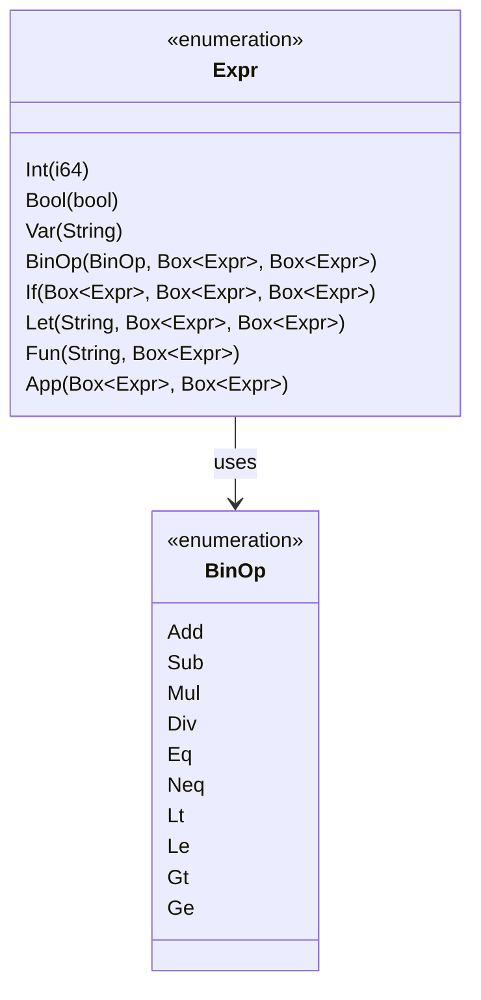
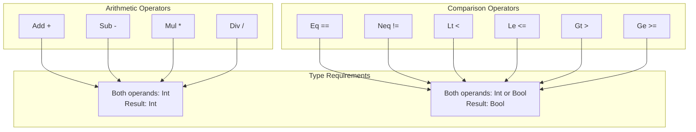
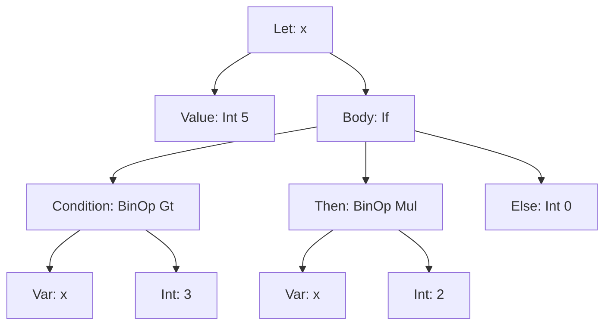
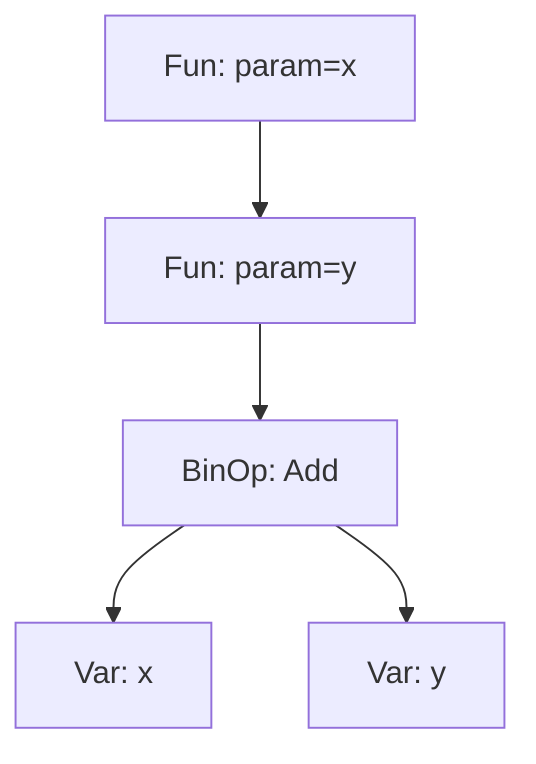
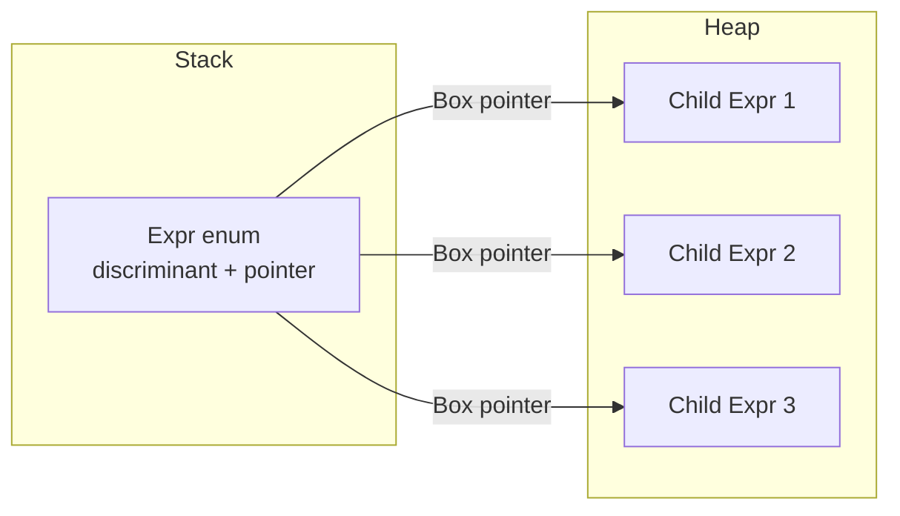

# AST Module Documentation

## Overview

The `ast.rs` module defines the Abstract Syntax Tree (AST) data structures for ParLang. The AST represents the structure of ParLang programs in a tree format that can be traversed and evaluated.

**Location**: `src/ast.rs`  
**Lines of Code**: ~365  
**Key Exports**: `Expr`, `BinOp`

## Purpose

The AST module serves as the intermediate representation between the parser and the evaluator. It provides:

1. **Type-safe representation** of ParLang programs
2. **Pattern matching** support for evaluation and transformation
3. **Display formatting** for debugging and error messages
4. **Immutable data structures** for safe manipulation

## Data Structures

### Expression Type (`Expr`)

The `Expr` enum represents all possible expressions in ParLang:

```rust
pub enum Expr {
    Int(i64),                                    // Integer literal
    Bool(bool),                                  // Boolean literal
    Var(String),                                 // Variable reference
    BinOp(BinOp, Box<Expr>, Box<Expr>),        // Binary operation
    If(Box<Expr>, Box<Expr>, Box<Expr>),       // Conditional
    Let(String, Box<Expr>, Box<Expr>),         // Let binding
    Fun(String, Box<Expr>),                    // Function definition
    App(Box<Expr>, Box<Expr>),                 // Function application
    Load(String, Box<Expr>),                   // Load library
    Seq(Vec<(String, Expr)>, Box<Expr>),       // Sequential bindings
    Rec(String, Box<Expr>),                    // Recursive function
}
```

#### Expression Variants



##### 1. `Int(i64)` - Integer Literal

Represents integer values.

**Syntax**: `42`, `-10`, `0`

**Example AST**:
```rust
Expr::Int(42)
Expr::Int(-10)
```

##### 2. `Bool(bool)` - Boolean Literal

Represents boolean values.

**Syntax**: `true`, `false`

**Example AST**:
```rust
Expr::Bool(true)
Expr::Bool(false)
```

##### 3. `Var(String)` - Variable Reference

Represents a reference to a variable by name.

**Syntax**: `x`, `foo`, `my_var`

**Example AST**:
```rust
Expr::Var("x".to_string())
Expr::Var("counter".to_string())
```

**Notes**:
- Variable names must start with a letter
- Can contain letters, numbers, and underscores
- Cannot be keywords (`let`, `in`, `if`, `then`, `else`, `fun`, `true`, `false`)

##### 4. `BinOp(BinOp, Box<Expr>, Box<Expr>)` - Binary Operation

Represents operations between two expressions.

**Syntax**: `e1 + e2`, `e1 * e2`, `e1 == e2`, etc.

**Example AST**:
```rust
// 1 + 2
Expr::BinOp(
    BinOp::Add,
    Box::new(Expr::Int(1)),
    Box::new(Expr::Int(2))
)

// x * (y + 1)
Expr::BinOp(
    BinOp::Mul,
    Box::new(Expr::Var("x".to_string())),
    Box::new(Expr::BinOp(
        BinOp::Add,
        Box::new(Expr::Var("y".to_string())),
        Box::new(Expr::Int(1))
    ))
)
```

##### 5. `If(Box<Expr>, Box<Expr>, Box<Expr>)` - Conditional Expression

Represents if-then-else conditional expressions.

**Syntax**: `if <condition> then <then-expr> else <else-expr>`

**Example AST**:
```rust
// if x > 0 then 1 else -1
Expr::If(
    Box::new(Expr::BinOp(
        BinOp::Gt,
        Box::new(Expr::Var("x".to_string())),
        Box::new(Expr::Int(0))
    )),
    Box::new(Expr::Int(1)),
    Box::new(Expr::Int(-1))
)
```

**Structure**:
- **First**: Condition expression (must evaluate to boolean)
- **Second**: Then-branch expression
- **Third**: Else-branch expression

##### 6. `Let(String, Box<Expr>, Box<Expr>)` - Let Binding

Represents local variable binding.

**Syntax**: `let <name> = <value> in <body>`

**Example AST**:
```rust
// let x = 42 in x + 1
Expr::Let(
    "x".to_string(),
    Box::new(Expr::Int(42)),
    Box::new(Expr::BinOp(
        BinOp::Add,
        Box::new(Expr::Var("x".to_string())),
        Box::new(Expr::Int(1))
    ))
)
```

**Structure**:
- **First**: Variable name (String)
- **Second**: Value expression
- **Third**: Body expression (where the variable is in scope)

##### 7. `Fun(String, Box<Expr>)` - Function Definition

Represents anonymous function (lambda) definitions.

**Syntax**: `fun <param> -> <body>`

**Example AST**:
```rust
// fun x -> x + 1
Expr::Fun(
    "x".to_string(),
    Box::new(Expr::BinOp(
        BinOp::Add,
        Box::new(Expr::Var("x".to_string())),
        Box::new(Expr::Int(1))
    ))
)

// fun x -> fun y -> x + y (curried)
Expr::Fun(
    "x".to_string(),
    Box::new(Expr::Fun(
        "y".to_string(),
        Box::new(Expr::BinOp(
            BinOp::Add,
            Box::new(Expr::Var("x".to_string())),
            Box::new(Expr::Var("y".to_string()))
        ))
    ))
)
```

**Structure**:
- **First**: Parameter name (String)
- **Second**: Function body expression

**Notes**:
- Functions take exactly one parameter
- Multi-parameter functions use currying
- Functions capture their environment (closures)

##### 8. `App(Box<Expr>, Box<Expr>)` - Function Application

Represents function call/application.

**Syntax**: `<function> <argument>`

**Example AST**:
```rust
// f 42
Expr::App(
    Box::new(Expr::Var("f".to_string())),
    Box::new(Expr::Int(42))
)

// f x y (parsed as (f x) y)
Expr::App(
    Box::new(Expr::App(
        Box::new(Expr::Var("f".to_string())),
        Box::new(Expr::Var("x".to_string()))
    )),
    Box::new(Expr::Var("y".to_string()))
)
```

**Structure**:
- **First**: Function expression
- **Second**: Argument expression

**Notes**:
- Application is left-associative: `f x y` = `(f x) y`
- Both function and argument can be arbitrary expressions

##### 9. `Load(String, Box<Expr>)` - Load Library

Represents loading and importing definitions from a library file.

**Syntax**: `load "<filepath>" in <body>`

**Example AST**:
```rust
// load "examples/stdlib.par" in double 21
Expr::Load(
    "examples/stdlib.par".to_string(),
    Box::new(Expr::App(
        Box::new(Expr::Var("double".to_string())),
        Box::new(Expr::Int(21))
    ))
)
```

**Structure**:
- **First**: File path (String)
- **Second**: Body expression evaluated with loaded bindings

**Notes**:
- Library files are parsed and their bindings are extracted
- Bindings from the library extend the current environment
- Libraries can load other libraries (nested loads)

##### 10. `Seq(Vec<(String, Expr)>, Box<Expr>)` - Sequential Let Bindings

Represents sequential let bindings separated by semicolons.

**Syntax**: `let x = e1; let y = e2; body`

**Example AST**:
```rust
// let x = 42; let y = 10; x + y
Expr::Seq(
    vec![
        ("x".to_string(), Expr::Int(42)),
        ("y".to_string(), Expr::Int(10))
    ],
    Box::new(Expr::BinOp(
        BinOp::Add,
        Box::new(Expr::Var("x".to_string())),
        Box::new(Expr::Var("y".to_string()))
    ))
)
```

**Structure**:
- **First**: Vector of (name, expression) pairs
- **Second**: Body expression

**Notes**:
- Each binding can reference previous bindings in the sequence
- Syntactic sugar for nested let-in expressions
- Commonly used at the top level of programs and in the REPL

##### 11. `Rec(String, Box<Expr>)` - Recursive Function

Represents a named recursive function that can reference itself.

**Syntax**: `rec <name> -> <body>`

**Example AST**:
```rust
// rec factorial -> fun n -> if n == 0 then 1 else n * factorial (n - 1)
Expr::Rec(
    "factorial".to_string(),
    Box::new(Expr::Fun(
        "n".to_string(),
        Box::new(Expr::If(
            Box::new(Expr::BinOp(
                BinOp::Eq,
                Box::new(Expr::Var("n".to_string())),
                Box::new(Expr::Int(0))
            )),
            Box::new(Expr::Int(1)),
            Box::new(Expr::BinOp(
                BinOp::Mul,
                Box::new(Expr::Var("n".to_string())),
                Box::new(Expr::App(
                    Box::new(Expr::Var("factorial".to_string())),
                    Box::new(Expr::BinOp(
                        BinOp::Sub,
                        Box::new(Expr::Var("n".to_string())),
                        Box::new(Expr::Int(1))
                    ))
                ))
            ))
        ))
    ))
)
```

**Structure**:
- **First**: Function name (String) - used for self-reference
- **Second**: Function body (typically a `Fun` expression)

**Notes**:
- The body must be a function definition
- The function name is bound within its own body, enabling recursion
- Tail call optimization is applied for tail-recursive patterns
- Allows expressing algorithms that require self-reference

### Binary Operators (`BinOp`)

```rust
pub enum BinOp {
    Add,  // +   Addition
    Sub,  // -   Subtraction
    Mul,  // *   Multiplication
    Div,  // /   Division
    Eq,   // ==  Equality
    Neq,  // !=  Inequality
    Lt,   // <   Less than
    Le,   // <=  Less than or equal
    Gt,   // >   Greater than
    Ge,   // >=  Greater than or equal
}
```

#### Operator Categories



#### Arithmetic Operators

| Operator | Name | Type Signature | Example |
|----------|------|----------------|---------|
| `Add` | Addition | `Int → Int → Int` | `1 + 2` = `3` |
| `Sub` | Subtraction | `Int → Int → Int` | `10 - 3` = `7` |
| `Mul` | Multiplication | `Int → Int → Int` | `6 * 7` = `42` |
| `Div` | Division | `Int → Int → Int` | `10 / 2` = `5` |

**Special Cases**:
- Division by zero results in `EvalError::DivisionByZero`
- Integer division (truncates towards zero)

#### Comparison Operators

| Operator | Name | Type Signature | Example |
|----------|------|----------------|---------|
| `Eq` | Equality | `Int → Int → Bool` or `Bool → Bool → Bool` | `5 == 5` = `true` |
| `Neq` | Inequality | `Int → Int → Bool` or `Bool → Bool → Bool` | `5 != 3` = `true` |
| `Lt` | Less than | `Int → Int → Bool` | `3 < 5` = `true` |
| `Le` | Less or equal | `Int → Int → Bool` | `5 <= 5` = `true` |
| `Gt` | Greater than | `Int → Int → Bool` | `5 > 3` = `true` |
| `Ge` | Greater or equal | `Int → Int → Bool` | `5 >= 5` = `true` |

**Notes**:
- Comparison operators for integers: all 6 operators
- Comparison operators for booleans: only `Eq` and `Neq`
- Mixing types in comparisons results in `EvalError::TypeError`

## AST Construction Examples

### Simple Expression

```rust
// Source: 42
let ast = Expr::Int(42);
```

### Arithmetic Expression

```rust
// Source: 1 + 2 * 3
// Parsed as: 1 + (2 * 3)
let ast = Expr::BinOp(
    BinOp::Add,
    Box::new(Expr::Int(1)),
    Box::new(Expr::BinOp(
        BinOp::Mul,
        Box::new(Expr::Int(2)),
        Box::new(Expr::Int(3))
    ))
);
```

### Let Binding

```rust
// Source: let x = 42 in x + 1
let ast = Expr::Let(
    "x".to_string(),
    Box::new(Expr::Int(42)),
    Box::new(Expr::BinOp(
        BinOp::Add,
        Box::new(Expr::Var("x".to_string())),
        Box::new(Expr::Int(1))
    ))
);
```

### Function Definition and Application

```rust
// Source: (fun x -> x + 1) 41
let ast = Expr::App(
    Box::new(Expr::Fun(
        "x".to_string(),
        Box::new(Expr::BinOp(
            BinOp::Add,
            Box::new(Expr::Var("x".to_string())),
            Box::new(Expr::Int(1))
        ))
    )),
    Box::new(Expr::Int(41))
);
```

### Complex Nested Expression

```rust
// Source: let double = fun x -> x + x in double 21
let ast = Expr::Let(
    "double".to_string(),
    Box::new(Expr::Fun(
        "x".to_string(),
        Box::new(Expr::BinOp(
            BinOp::Add,
            Box::new(Expr::Var("x".to_string())),
            Box::new(Expr::Var("x".to_string()))
        ))
    )),
    Box::new(Expr::App(
        Box::new(Expr::Var("double".to_string())),
        Box::new(Expr::Int(21))
    ))
);
```

## AST Visualization

### Expression Tree Example

For the expression: `let x = 5 in if x > 3 then x * 2 else 0`



### Curried Function Tree

For the expression: `fun x -> fun y -> x + y`



## Display Trait Implementation

The `Expr` and `BinOp` types implement the `Display` trait for human-readable output:

```rust
impl fmt::Display for Expr {
    fn fmt(&self, f: &mut fmt::Formatter) -> fmt::Result {
        match self {
            Expr::Int(n) => write!(f, "{}", n),
            Expr::Bool(b) => write!(f, "{}", b),
            Expr::Var(name) => write!(f, "{}", name),
            Expr::BinOp(op, left, right) => write!(f, "({} {} {})", left, op, right),
            Expr::If(cond, then_br, else_br) => 
                write!(f, "(if {} then {} else {})", cond, then_br, else_br),
            Expr::Let(name, value, body) => 
                write!(f, "(let {} = {} in {})", name, value, body),
            Expr::Fun(param, body) => write!(f, "(fun {} -> {})", param, body),
            Expr::App(func, arg) => write!(f, "({} {})", func, arg),
        }
    }
}
```

### Display Examples

| AST | Display Output |
|-----|----------------|
| `Expr::Int(42)` | `42` |
| `Expr::Bool(true)` | `true` |
| `Expr::Var("x".to_string())` | `x` |
| `BinOp(Add, Int(1), Int(2))` | `(1 + 2)` |
| `If(Bool(true), Int(1), Int(2))` | `(if true then 1 else 2)` |
| `Let("x", Int(42), Var("x"))` | `(let x = 42 in x)` |
| `Fun("x", Var("x"))` | `(fun x -> x)` |
| `App(Var("f"), Int(42))` | `(f 42)` |

## Traits and Derivations

The AST types derive several useful traits:

```rust
#[derive(Debug, Clone, PartialEq)]
pub enum Expr { ... }

#[derive(Debug, Clone, Copy, PartialEq, Eq)]
pub enum BinOp { ... }
```

### Trait Purposes

| Trait | Purpose | Usage |
|-------|---------|-------|
| `Debug` | Debug formatting | Error messages, debugging |
| `Clone` | Deep copying | Creating modified ASTs, closures |
| `PartialEq` | Equality comparison | Testing, optimization |
| `Eq` | Full equivalence | `BinOp` is fully equivalent |
| `Copy` | Bitwise copy | `BinOp` is a simple enum |

## Design Considerations

### Why Use `Box<Expr>`?

Rust requires recursive types to have a known size. Since `Expr` variants contain other `Expr` values, we use `Box` to:
1. **Enable recursion**: `Box` has a fixed size (pointer)
2. **Heap allocation**: Store variable-sized trees on the heap
3. **Ownership**: Clear ownership semantics for tree nodes

### Memory Layout



### Immutability

The AST is designed to be immutable:
- **No mutation methods**: AST nodes cannot be changed after creation
- **Transformations create new trees**: Any modification creates a new AST
- **Safe sharing**: Immutable ASTs can be safely shared and cloned

## Testing

The AST module includes comprehensive unit tests (86 tests):

### Test Categories

1. **Construction Tests**: Verify AST nodes can be created
2. **Equality Tests**: Verify structural equality
3. **Clone Tests**: Verify deep copying works correctly
4. **Display Tests**: Verify string representation
5. **Complex Expression Tests**: Verify nested structures

### Example Test

```rust
#[test]
fn test_complex_nested_expr() {
    // let f = fun x -> x + 1 in f 41
    let expr = Expr::Let(
        "f".to_string(),
        Box::new(Expr::Fun(
            "x".to_string(),
            Box::new(Expr::BinOp(
                BinOp::Add,
                Box::new(Expr::Var("x".to_string())),
                Box::new(Expr::Int(1)),
            )),
        )),
        Box::new(Expr::App(
            Box::new(Expr::Var("f".to_string())),
            Box::new(Expr::Int(41)),
        )),
    );
    assert_eq!(
        format!("{}", expr),
        "(let f = (fun x -> (x + 1)) in (f 41))"
    );
}
```

## Common Patterns

### Pattern Matching on Expressions

```rust
match expr {
    Expr::Int(n) => { /* handle integer */ }
    Expr::Bool(b) => { /* handle boolean */ }
    Expr::Var(name) => { /* handle variable */ }
    Expr::BinOp(op, left, right) => { /* handle operation */ }
    Expr::If(cond, then_br, else_br) => { /* handle conditional */ }
    Expr::Let(name, value, body) => { /* handle let binding */ }
    Expr::Fun(param, body) => { /* handle function */ }
    Expr::App(func, arg) => { /* handle application */ }
}
```

### Recursive Traversal

```rust
fn count_nodes(expr: &Expr) -> usize {
    match expr {
        Expr::Int(_) | Expr::Bool(_) | Expr::Var(_) => 1,
        Expr::BinOp(_, left, right) => 1 + count_nodes(left) + count_nodes(right),
        Expr::If(cond, then_br, else_br) => {
            1 + count_nodes(cond) + count_nodes(then_br) + count_nodes(else_br)
        }
        Expr::Let(_, value, body) => 1 + count_nodes(value) + count_nodes(body),
        Expr::Fun(_, body) => 1 + count_nodes(body),
        Expr::App(func, arg) => 1 + count_nodes(func) + count_nodes(arg),
    }
}
```

## Summary

The AST module provides:

✅ **Type-safe representation** of ParLang programs  
✅ **Comprehensive expression types** covering all language features  
✅ **Pattern matching support** for easy manipulation  
✅ **Display formatting** for debugging  
✅ **Immutable design** for safety  
✅ **Well-tested** with 86 unit tests  

The AST serves as the foundation for both parsing (parser produces AST) and evaluation (evaluator consumes AST), making it the central data structure of the ParLang interpreter.
