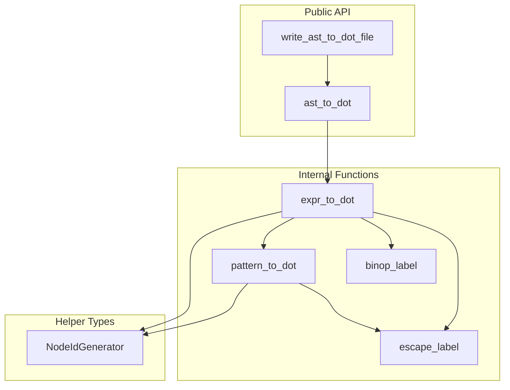
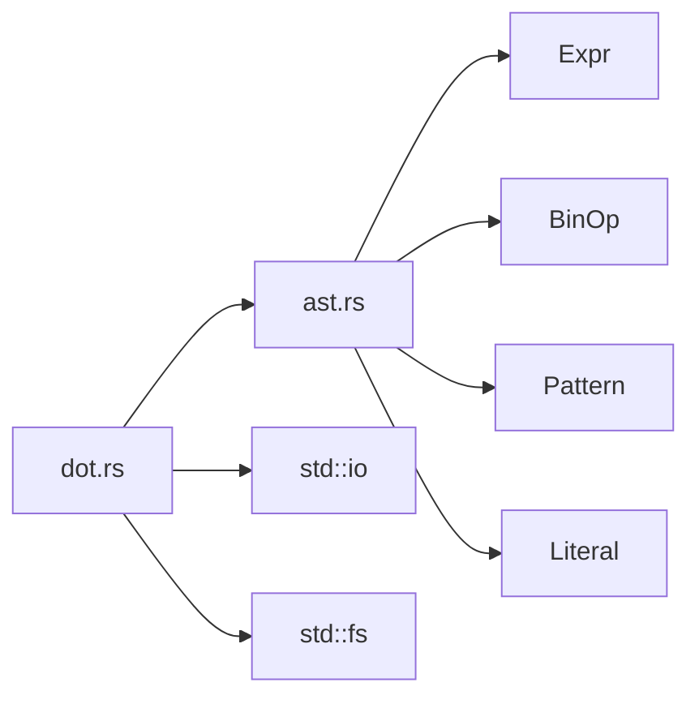
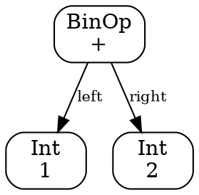
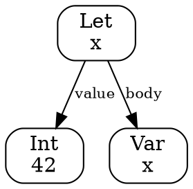

# DOT Module Documentation

## Overview

The `dot.rs` module provides functionality to convert ParLang Abstract Syntax Trees (ASTs) into Graphviz DOT format for visualization. This allows developers to visualize the structure of ParLang programs, making it easier to understand complex expressions and debug parser behavior.

**Location**: `src/dot.rs`  
**Lines of Code**: ~483  
**Key Functions**: `ast_to_dot()`, `write_ast_to_dot_file()`, `expr_to_dot()`, `pattern_to_dot()`  
**External Dependencies**: None (uses standard library only)

## Purpose

The DOT module is responsible for:

1. **AST Serialization**: Converting AST nodes into DOT format
2. **Graph Generation**: Creating directed graph representations of program structure
3. **File Output**: Writing DOT files that can be rendered with Graphviz tools
4. **Node Identification**: Generating unique node IDs for graph construction
5. **Label Formatting**: Properly escaping and formatting node labels

## Architecture

### Module Structure



### Dependencies



## Public API

### `ast_to_dot()`

Converts an expression to DOT format string.

```rust
pub fn ast_to_dot(expr: &Expr) -> String
```

**Parameters**:
- `expr`: Reference to the expression to convert

**Returns**:
- `String`: Complete DOT representation of the AST

**Example**:
```rust
use parlang::{parse, dot::ast_to_dot};

let source = "let x = 42 in x + 1";
let expr = parse(source).unwrap();
let dot_output = ast_to_dot(&expr);
println!("{}", dot_output);
```

**Output Structure**:
```dot
digraph AST {
  node [shape=box, style=rounded];
  edge [fontsize=10];

  [nodes and edges...]
}
```

### `write_ast_to_dot_file()`

Writes DOT representation of an expression to a file.

```rust
pub fn write_ast_to_dot_file(expr: &Expr, path: &str) -> io::Result<()>
```

**Parameters**:
- `expr`: Reference to the expression to convert
- `path`: File path where DOT file should be written

**Returns**:
- `Ok(())`: Success
- `Err(io::Error)`: File I/O error

**Example**:
```rust
use parlang::{parse, dot::write_ast_to_dot_file};

let source = "if x > 0 then x else 0";
let expr = parse(source).unwrap();
write_ast_to_dot_file(&expr, "ast.dot")?;
```

## Internal Implementation

### NodeIdGenerator

Helper struct for generating unique node IDs.

```rust
struct NodeIdGenerator {
    counter: usize,
}

impl NodeIdGenerator {
    fn new() -> Self
    fn next(&mut self) -> String  // Returns "node0", "node1", etc.
}
```

**Purpose**: Ensures each AST node gets a unique identifier in the DOT graph.

### `expr_to_dot()`

Recursively converts an expression to DOT format.

```rust
fn expr_to_dot(expr: &Expr, output: &mut String, gen: &mut NodeIdGenerator) -> String
```

**Parameters**:
- `expr`: Expression to convert
- `output`: Mutable string to append DOT statements to
- `gen`: Node ID generator

**Returns**:
- `String`: Node ID of the root node for this expression

**Behavior**:
- Generates a unique node ID
- Adds node definition to output
- Recursively processes child nodes
- Adds edges connecting parent to children
- Returns the node ID for parent nodes to reference

### `pattern_to_dot()`

Converts a pattern to DOT format.

```rust
fn pattern_to_dot(pattern: &Pattern, output: &mut String, gen: &mut NodeIdGenerator) -> String
```

Similar to `expr_to_dot()` but handles pattern matching constructs.

### `binop_label()`

Returns the string representation of a binary operator.

```rust
fn binop_label(op: &BinOp) -> &'static str
```

Maps operators to their symbolic representation ("+", "-", "*", etc.).

### `escape_label()`

Escapes special characters in node labels for DOT format.

```rust
fn escape_label(s: &str) -> String
```

Escapes:
- Backslashes (`\` → `\\`)
- Quotes (`"` → `\"`)
- Newlines (`\n` → `\\n`)

## Supported AST Nodes

### Expression Nodes

| Expression | DOT Label | Children |
|------------|-----------|----------|
| `Int(n)` | `Int\n{n}` | None |
| `Bool(b)` | `Bool\n{b}` | None |
| `Var(name)` | `Var\n{name}` | None |
| `BinOp(op, l, r)` | `BinOp\n{op}` | left, right |
| `If(c, t, e)` | `If` | cond, then, else |
| `Let(name, val, body)` | `Let\n{name}` | value, body |
| `Fun(param, body)` | `Fun\n{param}` | body |
| `App(func, arg)` | `App` | func, arg |
| `Load(path, body)` | `Load\n{path}` | body |
| `Seq(bindings, body)` | `Seq` | binding 0..n, body |
| `Rec(name, body)` | `Rec\n{name}` | body |
| `Match(scrut, arms)` | `Match` | scrutinee, arm 0..n |
| `Tuple(elems)` | `Tuple` | elem 0..n |
| `TupleProj(tuple, idx)` | `TupleProj\n{idx}` | tuple |

### Pattern Nodes

| Pattern | DOT Label | Children |
|---------|-----------|----------|
| `Literal(Int(n))` | `Literal\nInt {n}` | None |
| `Literal(Bool(b))` | `Literal\nBool {b}` | None |
| `Var(name)` | `Var\n{name}` | None |
| `Wildcard` | `Wildcard\n_` | None |
| `Tuple(patterns)` | `TuplePattern` | elem 0..n |

## DOT Format Details

### Node Attributes

All nodes use:
- `shape=box`: Rectangular nodes
- `style=rounded`: Rounded corners for readability

### Edge Attributes

All edges use:
- `fontsize=10`: Consistent label sizing

### Edge Labels

Edges are labeled to show the relationship:
- `left`, `right` - Binary operation operands
- `cond`, `then`, `else` - If expression branches
- `value`, `body` - Let binding components
- `func`, `arg` - Function application
- `scrutinee` - Match expression input
- `pattern`, `result` - Match arm components
- `elem N` - Tuple elements
- `binding N` - Sequential bindings

## Usage Examples

### Basic Expression

**Input**:
```rust
let expr = Expr::BinOp(
    BinOp::Add,
    Box::new(Expr::Int(1)),
    Box::new(Expr::Int(2)),
);
let dot = ast_to_dot(&expr);
```

**Output**:


### Let Expression

**Input**:
```rust
let expr = Expr::Let(
    "x".to_string(),
    Box::new(Expr::Int(42)),
    Box::new(Expr::Var("x".to_string())),
);
```

**Output**:


### Function Application

**Input**:
```rust
// (fun x -> x + 1) 41
let expr = Expr::App(
    Box::new(Expr::Fun(
        "x".to_string(),
        Box::new(Expr::BinOp(
            BinOp::Add,
            Box::new(Expr::Var("x".to_string())),
            Box::new(Expr::Int(1)),
        )),
    )),
    Box::new(Expr::Int(41)),
);
```

**Output**: Shows nested structure with Function → BinOp → Variables

### Match Expression

**Input**:
```rust
// match x with | 0 -> 1 | n -> n
let expr = Expr::Match(
    Box::new(Expr::Var("x".to_string())),
    vec![
        (Pattern::Literal(Literal::Int(0)), Expr::Int(1)),
        (Pattern::Var("n".to_string()), Expr::Var("n".to_string())),
    ],
);
```

**Output**: Shows match node with scrutinee and multiple arm branches

## Rendering DOT Files

### Using Graphviz Command-Line Tools

**Install Graphviz**:
```bash
# Ubuntu/Debian
sudo apt install graphviz

# macOS
brew install graphviz

# Windows
choco install graphviz
```

**Render to PNG**:
```bash
dot -Tpng ast.dot -o ast.png
```

**Render to SVG** (scalable):
```bash
dot -Tsvg ast.dot -o ast.svg
```

**Render to PDF**:
```bash
dot -Tpdf ast.dot -o ast.pdf
```

**Other formats**: `ps`, `gif`, `jpg`, `json`, `plain`, `svg`, `png`

### Using Online Tools

Upload DOT files to online Graphviz renderers:
- [GraphvizOnline](https://dreampuf.github.io/GraphvizOnline/)
- [Graphviz Visual Editor](http://magjac.com/graphviz-visual-editor/)
- [WebGraphviz](http://www.webgraphviz.com/)

### Integration with Editors

Many editors have Graphviz plugins:
- **VS Code**: Graphviz Preview, Graphviz (dot) language support
- **Vim**: vim-graphviz
- **Emacs**: graphviz-dot-mode

## Use Cases

### 1. Understanding Program Structure

Visualize complex nested expressions:
```bash
parlang examples/factorial.par --dump-ast factorial.dot
dot -Tpng factorial.dot -o factorial.png
```

View the image to see the recursive structure clearly.

### 2. Debugging Parser Issues

When parser output doesn't match expectations:
```bash
echo "let x = 1 in let y = 2 in x + y" | parlang --dump-ast debug.dot
```

Visualize the AST to verify correct parsing.

### 3. Educational Purposes

Teaching how expressions are structured:
- Show students the tree structure of their code
- Demonstrate how operators bind
- Illustrate recursion and nesting

### 4. Documentation

Include AST diagrams in documentation:
```bash
# Generate diagrams for all examples
for f in examples/*.par; do
  name=$(basename "$f" .par)
  parlang "$f" --dump-ast "docs/images/${name}_ast.dot"
  dot -Tsvg "docs/images/${name}_ast.dot" -o "docs/images/${name}_ast.svg"
done
```

### 5. Code Review

Attach AST visualizations to pull requests showing:
- How new syntax is parsed
- Impact of parser changes
- Correctness of complex expressions

## Testing

The DOT module includes comprehensive unit tests:

```rust
#[cfg(test)]
mod tests {
    use super::*;
    use crate::ast::*;

    #[test]
    fn test_int_literal() { /* ... */ }
    
    #[test]
    fn test_binop() { /* ... */ }
    
    #[test]
    fn test_complex_expr() { /* ... */ }
}
```

**Test Coverage**:
- All expression types
- All pattern types
- All binary operators
- Complex nested structures
- Label escaping
- Node ID generation

Run tests:
```bash
cargo test dot::tests
```

## Design Considerations

### Immutable Input

All functions take immutable references to AST nodes, ensuring:
- No modification of original AST
- Safe concurrent use
- Multiple DOT generation from same AST

### Memory Efficiency

- Builds DOT string incrementally (no intermediate structures)
- Uses `String` mutation instead of concatenation
- Minimal allocations for node IDs

### Deterministic Output

- Node IDs are sequentially generated
- Output is deterministic for same input
- Makes testing reliable

### DOT Format Compliance

- Follows Graphviz DOT specification
- Properly escapes special characters
- Uses standard attributes

### Extensibility

Adding support for new AST nodes requires:
1. New match arm in `expr_to_dot()`
2. Generate node with appropriate label
3. Recursively process children
4. Add edges with meaningful labels
5. Add unit test

## Future Enhancements

### Potential Improvements

1. **Color Coding**:
   - Different colors for different node types
   - Highlight error-prone patterns
   - Visual distinction for literals vs variables

2. **Subgraph Clustering**:
   - Group related nodes (function definitions)
   - Show scope boundaries visually

3. **Type Annotations**:
   - Show inferred types on nodes (if type system added)
   - Display type errors visually

4. **Source Positions**:
   - Include line/column information in labels
   - Link nodes back to source code

5. **Interactive Visualization**:
   - Generate HTML with interactive graph
   - Collapsible subtrees
   - Hover for details

6. **Multiple Output Formats**:
   - Direct PNG/SVG generation (bypass DOT)
   - JSON representation
   - PlantUML format

7. **Simplified View**:
   - Option to hide certain node types
   - Focus on control flow only
   - Show data flow only

## Related Modules

- **[`ast.rs`](./MODULE_AST.md)**: Defines the AST types that this module visualizes
- **[`parser.rs`](./MODULE_PARSER.md)**: Creates the AST that gets visualized
- **[`main.rs`](./MODULE_MAIN.md)**: Provides CLI interface for DOT generation

## Summary

The DOT module provides a simple but powerful way to visualize ParLang ASTs. By generating Graphviz DOT files, it enables:

- **Understanding**: Visual representation of program structure
- **Debugging**: Verification of parser correctness
- **Education**: Teaching tool for AST concepts
- **Documentation**: Diagrams for technical documentation

The module is self-contained, well-tested, and integrates seamlessly with the ParLang CLI through the `--dump-ast` option.
