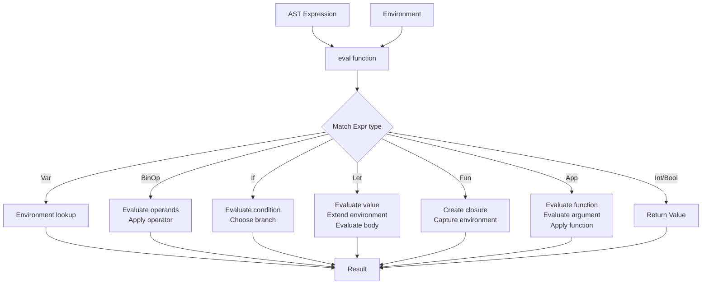
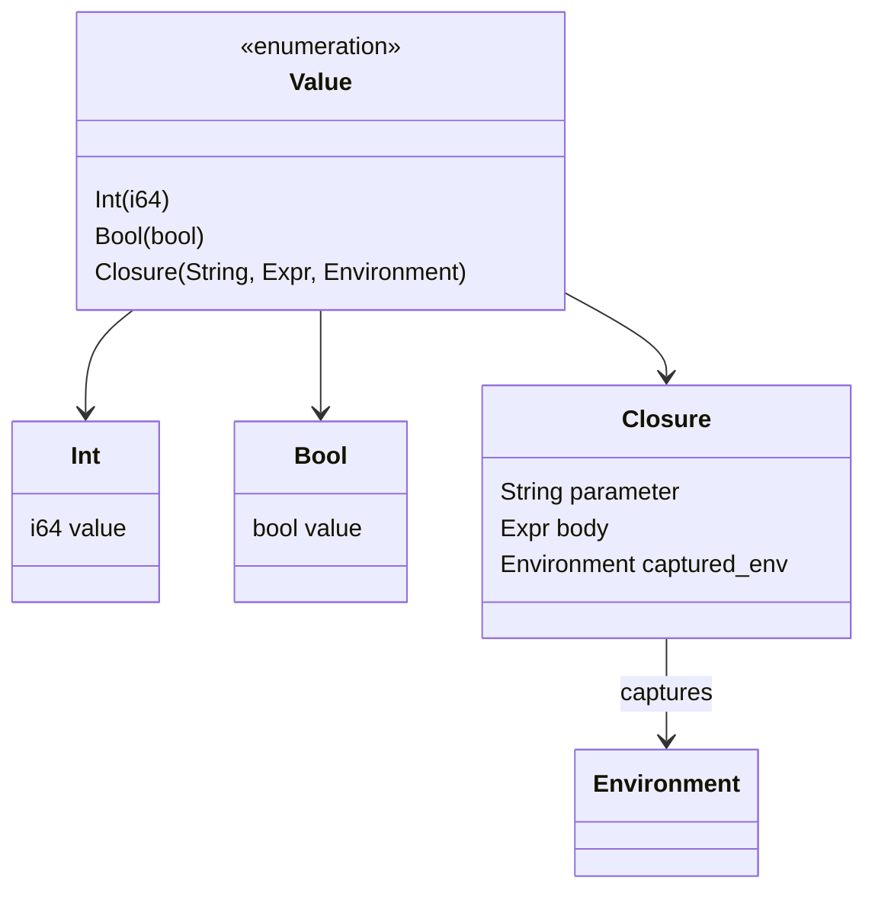
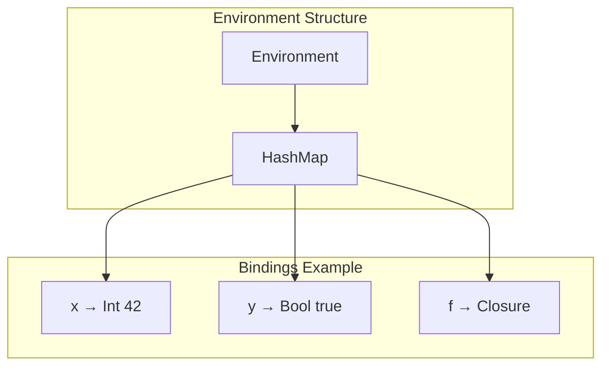
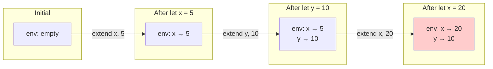
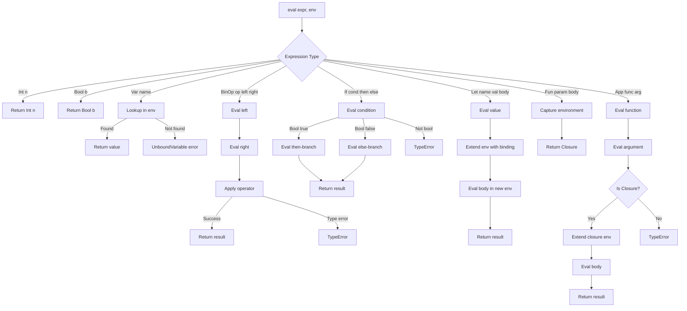
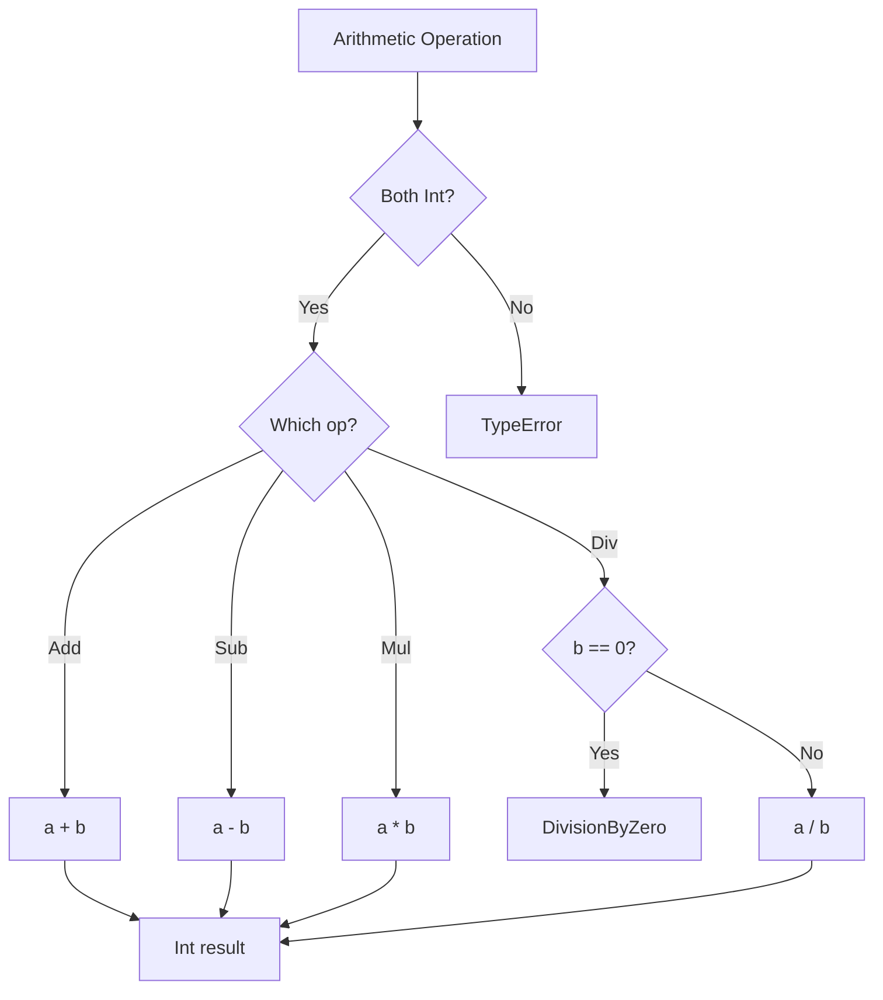
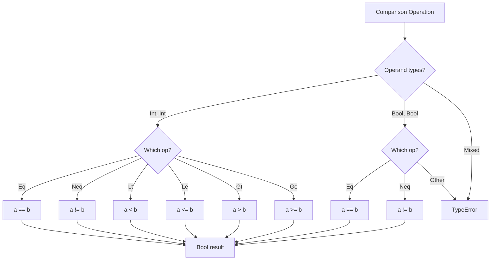
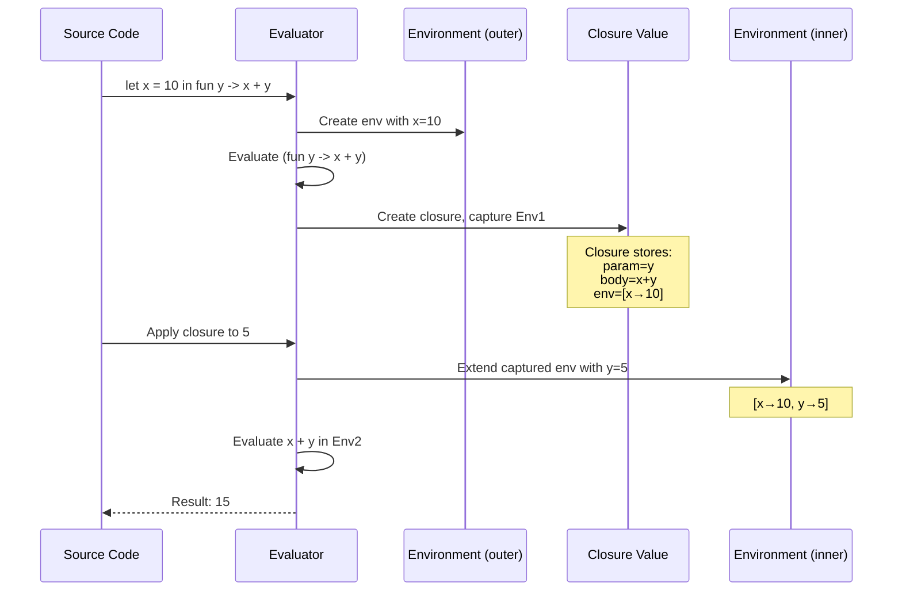
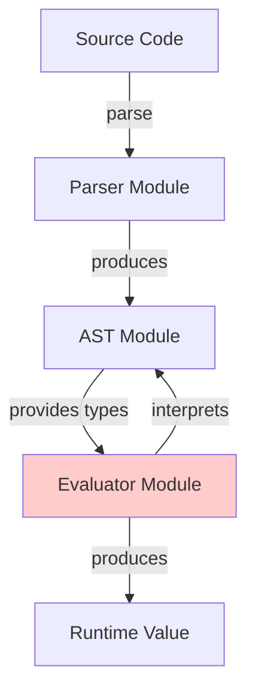

# Evaluator Module Documentation

## Overview

The `eval.rs` module implements the runtime evaluator/interpreter for the ParLang language. It executes ParLang Abstract Syntax Trees (ASTs) by recursively evaluating expressions and managing variable bindings through environments.

**Location**: `src/eval.rs`  
**Lines of Code**: ~855  
**Key Exports**: `eval()` function, `Value` enum, `Environment` struct, `EvalError` enum

## Purpose

The evaluator module is responsible for:

1. **Expression Evaluation**: Executing AST nodes to produce runtime values
2. **Environment Management**: Tracking variable bindings and scopes
3. **Closure Semantics**: Implementing lexical scoping and variable capture
4. **Type Checking**: Ensuring operations are performed on compatible types
5. **Error Handling**: Detecting and reporting runtime errors
6. **Control Flow**: Implementing conditionals and function application

## Architecture

### Evaluation Pipeline



## Data Structures

### Runtime Values (`Value`)

The `Value` enum represents all possible runtime values in ParLang:

```rust
#[derive(Debug, Clone, PartialEq)]
pub enum Value {
    Int(i64),                                          // Integer value
    Bool(bool),                                        // Boolean value
    Closure(String, Expr, Environment),                // Function closure
    RecClosure(String, String, Expr, Environment),     // Recursive function closure
}
```

#### Value Types Hierarchy



#### 1. `Int(i64)` - Integer Value

Represents integer values at runtime.

**Range**: -9,223,372,036,854,775,808 to 9,223,372,036,854,775,807 (64-bit signed)

**Example**:
```rust
Value::Int(42)
Value::Int(-10)
Value::Int(0)
```

**Display**: `42`, `-10`, `0`

#### 2. `Bool(bool)` - Boolean Value

Represents boolean values at runtime.

**Values**: `true`, `false`

**Example**:
```rust
Value::Bool(true)
Value::Bool(false)
```

**Display**: `true`, `false`

#### 3. `Closure(String, Expr, Environment)` - Function Closure

Represents a function value with its captured environment.

**Components**:
- **Parameter name** (`String`): The function's parameter
- **Body** (`Expr`): The function's body expression
- **Captured environment** (`Environment`): Variable bindings from the definition site

**Example**:
```rust
// fun x -> x + 1
Value::Closure(
    "x".to_string(),
    Expr::BinOp(
        BinOp::Add,
        Box::new(Expr::Var("x".to_string())),
        Box::new(Expr::Int(1))
    ),
    env
)
```

**Display**: `<function x>` (shows parameter name, hides body)

**Key Feature**: Closures capture their defining environment, enabling lexical scoping.

#### 4. `RecClosure(String, String, Expr, Environment)` - Recursive Function Closure

Represents a recursive function value that can reference itself by name.

**Components**:
- **Function name** (`String`): The recursive function's name (for self-reference)
- **Parameter name** (`String`): The function's parameter
- **Body** (`Expr`): The function's body expression
- **Captured environment** (`Environment`): Variable bindings from the definition site

**Example**:
```rust
// rec factorial -> fun n -> if n == 0 then 1 else n * factorial (n - 1)
Value::RecClosure(
    "factorial".to_string(),
    "n".to_string(),
    Expr::If(
        Box::new(Expr::BinOp(BinOp::Eq, ...)),
        Box::new(Expr::Int(1)),
        Box::new(Expr::BinOp(BinOp::Mul, ...))
    ),
    env
)
```

**Display**: `<recursive function factorial>` (shows function name, hides body)

**Key Features**:
- Self-reference: The function name is bound within its own body
- Tail call optimization: Direct tail calls use iteration instead of recursion
- Lexical scoping: Captures the environment at definition time

### Environment Management

#### Environment Structure

```rust
#[derive(Debug, Clone, PartialEq)]
pub struct Environment {
    bindings: HashMap<String, Value>,
}
```

The environment maps variable names to their runtime values.



#### Environment Operations

##### `new()` - Create Empty Environment

Creates a new environment with no bindings.

```rust
pub fn new() -> Self {
    Environment {
        bindings: HashMap::new(),
    }
}
```

**Usage**:
```rust
let env = Environment::new();
```

##### `bind()` - Add Binding (Mutable)

Adds or updates a variable binding in the environment.

```rust
pub fn bind(&mut self, name: String, value: Value) {
    self.bindings.insert(name, value);
}
```

**Usage**:
```rust
let mut env = Environment::new();
env.bind("x".to_string(), Value::Int(42));
```

**Behavior**: If the variable already exists, it's shadowed (replaced).

##### `lookup()` - Find Variable

Looks up a variable's value in the environment.

```rust
pub fn lookup(&self, name: &str) -> Option<&Value> {
    self.bindings.get(name)
}
```

**Returns**:
- `Some(&Value)`: Variable found
- `None`: Variable not found

**Usage**:
```rust
match env.lookup("x") {
    Some(val) => println!("x = {}", val),
    None => println!("x not found"),
}
```

##### `extend()` - Create Extended Environment (Immutable)

Creates a new environment with an additional binding, leaving the original unchanged.

```rust
pub fn extend(&self, name: String, value: Value) -> Self {
    let mut new_env = self.clone();
    new_env.bind(name, value);
    new_env
}
```

**Usage**:
```rust
let env1 = Environment::new();
let env2 = env1.extend("x".to_string(), Value::Int(42));
// env1 unchanged, env2 has x binding
```

**Key Feature**: Enables immutable environment handling for closures.

#### Environment Evolution Example



### Evaluation Errors (`EvalError`)

```rust
#[derive(Debug, Clone, PartialEq)]
pub enum EvalError {
    UnboundVariable(String),    // Variable not found
    TypeError(String),          // Type mismatch
    DivisionByZero,            // Division by zero
}
```

#### Error Types

##### 1. `UnboundVariable(String)`

Occurs when a variable is referenced but not defined in the environment.

**Example**:
```rust
// Source: x + 1  (x not defined)
EvalError::UnboundVariable("x".to_string())
```

**Display**: `"Unbound variable: x"`

##### 2. `TypeError(String)`

Occurs when an operation is performed on incompatible types.

**Examples**:
```rust
// Adding integer and boolean
// Source: 1 + true
EvalError::TypeError("Type error in binary operation: Add".to_string())

// Applying non-function
// Source: 42 10
EvalError::TypeError("Application requires a function".to_string())

// Non-boolean condition
// Source: if 42 then 1 else 2
EvalError::TypeError("If condition must be a boolean".to_string())
```

**Display**: `"Type error: <message>"`

##### 3. `DivisionByZero`

Occurs when dividing by zero.

**Example**:
```rust
// Source: 10 / 0
EvalError::DivisionByZero
```

**Display**: `"Division by zero"`

## Core Evaluation Function

### `eval()` - Main Evaluator

```rust
pub fn eval(expr: &Expr, env: &Environment) -> Result<Value, EvalError>
```

The main evaluation function recursively evaluates expressions in an environment.

**Parameters**:
- `expr`: AST expression to evaluate
- `env`: Current environment with variable bindings

**Returns**:
- `Ok(Value)`: Evaluation successful
- `Err(EvalError)`: Runtime error occurred

### Evaluation Algorithm by Expression Type

#### 1. Integer Literal (`Expr::Int`)

```rust
Expr::Int(n) => Ok(Value::Int(*n))
```

**Algorithm**:
1. Return the integer value directly

**Example**:
```rust
eval(&Expr::Int(42), &env)  // => Ok(Value::Int(42))
```

**Complexity**: O(1)

#### 2. Boolean Literal (`Expr::Bool`)

```rust
Expr::Bool(b) => Ok(Value::Bool(*b))
```

**Algorithm**:
1. Return the boolean value directly

**Example**:
```rust
eval(&Expr::Bool(true), &env)  // => Ok(Value::Bool(true))
```

**Complexity**: O(1)

#### 3. Variable Reference (`Expr::Var`)

```rust
Expr::Var(name) => env
    .lookup(name)
    .cloned()
    .ok_or_else(|| EvalError::UnboundVariable(name.clone()))
```

**Algorithm**:
1. Look up variable name in environment
2. If found, return cloned value
3. If not found, return `UnboundVariable` error

**Example**:
```rust
// With x bound to 42
eval(&Expr::Var("x".to_string()), &env)  // => Ok(Value::Int(42))

// With x unbound
eval(&Expr::Var("x".to_string()), &env)  // => Err(UnboundVariable("x"))
```

**Complexity**: O(1) average, O(n) worst case (HashMap lookup)

#### 4. Binary Operation (`Expr::BinOp`)

```rust
Expr::BinOp(op, left, right) => {
    let left_val = eval(left, env)?;
    let right_val = eval(right, env)?;
    eval_binop(*op, left_val, right_val)
}
```

**Algorithm**:
1. Evaluate left operand
2. Evaluate right operand
3. Apply binary operator to values
4. Return result or type error

**Evaluation Order**: Left-to-right (strict evaluation)

**Example**:
```rust
// 1 + 2
let expr = Expr::BinOp(
    BinOp::Add,
    Box::new(Expr::Int(1)),
    Box::new(Expr::Int(2))
);
eval(&expr, &env)  // => Ok(Value::Int(3))
```

**Complexity**: O(eval(left) + eval(right) + O(1))

#### 5. Conditional (`Expr::If`)

```rust
Expr::If(cond, then_branch, else_branch) => {
    let cond_val = eval(cond, env)?;
    match cond_val {
        Value::Bool(true) => eval(then_branch, env),
        Value::Bool(false) => eval(else_branch, env),
        _ => Err(EvalError::TypeError(
            "If condition must be a boolean".to_string(),
        )),
    }
}
```

**Algorithm**:
1. Evaluate condition expression
2. Check if condition is a boolean
3. If `true`, evaluate then-branch
4. If `false`, evaluate else-branch
5. If not boolean, return type error

**Example**:
```rust
// if true then 1 else 2
let expr = Expr::If(
    Box::new(Expr::Bool(true)),
    Box::new(Expr::Int(1)),
    Box::new(Expr::Int(2))
);
eval(&expr, &env)  // => Ok(Value::Int(1))
```

**Key Feature**: Only evaluates the chosen branch (lazy branches)

**Complexity**: O(eval(cond) + eval(chosen_branch))

#### 6. Let Binding (`Expr::Let`)

```rust
Expr::Let(name, value, body) => {
    let val = eval(value, env)?;
    let new_env = env.extend(name.clone(), val);
    eval(body, &new_env)
}
```

**Algorithm**:
1. Evaluate the value expression in current environment
2. Create new environment extending current one with binding
3. Evaluate body in extended environment
4. Return body's result

**Scoping**: Variable is only visible in the body

**Example**:
```rust
// let x = 42 in x + 1
let expr = Expr::Let(
    "x".to_string(),
    Box::new(Expr::Int(42)),
    Box::new(Expr::BinOp(
        BinOp::Add,
        Box::new(Expr::Var("x".to_string())),
        Box::new(Expr::Int(1))
    ))
);
eval(&expr, &env)  // => Ok(Value::Int(43))
```

**Complexity**: O(eval(value) + |env| + eval(body))
- `|env|` for cloning environment

#### 7. Function Definition (`Expr::Fun`)

```rust
Expr::Fun(param, body) => Ok(Value::Closure(
    param.clone(),
    (**body).clone(),
    env.clone(),
))
```

**Algorithm**:
1. Create closure capturing parameter name
2. Capture function body
3. **Capture current environment** (lexical scoping)
4. Return closure value

**Key Feature**: Environment is captured at definition time, not call time.

**Example**:
```rust
// fun x -> x + 1
let expr = Expr::Fun(
    "x".to_string(),
    Box::new(Expr::BinOp(
        BinOp::Add,
        Box::new(Expr::Var("x".to_string())),
        Box::new(Expr::Int(1))
    ))
);
eval(&expr, &env)  // => Ok(Value::Closure("x", body, env))
```

**Complexity**: O(|env|) for cloning environment

#### 8. Function Application (`Expr::App`)

```rust
Expr::App(func, arg) => {
    let func_val = eval(func, env)?;
    let arg_val = eval(arg, env)?;
    
    match func_val {
        Value::Closure(param, body, closure_env) => {
            let new_env = closure_env.extend(param, arg_val);
            eval(&body, &new_env)
        }
        _ => Err(EvalError::TypeError(
            "Application requires a function".to_string(),
        )),
    }
}
```

**Algorithm**:
1. Evaluate function expression (must yield closure)
2. Evaluate argument expression
3. Extract closure's parameter, body, and captured environment
4. Extend **captured environment** with parameter binding
5. Evaluate body in extended captured environment
6. Return result

**Key Feature**: Uses closure's captured environment, not current environment.

**Example**:
```rust
// (fun x -> x + 1) 41
let expr = Expr::App(
    Box::new(Expr::Fun(
        "x".to_string(),
        Box::new(Expr::BinOp(
            BinOp::Add,
            Box::new(Expr::Var("x".to_string())),
            Box::new(Expr::Int(1))
        ))
    )),
    Box::new(Expr::Int(41))
);
eval(&expr, &env)  // => Ok(Value::Int(42))
```

**Complexity**: O(eval(func) + eval(arg) + |closure_env| + eval(body))

### Evaluation Flow Diagram



## Binary Operation Evaluation

### `eval_binop()` - Binary Operator Application

```rust
fn eval_binop(op: BinOp, left: Value, right: Value) -> Result<Value, EvalError>
```

Applies a binary operator to two runtime values.

### Arithmetic Operations



#### Addition (`BinOp::Add`)

```rust
(BinOp::Add, Value::Int(a), Value::Int(b)) => Ok(Value::Int(a + b))
```

**Type**: `Int → Int → Int`

**Example**: `5 + 3` → `Value::Int(8)`

#### Subtraction (`BinOp::Sub`)

```rust
(BinOp::Sub, Value::Int(a), Value::Int(b)) => Ok(Value::Int(a - b))
```

**Type**: `Int → Int → Int`

**Example**: `10 - 3` → `Value::Int(7)`

#### Multiplication (`BinOp::Mul`)

```rust
(BinOp::Mul, Value::Int(a), Value::Int(b)) => Ok(Value::Int(a * b))
```

**Type**: `Int → Int → Int`

**Example**: `6 * 7` → `Value::Int(42)`

#### Division (`BinOp::Div`)

```rust
(BinOp::Div, Value::Int(a), Value::Int(b)) => {
    if b == 0 {
        Err(EvalError::DivisionByZero)
    } else {
        Ok(Value::Int(a / b))
    }
}
```

**Type**: `Int → Int → Int`

**Special Case**: Division by zero returns error

**Example**: 
- `10 / 2` → `Value::Int(5)`
- `10 / 0` → `Err(DivisionByZero)`

**Note**: Integer division truncates towards zero

### Comparison Operations



#### Integer Comparisons

All six comparison operators work on integers:

| Operator | Type | Example | Result |
|----------|------|---------|--------|
| `Eq` | `Int → Int → Bool` | `5 == 5` | `Bool(true)` |
| `Neq` | `Int → Int → Bool` | `5 != 3` | `Bool(true)` |
| `Lt` | `Int → Int → Bool` | `3 < 5` | `Bool(true)` |
| `Le` | `Int → Int → Bool` | `5 <= 5` | `Bool(true)` |
| `Gt` | `Int → Int → Bool` | `5 > 3` | `Bool(true)` |
| `Ge` | `Int → Int → Bool` | `5 >= 5` | `Bool(true)` |

#### Boolean Comparisons

Only equality operators work on booleans:

| Operator | Type | Example | Result |
|----------|------|---------|--------|
| `Eq` | `Bool → Bool → Bool` | `true == true` | `Bool(true)` |
| `Neq` | `Bool → Bool → Bool` | `true != false` | `Bool(true)` |

**Other operators** on booleans result in `TypeError`.

## Closure Semantics

### Lexical Scoping

ParLang implements **lexical scoping** (static scoping) where functions capture their defining environment.



### Example: Variable Capture

```rust
// let x = 10 in (fun y -> x + y) 32

// Step 1: Evaluate let binding
let env0 = Environment::new();
// Evaluate value: 10
let val = Value::Int(10);
// Extend environment
let env1 = env0.extend("x".to_string(), val);
// Now env1 = [x → 10]

// Step 2: Evaluate function definition
// Create closure capturing env1
let closure = Value::Closure(
    "y".to_string(),
    body,  // x + y
    env1.clone()  // Captures [x → 10]
);

// Step 3: Apply function to 32
// Extend closure's captured environment
let env2 = env1.extend("y".to_string(), Value::Int(32));
// Now env2 = [x → 10, y → 32]

// Step 4: Evaluate body (x + y) in env2
// x = 10, y = 32
// Result: 42
```

### Example: Closure Capturing Closure

```rust
// let add = fun x -> fun y -> x + y in 
// let add5 = add 5 in 
// add5 10

// Creates outer closure capturing x
let outer_closure = Value::Closure(
    "x",
    fun y -> x + y,
    []
);

// Apply outer_closure to 5
// Creates inner closure capturing [x → 5]
let inner_closure = Value::Closure(
    "y",
    x + y,
    [x → 5]
);

// Apply inner_closure to 10
// Evaluates in [x → 5, y → 10]
// Result: 15
```

### Shadowing Example

```rust
// let x = 1 in let x = 2 in x

// Step 1: First let
let env1 = env0.extend("x", Value::Int(1));
// env1 = [x → 1]

// Step 2: Second let (shadows x)
let env2 = env1.extend("x", Value::Int(2));
// env2 = [x → 2, x → 1]  (conceptually)
// HashMap keeps only latest binding

// Step 3: Lookup x
// Returns 2 (most recent binding)
```

## Detailed Evaluation Examples

### Example 1: Simple Arithmetic

```rust
// Source: (1 + 2) * 3

let expr = Expr::BinOp(
    BinOp::Mul,
    Box::new(Expr::BinOp(
        BinOp::Add,
        Box::new(Expr::Int(1)),
        Box::new(Expr::Int(2))
    )),
    Box::new(Expr::Int(3))
);

// Evaluation trace:
eval(&expr, &env)
├─ eval(BinOp(Mul, left, right), env)
│  ├─ eval(BinOp(Add, 1, 2), env)
│  │  ├─ eval(Int(1), env) → Value::Int(1)
│  │  ├─ eval(Int(2), env) → Value::Int(2)
│  │  └─ eval_binop(Add, Int(1), Int(2)) → Value::Int(3)
│  ├─ eval(Int(3), env) → Value::Int(3)
│  └─ eval_binop(Mul, Int(3), Int(3)) → Value::Int(9)
└─ Result: Ok(Value::Int(9))
```

### Example 2: Conditional

```rust
// Source: if 5 > 3 then 100 else 0

let expr = Expr::If(
    Box::new(Expr::BinOp(
        BinOp::Gt,
        Box::new(Expr::Int(5)),
        Box::new(Expr::Int(3))
    )),
    Box::new(Expr::Int(100)),
    Box::new(Expr::Int(0))
);

// Evaluation trace:
eval(&expr, &env)
├─ eval(If(cond, then, else), env)
│  ├─ eval(BinOp(Gt, 5, 3), env)
│  │  ├─ eval(Int(5), env) → Value::Int(5)
│  │  ├─ eval(Int(3), env) → Value::Int(3)
│  │  └─ eval_binop(Gt, Int(5), Int(3)) → Value::Bool(true)
│  ├─ Condition is Bool(true), evaluate then-branch
│  └─ eval(Int(100), env) → Value::Int(100)
└─ Result: Ok(Value::Int(100))

// Note: else-branch (Int(0)) is NOT evaluated
```

### Example 3: Let Binding with Shadowing

```rust
// Source: let x = 1 in let x = x + 1 in x

let expr = Expr::Let(
    "x".to_string(),
    Box::new(Expr::Int(1)),
    Box::new(Expr::Let(
        "x".to_string(),
        Box::new(Expr::BinOp(
            BinOp::Add,
            Box::new(Expr::Var("x".to_string())),
            Box::new(Expr::Int(1))
        )),
        Box::new(Expr::Var("x".to_string()))
    ))
);

// Evaluation trace:
eval(&expr, env0=[])
├─ eval(Let(x, 1, body), env0=[])
│  ├─ eval(Int(1), env0=[]) → Value::Int(1)
│  ├─ Extend env0 with x → 1: env1=[x→1]
│  └─ eval(Let(x, x+1, x), env1=[x→1])
│     ├─ eval(BinOp(Add, x, 1), env1=[x→1])
│     │  ├─ eval(Var(x), env1=[x→1]) → Value::Int(1)
│     │  ├─ eval(Int(1), env1=[x→1]) → Value::Int(1)
│     │  └─ eval_binop(Add, Int(1), Int(1)) → Value::Int(2)
│     ├─ Extend env1 with x → 2: env2=[x→2]
│     └─ eval(Var(x), env2=[x→2]) → Value::Int(2)
└─ Result: Ok(Value::Int(2))
```

### Example 4: Closure with Captured Variable

```rust
// Source: let x = 10 in (fun y -> x + y) 32

let expr = Expr::Let(
    "x".to_string(),
    Box::new(Expr::Int(10)),
    Box::new(Expr::App(
        Box::new(Expr::Fun(
            "y".to_string(),
            Box::new(Expr::BinOp(
                BinOp::Add,
                Box::new(Expr::Var("x".to_string())),
                Box::new(Expr::Var("y".to_string()))
            ))
        )),
        Box::new(Expr::Int(32))
    ))
);

// Evaluation trace:
eval(&expr, env0=[])
├─ eval(Let(x, 10, body), env0=[])
│  ├─ eval(Int(10), env0=[]) → Value::Int(10)
│  ├─ Extend env0 with x → 10: env1=[x→10]
│  └─ eval(App(fun, 32), env1=[x→10])
│     ├─ eval(Fun(y, x+y), env1=[x→10])
│     │  └─ Create Closure(y, x+y, env1=[x→10])
│     ├─ eval(Int(32), env1=[x→10]) → Value::Int(32)
│     ├─ Extract closure: param=y, body=x+y, closure_env=[x→10]
│     ├─ Extend closure_env with y → 32: env2=[x→10, y→32]
│     └─ eval(BinOp(Add, x, y), env2=[x→10, y→32])
│        ├─ eval(Var(x), env2) → Value::Int(10)
│        ├─ eval(Var(y), env2) → Value::Int(32)
│        └─ eval_binop(Add, Int(10), Int(32)) → Value::Int(42)
└─ Result: Ok(Value::Int(42))
```

### Example 5: Curried Function

```rust
// Source: (fun x -> fun y -> x + y) 40 2

let expr = Expr::App(
    Box::new(Expr::App(
        Box::new(Expr::Fun(
            "x".to_string(),
            Box::new(Expr::Fun(
                "y".to_string(),
                Box::new(Expr::BinOp(
                    BinOp::Add,
                    Box::new(Expr::Var("x".to_string())),
                    Box::new(Expr::Var("y".to_string()))
                ))
            ))
        )),
        Box::new(Expr::Int(40))
    )),
    Box::new(Expr::Int(2))
);

// Evaluation trace:
eval(&expr, env0=[])
├─ eval(App(App(outer_fun, 40), 2), env0=[])
│  ├─ eval(App(outer_fun, 40), env0=[])
│  │  ├─ eval(Fun(x, inner_fun), env0=[])
│  │  │  └─ Closure(x, Fun(y, x+y), env0=[])
│  │  ├─ eval(Int(40), env0=[]) → Value::Int(40)
│  │  ├─ Extend [] with x → 40: env1=[x→40]
│  │  └─ eval(Fun(y, x+y), env1=[x→40])
│  │     └─ Closure(y, x+y, env1=[x→40])
│  ├─ eval(Int(2), env0=[]) → Value::Int(2)
│  ├─ Extend [x→40] with y → 2: env2=[x→40, y→2]
│  └─ eval(BinOp(Add, x, y), env2=[x→40, y→2])
│     ├─ eval(Var(x), env2) → Value::Int(40)
│     ├─ eval(Var(y), env2) → Value::Int(2)
│     └─ eval_binop(Add, Int(40), Int(2)) → Value::Int(42)
└─ Result: Ok(Value::Int(42))
```

## Error Handling Examples

### Example 1: Unbound Variable

```rust
// Source: x + 1  (x not defined)

eval(&Expr::BinOp(
    BinOp::Add,
    Box::new(Expr::Var("x".to_string())),
    Box::new(Expr::Int(1))
), &Environment::new())

// Evaluation trace:
├─ eval(BinOp(Add, x, 1), [])
│  ├─ eval(Var(x), [])
│  │  └─ lookup("x") → None
│  │  └─ Error: UnboundVariable("x")
│  └─ Propagate error
└─ Result: Err(UnboundVariable("x"))
```

### Example 2: Type Error - Wrong Operand Type

```rust
// Source: 1 + true

eval(&Expr::BinOp(
    BinOp::Add,
    Box::new(Expr::Int(1)),
    Box::new(Expr::Bool(true))
), &Environment::new())

// Evaluation trace:
├─ eval(BinOp(Add, 1, true), [])
│  ├─ eval(Int(1), []) → Value::Int(1)
│  ├─ eval(Bool(true), []) → Value::Bool(true)
│  └─ eval_binop(Add, Int(1), Bool(true))
│     └─ Pattern doesn't match any valid operation
│     └─ Error: TypeError
└─ Result: Err(TypeError("Type error in binary operation: Add"))
```

### Example 3: Type Error - Non-Boolean Condition

```rust
// Source: if 42 then 1 else 2

eval(&Expr::If(
    Box::new(Expr::Int(42)),
    Box::new(Expr::Int(1)),
    Box::new(Expr::Int(2))
), &Environment::new())

// Evaluation trace:
├─ eval(If(42, 1, 2), [])
│  ├─ eval(Int(42), []) → Value::Int(42)
│  ├─ Match on condition value
│  │  └─ Not Bool(true) or Bool(false)
│  └─ Error: TypeError
└─ Result: Err(TypeError("If condition must be a boolean"))
```

### Example 4: Type Error - Applying Non-Function

```rust
// Source: 42 10

eval(&Expr::App(
    Box::new(Expr::Int(42)),
    Box::new(Expr::Int(10))
), &Environment::new())

// Evaluation trace:
├─ eval(App(42, 10), [])
│  ├─ eval(Int(42), []) → Value::Int(42)
│  ├─ eval(Int(10), []) → Value::Int(10)
│  ├─ Match func_val
│  │  └─ Int(42), not Closure
│  └─ Error: TypeError
└─ Result: Err(TypeError("Application requires a function"))
```

### Example 5: Division by Zero

```rust
// Source: 10 / 0

eval(&Expr::BinOp(
    BinOp::Div,
    Box::new(Expr::Int(10)),
    Box::new(Expr::Int(0))
), &Environment::new())

// Evaluation trace:
├─ eval(BinOp(Div, 10, 0), [])
│  ├─ eval(Int(10), []) → Value::Int(10)
│  ├─ eval(Int(0), []) → Value::Int(0)
│  └─ eval_binop(Div, Int(10), Int(0))
│     └─ Check: b == 0? Yes
│     └─ Error: DivisionByZero
└─ Result: Err(DivisionByZero)
```

## Testing

The evaluator module includes comprehensive unit tests (73 tests):

### Test Categories

1. **Basic Evaluation** (5 tests): Literals, simple expressions
2. **Arithmetic Operations** (5 tests): All arithmetic operators
3. **Comparison Operations** (12 tests): Integer and boolean comparisons
4. **Conditional Expressions** (4 tests): If-then-else, condition checking
5. **Let Bindings** (4 tests): Simple, nested, shadowing
6. **Functions and Closures** (9 tests): Creation, application, currying, capture
7. **Type Errors** (3 tests): Invalid operations
8. **Environment Tests** (7 tests): Operations on environments
9. **Display Tests** (3 tests): Value and error formatting
10. **Value Tests** (2 tests): Cloning and equality
11. **Complex Scenarios** (3 tests): Real-world programs
12. **Error Display** (3 tests): Error message formatting

### Example Tests

#### Test: Simple Function Application

```rust
#[test]
fn test_eval_fun_and_app() {
    let env = Environment::new();
    // (fun x -> x + 1) 41
    let expr = Expr::App(
        Box::new(Expr::Fun(
            "x".to_string(),
            Box::new(Expr::BinOp(
                BinOp::Add,
                Box::new(Expr::Var("x".to_string())),
                Box::new(Expr::Int(1)),
            )),
        )),
        Box::new(Expr::Int(41)),
    );
    assert_eq!(eval(&expr, &env), Ok(Value::Int(42)));
}
```

#### Test: Closure Captures Environment

```rust
#[test]
fn test_eval_closure_captures_environment() {
    let env = Environment::new();
    // let x = 10 in (fun y -> x + y) 32
    let expr = Expr::Let(
        "x".to_string(),
        Box::new(Expr::Int(10)),
        Box::new(Expr::App(
            Box::new(Expr::Fun(
                "y".to_string(),
                Box::new(Expr::BinOp(
                    BinOp::Add,
                    Box::new(Expr::Var("x".to_string())),
                    Box::new(Expr::Var("y".to_string())),
                )),
            )),
            Box::new(Expr::Int(32)),
        )),
    );
    assert_eq!(eval(&expr, &env), Ok(Value::Int(42)));
}
```

#### Test: Division by Zero

```rust
#[test]
fn test_eval_div_by_zero() {
    let env = Environment::new();
    let expr = Expr::BinOp(
        BinOp::Div,
        Box::new(Expr::Int(42)),
        Box::new(Expr::Int(0)),
    );
    assert_eq!(eval(&expr, &env), Err(EvalError::DivisionByZero));
}
```

#### Test: Complex Nested Expression

```rust
#[test]
fn test_eval_complex_nested() {
    let env = Environment::new();
    // let double = fun x -> x + x in double 21
    let expr = Expr::Let(
        "double".to_string(),
        Box::new(Expr::Fun(
            "x".to_string(),
            Box::new(Expr::BinOp(
                BinOp::Add,
                Box::new(Expr::Var("x".to_string())),
                Box::new(Expr::Var("x".to_string())),
            )),
        )),
        Box::new(Expr::App(
            Box::new(Expr::Var("double".to_string())),
            Box::new(Expr::Int(21)),
        )),
    );
    assert_eq!(eval(&expr, &env), Ok(Value::Int(42)));
}
```

## Performance Characteristics

| Operation | Time Complexity | Space Complexity | Notes |
|-----------|----------------|------------------|-------|
| Literal evaluation | O(1) | O(1) | Direct value return |
| Variable lookup | O(1) avg | O(1) | HashMap lookup |
| Binary operation | O(eval(left) + eval(right)) | O(call stack depth) | Recursive evaluation |
| Conditional | O(eval(cond) + eval(branch)) | O(call stack depth) | Only one branch evaluated |
| Let binding | O(eval(value) + \|env\| + eval(body)) | O(\|env\|) | Environment cloning |
| Function creation | O(\|env\|) | O(\|env\|) | Environment capture |
| Function application | O(eval(func) + eval(arg) + \|env\| + eval(body)) | O(\|env\| + call stack) | Environment extension |

### Memory Considerations

**Environment Cloning**: Each `let` binding and function creation clones the environment.
- **Cost**: O(number of bindings)
- **Trade-off**: Simplicity vs. performance
- **Alternative**: Reference-counted environments (not implemented)

**Closure Size**: Each closure stores:
- Parameter name (~24 bytes)
- Body expression (varies)
- Full environment (potentially large)

**Call Stack Depth**: Recursive evaluation limited by system stack size.
- **Typical limit**: ~1000-10000 nested calls
- **Mitigation**: Not implemented (would require trampolining)

## Design Decisions

### 1. Strict Evaluation

ParLang uses **strict (eager) evaluation** - arguments are evaluated before function application.

**Example**:
```rust
// (fun x -> 42) (1 / 0)
// Evaluates 1 / 0 first → DivisionByZero error
// Never reaches function body
```

**Alternative**: Lazy evaluation (evaluate arguments only when needed)
- **Not chosen** due to complexity and typical use case

### 2. Lexical Scoping

Functions capture their **defining environment**, not their calling environment.

**Rationale**:
- Predictable behavior
- Standard in modern languages
- Enables proper closures

**Alternative**: Dynamic scoping (use calling environment)
- **Not chosen** due to unpredictability

### 3. Immutable Environment Extension

`extend()` creates a new environment rather than mutating existing one.

**Rationale**:
- Safe closure capture
- No aliasing issues
- Easier to reason about

**Trade-off**: Memory overhead from cloning

### 4. No Tail Call Optimization

Recursive calls build up stack frames.

**Rationale**: Simplicity of implementation

**Trade-off**: Stack overflow on deep recursion

**Future Enhancement**: Could add trampolining or explicit TCO

### 5. Integer-Only Arithmetic

Only `i64` integers, no floats or other numeric types.

**Rationale**: Simplicity for educational language

**Extension Point**: Could add `Value::Float(f64)` variant

### 6. Pattern Matching for Operations

Uses exhaustive pattern matching for type checking and operation dispatch.

**Advantages**:
- Type-safe
- Compiler ensures completeness
- Clear error messages

**Alternative**: Runtime type checking with casting
- **Not chosen** due to Rust's type system

### 7. Error Propagation with `?` Operator

Uses `Result` type and `?` for error handling.

**Advantages**:
- Idiomatic Rust
- Clear error flow
- Type-safe

**Alternative**: Exceptions or panic
- **Not chosen** - Rust doesn't have exceptions

## Extension Points

The evaluator can be extended to support:

### 1. Additional Value Types

```rust
pub enum Value {
    Int(i64),
    Bool(bool),
    Float(f64),        // Floating-point numbers
    String(String),    // String values
    List(Vec<Value>),  // Lists
    Closure(String, Expr, Environment),
}
```

### 2. More Binary Operators

```rust
// Logical operators
BinOp::And | BinOp::Or => // Boolean logic

// String concatenation
(BinOp::Concat, Value::String(a), Value::String(b)) => 
    Ok(Value::String(format!("{}{}", a, b)))
```

### 3. Built-in Functions

```rust
impl Environment {
    pub fn with_builtins() -> Self {
        let mut env = Environment::new();
        // Add print function
        env.bind("print".to_string(), Value::BuiltinFn("print"));
        env
    }
}
```

### 4. Pattern Matching

```rust
Expr::Match(scrutinee, arms) => {
    let val = eval(scrutinee, env)?;
    for (pattern, body) in arms {
        if let Some(bindings) = match_pattern(pattern, val) {
            let new_env = env.extend_many(bindings);
            return eval(body, &new_env);
        }
    }
    Err(EvalError::NoMatchingPattern)
}
```

### 5. Mutable References

```rust
Value::Ref(Rc<RefCell<Value>>)  // Shared mutable references
```

## Integration with Other Modules



**Dependencies**:
- **Requires**: `ast.rs` (for `Expr`, `BinOp` types)
- **Uses**: `std::collections::HashMap` (for environment storage)
- **Provides**: Runtime execution capability

**Data Flow**:
1. Parser produces `Expr` (AST)
2. Evaluator consumes `Expr`
3. Evaluator produces `Value` or `EvalError`
4. REPL displays result to user

## Summary

The evaluator module provides:

✅ **Complete language execution** for all ParLang constructs  
✅ **Lexical scoping** with proper closure semantics  
✅ **Type-safe operations** with comprehensive error checking  
✅ **Environment management** supporting nested scopes and shadowing  
✅ **Strict evaluation** with left-to-right operand evaluation  
✅ **Comprehensive testing** with 73 unit tests  
✅ **Clear error messages** for debugging  
✅ **Extensible design** for future language features  

The evaluator successfully executes ParLang programs by recursively traversing the AST and maintaining runtime state through environments, implementing a clean and correct interpreter for the functional programming language.
