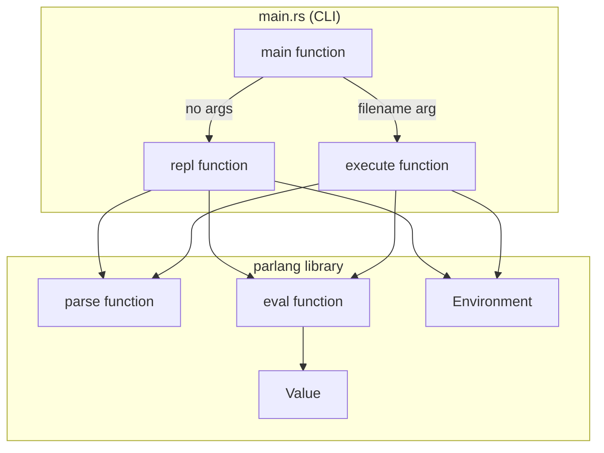
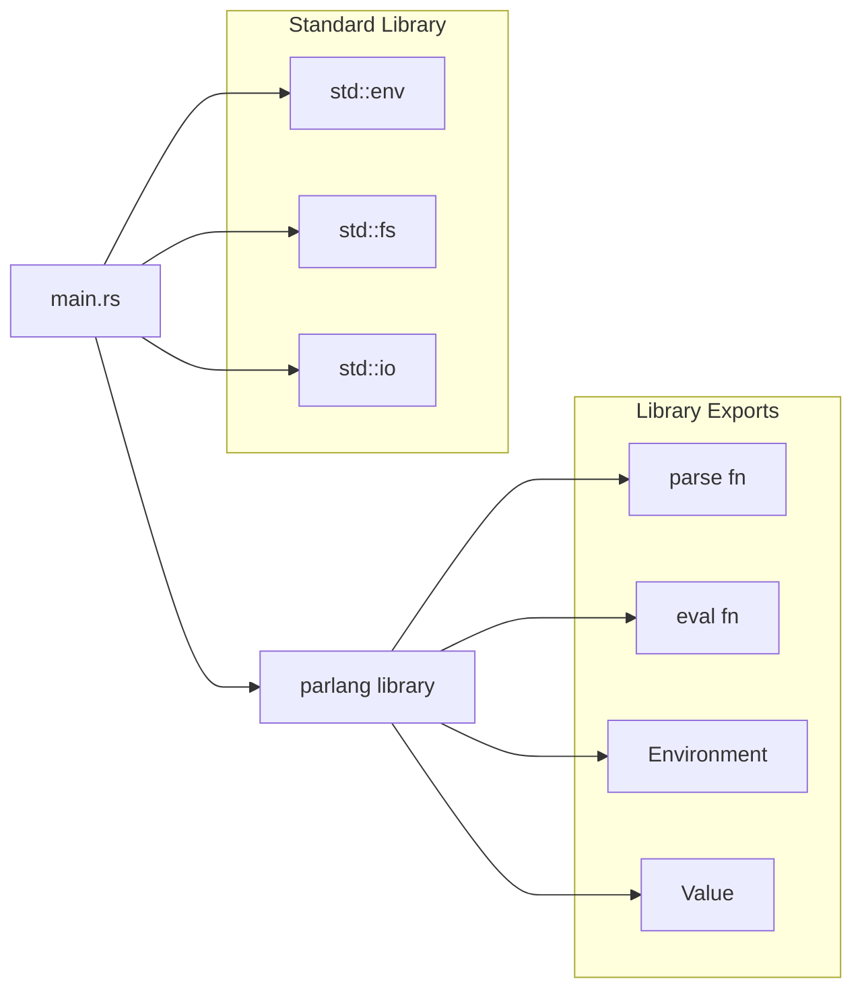
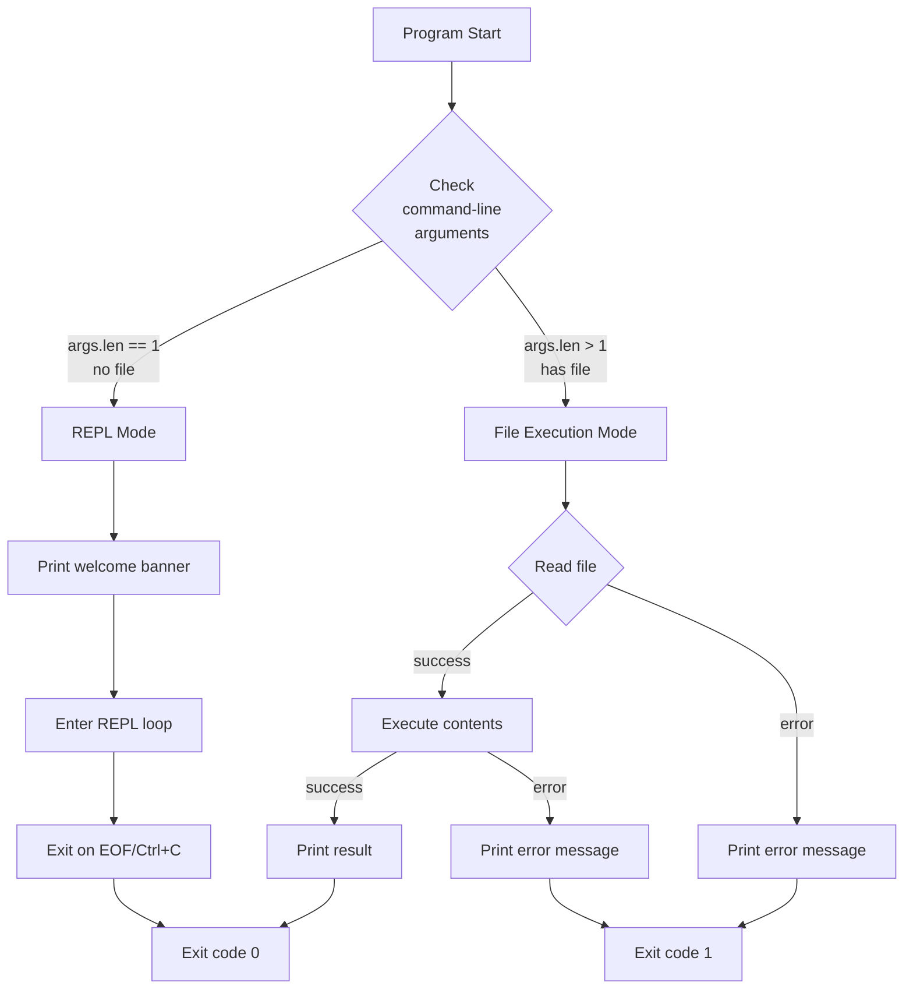
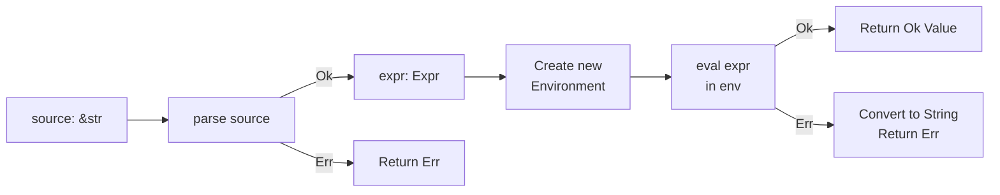
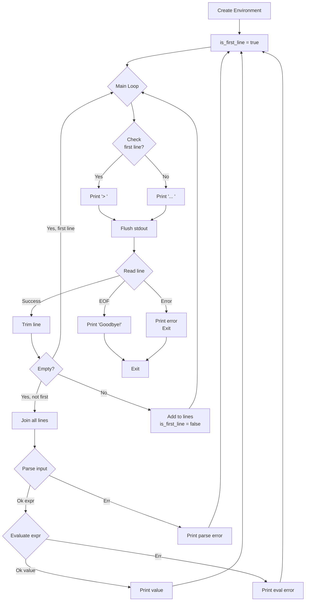
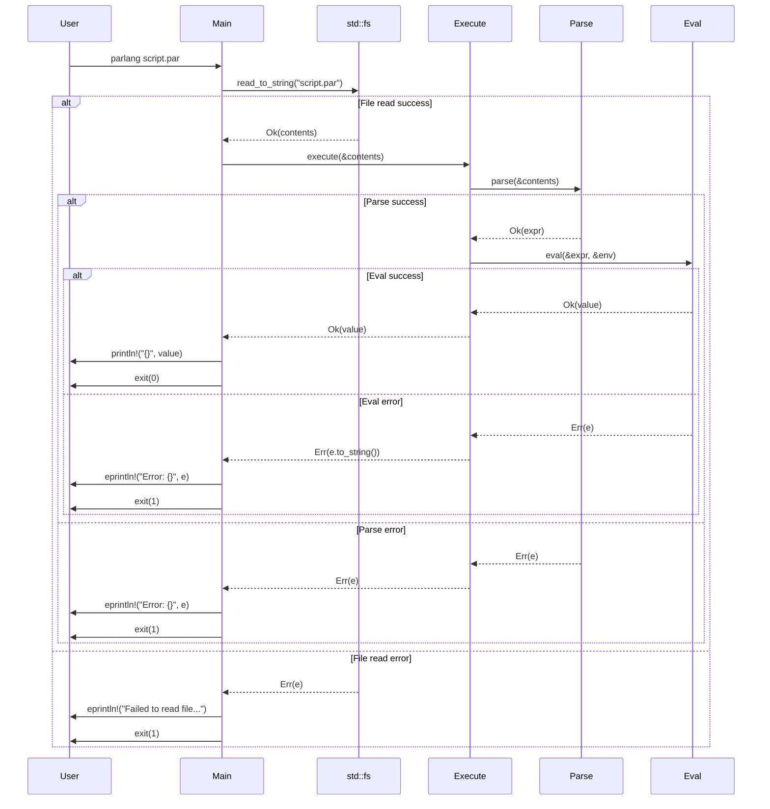
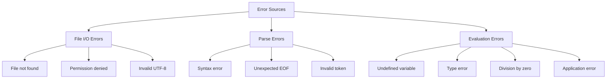
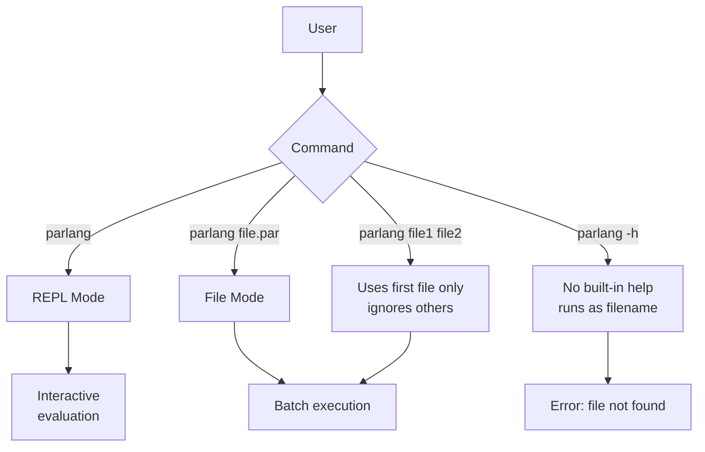
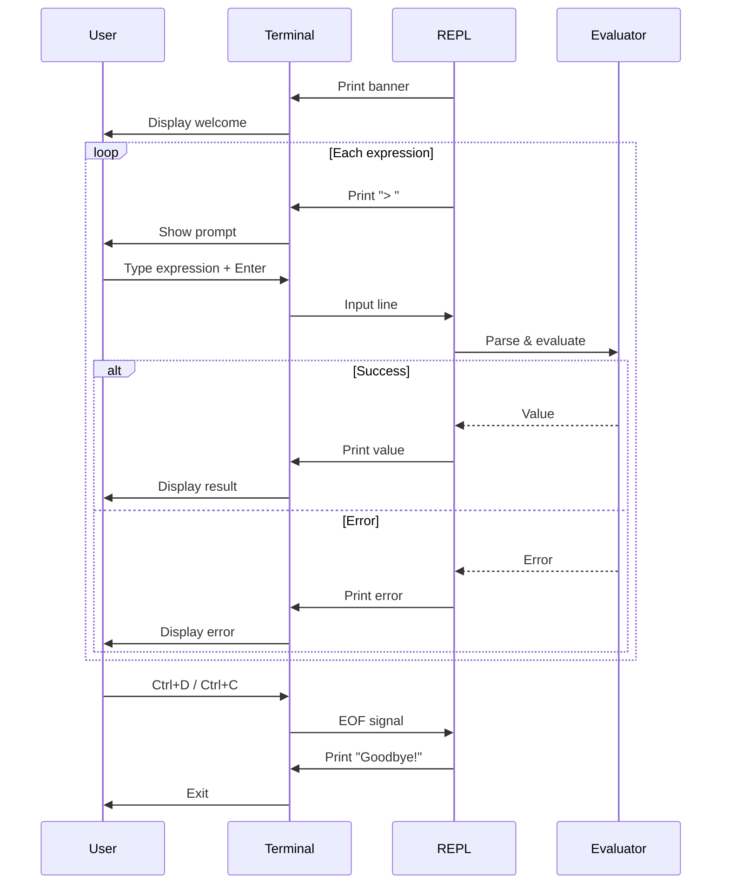
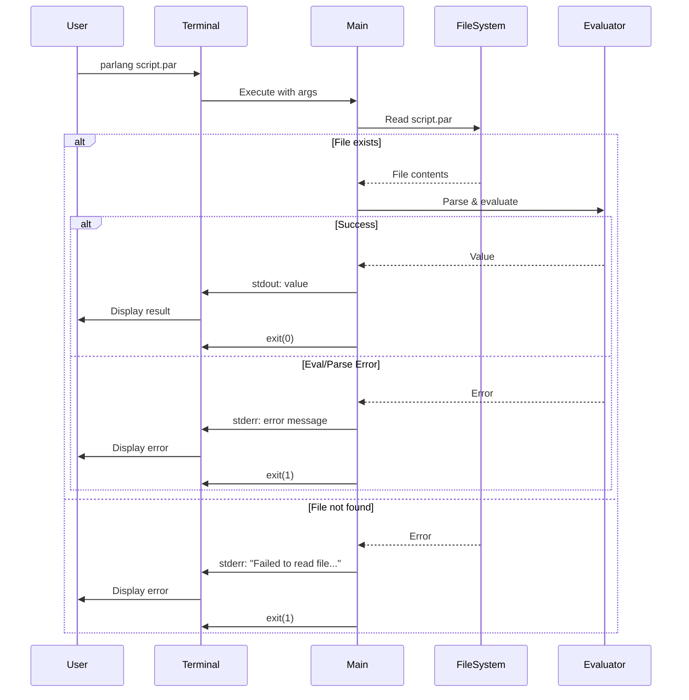

# Main CLI/REPL Module Documentation

## Overview

The `main.rs` module implements the command-line interface and Read-Eval-Print Loop (REPL) for ParLang. It provides two execution modes: interactive REPL mode for exploring the language and file execution mode for running ParLang programs from `.par` files.

**Location**: `src/main.rs`  
**Lines of Code**: ~116  
**Key Functions**: `main()`, `repl()`, `execute()`  
**External Dependencies**: Standard library only (`std::env`, `std::fs`, `std::io`)

## Purpose

The main module is responsible for:

1. **Command-Line Interface**: Parsing arguments and routing to appropriate execution mode
2. **REPL Mode**: Providing interactive expression evaluation with immediate feedback
3. **File Execution**: Loading and executing ParLang programs from files
4. **User Interaction**: Handling input/output and presenting results
5. **Error Handling**: Catching and reporting parse and evaluation errors
6. **Exit Codes**: Returning appropriate exit codes for file execution errors

## Architecture

### CLI as a Thin Wrapper

The main module acts as a thin wrapper around the ParLang library, delegating all parsing and evaluation to the library components:



### Module Dependencies



## Execution Modes

### Mode Selection Flow



### 1. REPL Mode (Interactive)

**Activated**: When program is run without arguments

**Command**: `parlang` or `cargo run`

**Behavior**:
- Displays welcome banner with version information
- Presents a `>` prompt for the first line of input
- Presents a `... ` continuation prompt for subsequent lines
- Supports multiline input: press Enter to continue, submit with blank line
- Parses and evaluates each expression after submission
- Displays results or errors
- Maintains a persistent environment (note: current implementation creates fresh env)
- Exits on EOF (Ctrl+D) or Ctrl+C

### 2. File Execution Mode

**Activated**: When program is run with a filename argument

**Command**: `parlang script.par` or `cargo run script.par`

**Behavior**:
- Reads the specified file
- Parses the entire file contents as a single expression
- Evaluates the expression in a fresh environment
- Prints the final result value
- Exits with code 0 on success, code 1 on any error

## Function Documentation

### `main()`

The entry point of the ParLang executable.

```rust
fn main()
```

**Behavior**:
1. Collects command-line arguments using `std::env::args()`
2. Checks the number of arguments to determine execution mode:
   - If `args.len() > 1`: File execution mode
   - Otherwise: REPL mode

**File Execution Mode Logic**:
```rust
let filename = &args[1];
match fs::read_to_string(filename) {
    Ok(contents) => {
        match execute(&contents) {
            Ok(value) => println!("{}", value),
            Err(e) => {
                eprintln!("Error: {}", e);
                std::process::exit(1);
            }
        }
    }
    Err(e) => {
        eprintln!("Failed to read file '{}': {}", filename, e);
        std::process::exit(1);
    }
}
```

**REPL Mode Logic**:
```rust
println!("ParLang v0.1.0 - A small ML-alike functional language");
println!("Type expressions to evaluate them. Press Ctrl+C to exit.");
println!();
repl();
```

**Exit Codes**:
- `0`: Success (REPL exit or successful file execution)
- `1`: Error (file read failure, parse error, or evaluation error)

### `execute()`

Executes a ParLang source string and returns the result value.

```rust
fn execute(source: &str) -> Result<Value, String>
```

**Parameters**:
- `source`: ParLang source code as a string slice

**Returns**:
- `Ok(Value)`: The computed value from evaluating the expression
- `Err(String)`: Error message describing parse or evaluation failure

**Implementation Flow**:



**Example**:
```rust
let result = execute("1 + 2");
assert_eq!(result, Ok(Value::Int(3)));

let error = execute("x + 1");  // undefined variable
assert!(error.is_err());
```

**Error Handling**:
- Parse errors from `parse()` are propagated directly (already strings)
- Evaluation errors from `eval()` are converted to strings via `.map_err(|e| e.to_string())`

### `repl()`

Implements the Read-Eval-Print Loop for interactive ParLang evaluation with multiline input support.

```rust
fn repl()
```

**Behavior**:
- Creates a fresh `Environment` for the REPL session
- Enters an infinite loop reading and evaluating expressions
- **Multiline Input**: Accumulates input across multiple lines
  - First line shows `> ` prompt
  - Continuation lines show `... ` prompt
  - Empty line (just Enter) signals end of input and triggers evaluation
- Each submission cycle:
  1. Accumulates lines until blank line is entered
  2. Joins all accumulated lines
  3. Trims whitespace
  4. Parses the complete input
  5. Evaluates the expression
  6. Prints the result or error
  7. Returns to initial `> ` prompt
- Exits on EOF (Ctrl+D on Unix, Ctrl+Z on Windows)
- Prints "Goodbye!" message on exit

**Multiline Input Flow**:



## REPL Features and Behavior

### Interactive Prompt

The REPL uses two types of prompts:
- `> ` - Initial prompt for starting a new expression
- `... ` - Continuation prompt for multiline input

```
ParLang v0.1.0 - A small ML-alike functional language
Type expressions to evaluate them. Press Ctrl+C to exit.

> 
```

### Multiline Input Support

The REPL supports multiline expressions. Continue typing on multiple lines and submit with a blank line:

**Single-line expression**:
```
> 42
42
```

**Multiline expression**:
```
> let double = fun x -> x + x
... in double 5

10
```

**Complex multiline example**:
```
> let add = fun x -> fun y -> x + y
... in let add5 = add 5
... in add5 10

15
```

### Expression Evaluation

Each complete expression (after blank line submission) is evaluated immediately:

```
> 42
42
> 1 + 2 * 3
7
> if true then 10 else 20
10
```

### Error Handling

The REPL distinguishes between parse errors and evaluation errors:

**Parse Errors** (syntax errors):
```
> 1 +
Parse error: Unexpected end of input at line 1, column 3
```

**Evaluation Errors** (runtime errors):
```
> x + 1
Evaluation error: Undefined variable: x
> 1 / 0
Evaluation error: Division by zero
```

### Empty Line Handling

**Single-line mode**: Empty lines on the initial prompt are silently skipped:

```
> 

> 42
42
```

**Multiline mode**: Empty line after starting multiline input signals end of expression and triggers evaluation:

```
> let x = 10
... in x + 5

15
```

### Environment Persistence

**Persistent Environment**: The REPL now maintains a persistent environment across evaluations. When you define functions or load libraries using semicolon syntax (Seq expressions), they remain available for subsequent evaluations.

**How it works**:
```rust
fn repl() {
    let mut env = Environment::new();  // Mutable environment
    // ... in evaluation loop:
    match eval(&expr, &env) {
        Ok(value) => {
            println!("{}", value);
            // Extract bindings from the expression and merge into environment
            match extract_bindings(&expr, &env) {
                Ok(new_env) => {
                    env = new_env;
                }
                Err(e) => {
                    eprintln!("Warning: Failed to persist bindings: {}", e);
                }
            }
        }
        // ...
    }
}
```

**Example with semicolon syntax (persists)**:
```
> let double = fun x -> x + x;

0
> double 21

42
```

**Note:** The trailing expression after semicolons is now optional. Both `let x = 42;` and `let x = 42; 0` work identically, defaulting to `0` when omitted.

**Example with traditional let-in syntax (does not persist)**:
```
> let x = 10 in x + 5
15
> x
Evaluation error: Unbound variable: x
```

**Load statements persist**:
```
> load "examples/stdlib.par"

0
> double 21

42
> triple 14

42
```

**Note:** The `in 0` part of load statements is now optional. Both `load "file"` and `load "file" in 0` work identically.

**Multiple bindings persist**:
```
> let x = 1; let y = 2; let z = 3;

0
> x + y + z

6
```

This makes the REPL much more convenient for interactive development, as you don't need to redefine functions after each evaluation, and you don't need to type unnecessary trailing expressions.

### Exit Behavior

**EOF (End of File)**:
- Unix/Linux/macOS: Press `Ctrl+D`
- Windows: Press `Ctrl+Z` followed by Enter
- Triggers clean exit with "Goodbye!" message

**Keyboard Interrupt**:
- Press `Ctrl+C`
- Terminates the program immediately (no goodbye message)

**Read Error**:
- If stdin cannot be read, prints error and exits

## File Execution Mode

### File Loading

The file execution mode reads the entire file contents as a UTF-8 string:

```rust
match fs::read_to_string(filename) {
    Ok(contents) => { /* execute */ }
    Err(e) => {
        eprintln!("Failed to read file '{}': {}", filename, e);
        std::process::exit(1);
    }
}
```

**Error Cases**:
- File does not exist
- Insufficient permissions
- File is not valid UTF-8
- I/O errors

### Execution Flow



### Single Expression Requirement

The file must contain exactly one expression. Multiple expressions are not supported:

**Valid** (`valid.par`):
```
let x = 10 in
let y = 20 in
x + y
```

**Invalid** (`invalid.par`):
```
let x = 10
x + 5
```
Error: The parser will try to parse this as a single expression and fail.

### Output Format

The result value is printed using the `Display` implementation of `Value`:

```
$ cat example.par
let compose = fun f -> fun g -> fun x -> f (g x)
in let inc = fun x -> x + 1
in let double = fun x -> x + x
in compose inc double 5

$ parlang example.par
11
```

## Error Handling

### Error Categories



### Error Message Formats

#### File I/O Errors (File Mode Only)

**Format**: `Failed to read file '<filename>': <error>`

**Examples**:
```
Failed to read file 'missing.par': No such file or directory
Failed to read file 'private.par': Permission denied
```

#### Parse Errors (Both Modes)

**REPL Format**: `Parse error: <message>`  
**File Format**: `Error: <message>`

**Examples**:
```
Parse error: Unexpected token at line 1, column 5
Error: Expected closing parenthesis
```

#### Evaluation Errors (Both Modes)

**REPL Format**: `Evaluation error: <message>`  
**File Format**: `Error: <message>`

**Examples**:
```
Evaluation error: Undefined variable: x
Evaluation error: Type error: expected Bool, got Int
Error: Division by zero
```

### Error Handling Patterns

#### REPL Error Handling

Errors in the REPL are **non-fatal** - they are printed but the REPL continues:

```rust
match parse(input) {
    Ok(expr) => match eval(&expr, &env) {
        Ok(value) => println!("{}", value),
        Err(e) => eprintln!("Evaluation error: {}", e),  // Continue
    },
    Err(e) => eprintln!("Parse error: {}", e),  // Continue
}
```

**Example Session**:
```
> 1 + 
Parse error: Unexpected end of input
> x
Evaluation error: Undefined variable: x
> 2 + 3
5
```

#### File Mode Error Handling

Errors in file mode are **fatal** - they cause immediate exit with code 1:

```rust
Err(e) => {
    eprintln!("Error: {}", e);
    std::process::exit(1);  // Exit immediately
}
```

### Exit Codes

| Exit Code | Meaning | Conditions |
|-----------|---------|------------|
| 0 | Success | REPL normal exit, or file executed successfully |
| 1 | Error | File read error, parse error, or evaluation error |

## Usage Examples

### REPL Mode

#### Starting the REPL

```bash
$ parlang
ParLang v0.1.0 - A small ML-alike functional language
Type expressions to evaluate them. Press Ctrl+C to exit.

> 
```

Or with Cargo:

```bash
$ cargo run
    Finished dev [unoptimized + debuginfo] target(s) in 0.01s
     Running `target/debug/parlang`
ParLang v0.1.0 - A small ML-alike functional language
Type expressions to evaluate them. Press Ctrl+C to exit.

> 
```

#### Basic Arithmetic

```
> 5 + 3
8
> 10 - 4
6
> 3 * 7
21
> 20 / 4
5
```

#### Boolean Logic

```
> true
true
> false
false
> 5 < 10
true
> 3 == 3
true
> 7 != 7
false
```

#### Conditionals

```
> if true then 42 else 0
42
> if 5 > 3 then 100 else 200
100
```

#### Let Bindings

```
> let x = 10 in x + 5
15
> let x = 5 in let y = 3 in x * y
15
```

#### Functions

Single-line:
```
> let double = fun x -> x * 2 in double 21
42
```

Multiline:
```
> let add = fun x -> fun y -> x + y
... in add 10 5

15
```

#### Complex Example

```
> let compose = fun f -> fun g -> fun x -> f (g x) in let inc = fun x -> x + 1 in let double = fun x -> x + x in compose inc double 5
11
```

#### Error Demonstration

```
> 1 +
Parse error: Unexpected end of input at line 1, column 3

> x + 1
Evaluation error: Undefined variable: x

> if 1 then 2 else 3
Evaluation error: Type error: condition must be Bool, got Int
```

#### Exiting the REPL

```
> 42
42
> ^D
Goodbye!
```

### File Execution Mode

#### Simple Expression File

**File**: `example.par`
```
1 + 2 * 3
```

**Execution**:
```bash
$ parlang example.par
7
```

#### Let Binding File

**File**: `compute.par`
```
let x = 10 in
let y = 20 in
let z = 30 in
x + y + z
```

**Execution**:
```bash
$ parlang compute.par
60
```

#### Composition Example

**File**: `compose.par`
```
let compose = fun f -> fun g -> fun x -> f (g x)
in let inc = fun x -> x + 1
in let double = fun x -> x + x
in compose inc double 5
```

**Execution**:
```bash
$ parlang compose.par
11
```

#### Max Function Example

**File**: `max.par`
```
let max = fun a -> fun b ->
  if a > b then a else b
in max 10 20
```

**Execution**:
```bash
$ parlang max.par
20
```

#### Absolute Value Example

**File**: `abs.par`
```
let abs = fun x ->
  if x < 0 then 0 - x else x
in abs (-42)
```

**Execution**:
```bash
$ parlang abs.par
42
```

#### Error Handling Example

**File**: `error.par`
```
x + 1
```

**Execution**:
```bash
$ parlang error.par
Error: Undefined variable: x
$ echo $?
1
```

#### File Not Found

```bash
$ parlang missing.par
Failed to read file 'missing.par': No such file or directory (os error 2)
$ echo $?
1
```

### Using with Cargo

When developing, you can use Cargo to run ParLang:

**REPL Mode**:
```bash
$ cargo run
```

**File Mode**:
```bash
$ cargo run -- examples/factorial.par
```

**Note**: The `--` separator tells Cargo that following arguments should be passed to the program, not to Cargo itself.

## User Interaction Patterns

### Command-Line Argument Patterns



### Input/Output Flow

#### REPL Input/Output



#### File Execution Input/Output



### Stdio Usage

The main module uses standard I/O streams appropriately:

| Stream | REPL Mode | File Mode |
|--------|-----------|-----------|
| **stdin** | Read user input line-by-line | Not used |
| **stdout** | Print prompts (`> `), results | Print final result value |
| **stderr** | Print errors (parse, eval) | Print all errors |

**Example** (success):
```bash
$ parlang compute.par > result.txt
$ cat result.txt
42
```

**Example** (error):
```bash
$ parlang error.par > result.txt
Error: Undefined variable: x
$ cat result.txt
[empty]
```

### Prompt Behavior

The REPL prompt is flushed immediately to ensure it appears before waiting for input:

```rust
print!("> ");           // Print without newline
stdout.flush().unwrap(); // Force display
```

This ensures proper interaction even when stdout is buffered.

### Signal Handling

**Ctrl+C (SIGINT)**:
- Default Rust behavior: immediate termination
- No cleanup or goodbye message
- Exit code may vary by platform

**Ctrl+D (EOF)**:
- Graceful exit from REPL
- Prints "Goodbye!" message
- Clean exit with code 0

**Ctrl+Z (SIGTSTP)** on Unix:
- Suspends the process
- Can be resumed with `fg` command

## Design Considerations

### Stateless Execution

The `execute()` function creates a fresh environment for each call:

```rust
fn execute(source: &str) -> Result<Value, String> {
    let expr = parse(source)?;
    let env = Environment::new();  // Fresh environment
    eval(&expr, &env).map_err(|e| e.to_string())
}
```

**Implications**:
- No state carries over between file executions
- Each file execution is independent and reproducible
- REPL evaluations don't share bindings (in current implementation)

### Environment Persistence in REPL

**Current Limitation**: The REPL creates one environment but doesn't persist bindings:

```rust
fn repl() {
    let env = Environment::new();  // Created once
    loop {
        // ...
        match eval(&expr, &env) {  // Uses same env
            // But bindings from `let` don't persist
        }
    }
}
```

**Why Bindings Don't Persist**:
The `let` expression in ParLang creates a new scope for its body only:
```
let x = 10 in x + 5  // x only exists in `x + 5`
```

After evaluation, `x` is not bound in the outer environment.

**Future Enhancement**: To support persistent bindings, the REPL would need:
1. Top-level `let` statements (not expressions)
2. Mutate/extend the environment after each evaluation
3. Special syntax for bindings vs. expressions

### Error Output Consistency

The error formatting differs slightly between modes for clarity:

**REPL** (conversational):
```
Parse error: <message>
Evaluation error: <message>
```

**File** (scriptable):
```
Error: <message>
Failed to read file '<name>': <message>
```

This helps users distinguish interactive errors from script errors.

### Minimal Dependency Footprint

The main module uses only the standard library:
- `std::env` - Command-line arguments
- `std::fs` - File reading
- `std::io` - Input/output operations

This keeps the CLI lightweight and maximizes portability.

### Single Expression Design

Files must contain one complete expression. This design:

**Advantages**:
- Simple implementation
- Clear semantics
- Matches functional language design
- Easy to reason about

**Limitations**:
- Cannot have multiple top-level definitions
- Must wrap everything in nested `let` expressions
- No module or import system

**Workaround** (nested lets):
```
let helper1 = fun x -> x * 2 in
let helper2 = fun y -> y + 1 in
let main = fun n -> helper2 (helper1 n) in
main 5
```

## Future Enhancements

### Potential REPL Improvements

1. **Persistent Bindings**:
   ```
   > let x = 10
   x = 10
   > x + 5
   15
   ```

2. **Special Commands**:
   ```
   > :help
   > :type x + 1
   > :env
   > :quit
   ```

3. **Enhanced Multiline Input** (building on basic multiline support):
   - Syntax highlighting for multiline input
   - Bracket/parenthesis matching
   - Automatic indentation

4. **History and Editing**:
   - Arrow keys for history navigation
   - Line editing capabilities
   - Using `rustyline` or similar library

5. **Result Binding**:
   ```
   > 2 + 3
   5
   > it * 2  // 'it' refers to previous result
   10
   ```

### Potential CLI Improvements

1. **Help Flag**:
   ```bash
   $ parlang --help
   $ parlang -h
   ```

2. **Version Flag**:
   ```bash
   $ parlang --version
   $ parlang -v
   ```

3. **Expression Flag** (eval from command line):
   ```bash
   $ parlang -e "1 + 2"
   3
   ```

4. **Verbose Mode**:
   ```bash
   $ parlang --verbose script.par
   Parsing... OK
   Evaluating... OK
   Result: 42
   ```

5. **AST Display**:
   ```bash
   $ parlang --ast script.par
   Let("x", Int(10), BinOp(Add, Var("x"), Int(5)))
   ```

### Potential File Mode Improvements

1. **Multiple Expressions**:
   Allow sequential evaluation of multiple expressions

2. **Module System**:
   Support for imports and exports

3. **Script Arguments**:
   Pass arguments to ParLang programs
   ```bash
   $ parlang script.par arg1 arg2
   ```

## Related Modules

- **[`lib.rs`](./ARCHITECTURE.md)**: Defines the public API exported to main.rs
- **[`parser.rs`](./MODULE_PARSER.md)**: Provides the `parse()` function used by main.rs
- **[`eval.rs`](./MODULE_EVAL.md)**: Provides the `eval()` function and `Environment` used by main.rs
- **[`ast.rs`](./MODULE_AST.md)**: Defines `Expr` type returned by `parse()` and consumed by `eval()`

## Testing Recommendations

### REPL Testing

```bash
# Basic functionality
echo "1 + 2" | parlang

# Multiple expressions
printf "1 + 2\n3 * 4\n5 - 1\n" | parlang

# Error handling
echo "x + 1" | parlang

# Empty input
echo "" | parlang

# EOF handling
echo "42" | parlang
```

### File Execution Testing

```bash
# Success case
echo "1 + 2" > test.par
parlang test.par
echo $?  # Should be 0

# Error case
echo "x + 1" > error.par
parlang error.par
echo $?  # Should be 1

# File not found
parlang nonexistent.par
echo $?  # Should be 1
```

### Integration Testing

Create a test suite that verifies:
1. REPL accepts valid expressions
2. REPL rejects invalid syntax
3. File mode produces correct output
4. File mode returns correct exit codes
5. Error messages are clear and helpful

## Summary

The `main.rs` module provides a clean, minimal CLI interface to ParLang with two complementary execution modes:

- **REPL Mode**: Interactive exploration and learning
- **File Mode**: Script execution and automation

By delegating all parsing and evaluation to the library, it maintains a clear separation of concerns and keeps the CLI code simple and maintainable at just ~86 lines.
