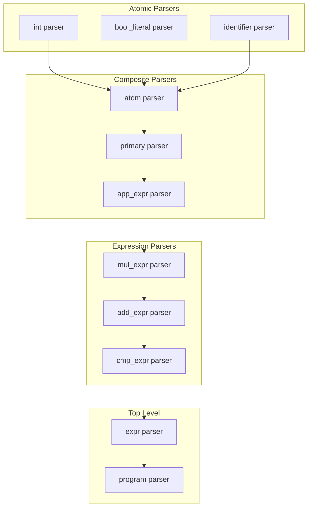
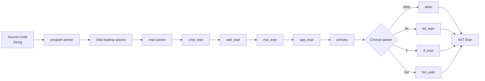
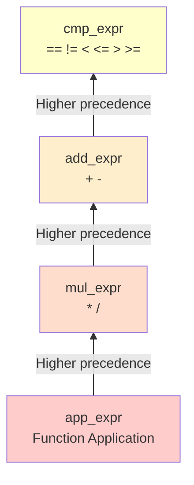
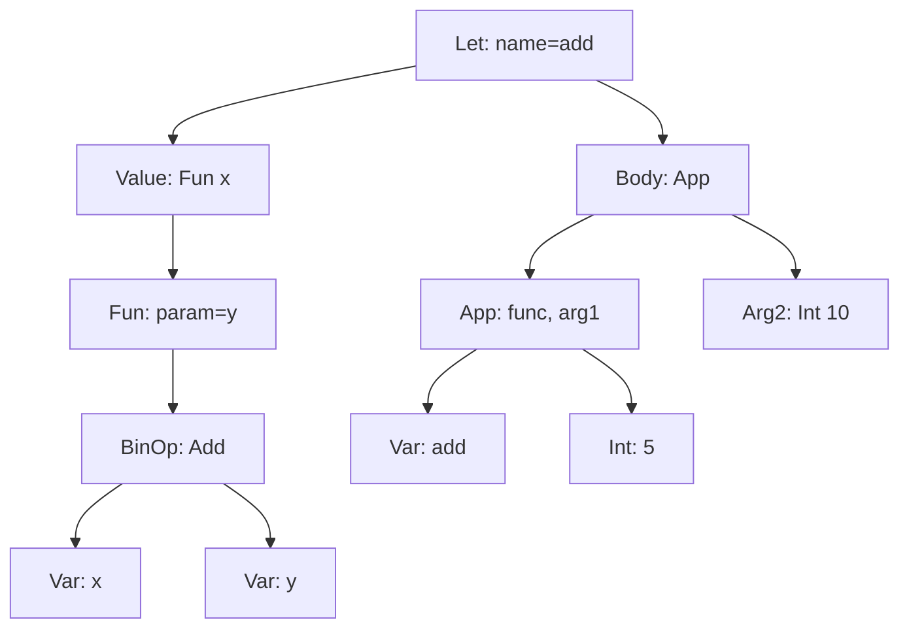

# Parser Module Documentation

## Overview

The `parser.rs` module implements a parser for the ParLang language using the `combine` parser combinator library. It transforms source code text into an Abstract Syntax Tree (AST).

**Location**: `src/parser.rs`  
**Lines of Code**: ~718  
**Key Exports**: `parse()` function  
**External Dependencies**: `combine` crate (v4.6)

## Purpose

The parser module is responsible for:

1. **Lexical Analysis**: Breaking source code into tokens
2. **Syntax Analysis**: Building an AST from tokens
3. **Error Reporting**: Providing meaningful error messages
4. **Operator Precedence**: Correctly parsing expressions with multiple operators
5. **Whitespace Handling**: Accepting flexible spacing in source code

## Architecture

### Parser Combinator Approach

ParLang uses **parser combinators** - small parsers that can be composed to build larger parsers:



### Parsing Pipeline



## Parser Functions

### Top-Level Parser

#### `program()`

The entry point for parsing a complete ParLang program.

```rust
pub fn program[Input]()(Input) -> Expr
where [Input: Stream<Token = char>]
{
    spaces().with(expr()).skip(spaces())
}
```

**Behavior**:
- Skips leading whitespace
- Parses an expression
- Skips trailing whitespace
- Returns the parsed `Expr`

#### `parse(input: &str)`

Public API function that wraps `program()` and handles errors.

```rust
pub fn parse(input: &str) -> Result<Expr, String>
```

**Parameters**:
- `input`: Source code string

**Returns**:
- `Ok(Expr)`: Successfully parsed AST
- `Err(String)`: Error message describing the parse failure

**Example**:
```rust
let result = parse("1 + 2");
assert_eq!(result, Ok(Expr::BinOp(
    BinOp::Add,
    Box::new(Expr::Int(1)),
    Box::new(Expr::Int(2))
)));
```

### Atomic Parsers

#### `int()`

Parses integer literals, including negative numbers.

```rust
fn int<Input>() -> impl Parser<Input, Output = Expr>
```

**Syntax**: `42`, `-10`, `0`

**Implementation**:
```rust
let number = many1(digit()).map(|s: String| s.parse::<i64>().unwrap());
(optional(token('-')), number)
    .map(|(sign, n)| {
        if sign.is_some() {
            Expr::Int(-n)
        } else {
            Expr::Int(n)
        }
    })
```

**Features**:
- Handles negative numbers with optional `-` prefix
- Requires at least one digit
- Converts string to `i64`

#### `bool_literal()`

Parses boolean literals.

```rust
fn bool_literal<Input>() -> impl Parser<Input, Output = Expr>
```

**Syntax**: `true`, `false`

**Implementation**:
```rust
choice((
    attempt(string("true")).map(|_| Expr::Bool(true)),
    attempt(string("false")).map(|_| Expr::Bool(false)),
))
```

**Features**:
- Uses `attempt()` to backtrack on failure
- Tries `true` first, then `false`

#### `identifier()`

Parses variable names, rejecting keywords.

```rust
fn identifier<Input>() -> impl Parser<Input, Output = String>
```

**Syntax**: `x`, `myVar`, `foo_bar`, `x123`

**Rules**:
- Must start with a letter
- Can contain letters, numbers, and underscores
- Cannot be a keyword

**Keywords** (rejected):
- `let`, `in`, `if`, `then`, `else`, `fun`, `true`, `false`, `load`, `rec`

**Implementation**:
```rust
raw_identifier().then(|name: String| {
    if matches!(name.as_str(),
        "let" | "in" | "if" | "then" | "else" | "fun" | "true" | "false" | "load" | "rec"
    ) {
        combine::unexpected("keyword").map(move |_: ()| name.clone()).right()
    } else {
        combine::value(name).left()
    }
})
```

#### `variable()`

Parses variable references.

```rust
fn variable<Input>() -> impl Parser<Input, Output = Expr>
```

**Syntax**: Same as `identifier()`

**Implementation**:
```rust
identifier().map(Expr::Var)
```

#### `atom()`

Parses atomic expressions (literals, variables, parenthesized expressions).

```rust
fn atom[Input]()(Input) -> Expr
```

**Syntax**:
- `42` (integer)
- `true` (boolean)
- `x` (variable)
- `(expr)` (parenthesized expression)

**Implementation**:
```rust
choice((
    attempt(bool_literal()),
    attempt(int()),
    attempt(variable()),
    attempt(between(
        token('(').skip(spaces()),
        token(')'),
        expr().skip(spaces()),
    )),
))
```

**Priority**: Tries parsers in order, uses `attempt()` for backtracking

### Expression Parsers

#### `let_expr()`

Parses let bindings.

```rust
fn let_expr[Input]()(Input) -> Expr
```

**Syntax**: `let <name> = <value> in <body>`

**Example**:
```
let x = 42 in x + 1
```

**Implementation**:
```rust
(
    string("let").skip(spaces()),
    identifier().skip(spaces()),
    token('=').skip(spaces()),
    expr().skip(spaces()),
    string("in").skip(spaces()),
    expr(),
)
    .map(|(_, name, _, value, _, body)| {
        Expr::Let(name, Box::new(value), Box::new(body))
    })
```

#### `if_expr()`

Parses conditional expressions.

```rust
fn if_expr[Input]()(Input) -> Expr
```

**Syntax**: `if <condition> then <then-branch> else <else-branch>`

**Example**:
```
if x > 0 then 1 else -1
```

**Implementation**:
```rust
(
    string("if").skip(spaces()),
    expr().skip(spaces()),
    string("then").skip(spaces()),
    expr().skip(spaces()),
    string("else").skip(spaces()),
    expr(),
)
    .map(|(_, cond, _, then_branch, _, else_branch)| {
        Expr::If(
            Box::new(cond),
            Box::new(then_branch),
            Box::new(else_branch),
        )
    })
```

#### `fun_expr()`

Parses function definitions.

```rust
fn fun_expr[Input]()(Input) -> Expr
```

**Syntax**: `fun <param> -> <body>`

**Example**:
```
fun x -> x + 1
```

**Implementation**:
```rust
(
    string("fun").skip(spaces()),
    identifier().skip(spaces()),
    string("->").skip(spaces()),
    expr(),
)
    .map(|(_, param, _, body)| Expr::Fun(param, Box::new(body)))
```

#### `rec_expr()`

Parses recursive function definitions.

```rust
fn rec_expr[Input]()(Input) -> Expr
```

**Syntax**: `rec <name> -> <body>`

**Example**:
```
rec factorial -> fun n -> if n == 0 then 1 else n * factorial (n - 1)
```

**Implementation**:
```rust
(
    string("rec").skip(spaces()),
    identifier().skip(spaces()),
    string("->").skip(spaces()),
    expr(),
)
    .map(|(_, name, _, body)| Expr::Rec(name, Box::new(body)))
```

**Notes**:
- The function name is used for self-reference within the body
- The body is typically a function expression (`fun param -> ...`)
- Enables recursive algorithms without requiring Y-combinator

#### `primary()`

Parses primary expressions (let, if, rec, fun, or atoms).

```rust
fn primary[Input]()(Input) -> Expr
```

**Priority** (tries in order):
1. `let_expr()`
2. `load_expr()`
3. `if_expr()`
4. `rec_expr()`
5. `fun_expr()`
6. `atom()`

### Operator Precedence Parsers

The parser implements operator precedence through a hierarchy of parsers:



#### `app_expr()`

Parses function application (highest precedence).

```rust
fn app_expr[Input]()(Input) -> Expr
```

**Syntax**: `f x y` (parsed as `(f x) y`)

**Associativity**: Left-associative

**Implementation**:
```rust
(primary().skip(spaces()), many(primary().skip(spaces())))
    .map(|(func, args): (Expr, Vec<Expr>)| {
        args.into_iter()
            .fold(func, |f, arg| Expr::App(Box::new(f), Box::new(arg)))
    })
```

**Example**:
- Input: `f x y`
- Parsed as: `App(App(Var("f"), Var("x")), Var("y"))`

#### `mul_expr()`

Parses multiplication and division.

```rust
fn mul_expr[Input]()(Input) -> Expr
```

**Syntax**: `e1 * e2`, `e1 / e2`

**Associativity**: Left-associative

**Implementation**:
```rust
let op = choice((
    token('*').map(|_| BinOp::Mul),
    token('/').map(|_| BinOp::Div),
));

(
    app_expr().skip(spaces()),
    many((op.skip(spaces()), app_expr().skip(spaces()))),
)
    .map(|(first, rest): (Expr, Vec<(BinOp, Expr)>)| {
        rest.into_iter()
            .fold(first, |left, (op, right)| {
                Expr::BinOp(op, Box::new(left), Box::new(right))
            })
    })
```

**Example**:
- Input: `2 * 3 / 4`
- Parsed as: `BinOp(Div, BinOp(Mul, Int(2), Int(3)), Int(4))`

#### `add_expr()`

Parses addition and subtraction.

```rust
fn add_expr[Input]()(Input) -> Expr
```

**Syntax**: `e1 + e2`, `e1 - e2`

**Associativity**: Left-associative

**Implementation**: Similar to `mul_expr()`, but operates on `mul_expr()` results

**Example**:
- Input: `1 + 2 * 3`
- Parsed as: `BinOp(Add, Int(1), BinOp(Mul, Int(2), Int(3)))`
- Respects precedence: multiplication before addition

#### `cmp_expr()`

Parses comparison operators (lowest precedence).

```rust
fn cmp_expr[Input]()(Input) -> Expr
```

**Syntax**: `e1 == e2`, `e1 != e2`, `e1 < e2`, `e1 <= e2`, `e1 > e2`, `e1 >= e2`

**Associativity**: Non-associative (only one comparison per expression)

**Implementation**:
```rust
let op = choice((
    attempt(string("==")).map(|_| BinOp::Eq),
    attempt(string("!=")).map(|_| BinOp::Neq),
    attempt(string("<=")).map(|_| BinOp::Le),
    attempt(string(">=")).map(|_| BinOp::Ge),
    attempt(token('<')).map(|_| BinOp::Lt),
    attempt(token('>')).map(|_| BinOp::Gt),
));

(add_expr().skip(spaces()), optional(op.skip(spaces()).and(add_expr())))
    .map(|(left, rest)| {
        if let Some((op, right)) = rest {
            Expr::BinOp(op, Box::new(left), Box::new(right))
        } else {
            left
        }
    })
```

**Features**:
- Uses `attempt()` for multi-character operators (`==`, `!=`, `<=`, `>=`)
- Tries longer operators first to avoid partial matches
- Only allows single comparison (no chaining)

**Example**:
- Input: `1 + 2 == 3`
- Parsed as: `BinOp(Eq, BinOp(Add, Int(1), Int(2)), Int(3))`

## Operator Precedence Table

| Precedence | Operators | Associativity | Example | Parsed As |
|------------|-----------|---------------|---------|-----------|
| 1 (Highest) | Function application | Left | `f x y` | `(f x) y` |
| 2 | `*` `/` | Left | `2 * 3 / 4` | `(2 * 3) / 4` |
| 3 | `+` `-` | Left | `1 + 2 - 3` | `(1 + 2) - 3` |
| 4 (Lowest) | `==` `!=` `<` `<=` `>` `>=` | Non-assoc | `1 + 2 == 3` | `(1 + 2) == 3` |

## Parsing Examples

### Example 1: Simple Arithmetic

**Input**: `1 + 2 * 3`

**Parsing Steps**:
1. `program()` calls `expr()`
2. `expr()` calls `cmp_expr()`
3. `cmp_expr()` calls `add_expr()`
4. `add_expr()` parses:
   - First operand: `1` (via `mul_expr()` → `app_expr()` → `primary()` → `atom()`)
   - Operator: `+`
   - Second operand: `2 * 3` (via `mul_expr()`)
5. `mul_expr()` parses `2 * 3` as `BinOp(Mul, Int(2), Int(3))`
6. Result: `BinOp(Add, Int(1), BinOp(Mul, Int(2), Int(3)))`

**AST**:
```rust
Expr::BinOp(
    BinOp::Add,
    Box::new(Expr::Int(1)),
    Box::new(Expr::BinOp(
        BinOp::Mul,
        Box::new(Expr::Int(2)),
        Box::new(Expr::Int(3))
    ))
)
```

### Example 2: Let Binding

**Input**: `let x = 42 in x + 1`

**Parsing Steps**:
1. `primary()` tries `let_expr()`
2. `let_expr()` parses:
   - Keyword: `let`
   - Name: `x`
   - Equals: `=`
   - Value: `42`
   - Keyword: `in`
   - Body: `x + 1`
3. Result: `Let("x", Int(42), BinOp(Add, Var("x"), Int(1)))`

**AST**:
```rust
Expr::Let(
    "x".to_string(),
    Box::new(Expr::Int(42)),
    Box::new(Expr::BinOp(
        BinOp::Add,
        Box::new(Expr::Var("x".to_string())),
        Box::new(Expr::Int(1))
    ))
)
```

### Example 3: Function Application

**Input**: `f x y`

**Parsing Steps**:
1. `app_expr()` parses:
   - Function: `f` (via `primary()`)
   - Arguments: `[x, y]` (via `many(primary())`)
2. Fold operation creates nested applications:
   - First: `App(Var("f"), Var("x"))`
   - Then: `App(App(Var("f"), Var("x")), Var("y"))`

**AST**:
```rust
Expr::App(
    Box::new(Expr::App(
        Box::new(Expr::Var("f".to_string())),
        Box::new(Expr::Var("x".to_string()))
    )),
    Box::new(Expr::Var("y".to_string()))
)
```

### Example 4: Complex Expression

**Input**: `let add = fun x -> fun y -> x + y in add 5 10`



## Error Handling

### Parse Errors

The parser returns descriptive error messages:

```rust
pub fn parse(input: &str) -> Result<Expr, String> {
    match program().easy_parse(input) {
        Ok((expr, rest)) => {
            if rest.is_empty() {
                Ok(expr)
            } else {
                Err(format!("Unexpected input after expression: '{}'", rest))
            }
        }
        Err(err) => Err(format!("Parse error: {}", err)),
    }
}
```

### Common Error Cases

| Error | Example | Message |
|-------|---------|---------|
| Incomplete let | `let x = 42` | Parse error: Expected "in" |
| Incomplete if | `if true then 1` | Parse error: Expected "else" |
| Invalid variable | `123abc` | Parse error: Expected identifier |
| Keyword as variable | `let let = 5 in let` | Parse error: Unexpected keyword |
| Unmatched parenthesis | `(1 + 2` | Parse error: Expected ')' |
| Unexpected input | `42 +` | Parse error: Expected expression |

## Whitespace Handling

The parser is flexible with whitespace:

```rust
// All equivalent:
parse("1+2")
parse("1 + 2")
parse("  1  +  2  ")
parse("1    +    2")

// All equivalent:
parse("let x=42 in x")
parse("let x = 42 in x")
parse("let  x  =  42  in  x")
```

**Implementation**: Each parser calls `spaces()` to skip whitespace where appropriate.

## Testing

The parser module includes 67 unit tests covering:

### Test Categories

1. **Basic Parsing** (10 tests): Literals, variables, simple expressions
2. **Operator Tests** (10 tests): All arithmetic and comparison operators
3. **Precedence Tests** (5 tests): Operator precedence and parentheses
4. **Keyword Tests** (6 tests): Keyword rejection
5. **Whitespace Tests** (3 tests): Flexible whitespace handling
6. **Function Tests** (8 tests): Functions, currying, application
7. **Complex Expressions** (7 tests): Nested and realistic programs
8. **Error Cases** (8 tests): Invalid syntax detection
9. **Edge Cases** (10 tests): Negative numbers, comparison chaining, etc.

### Example Test

```rust
#[test]
fn test_precedence_mul_before_add() {
    // 1 + 2 * 3 should parse as 1 + (2 * 3)
    let expected = Expr::BinOp(
        BinOp::Add,
        Box::new(Expr::Int(1)),
        Box::new(Expr::BinOp(
            BinOp::Mul,
            Box::new(Expr::Int(2)),
            Box::new(Expr::Int(3)),
        )),
    );
    assert_eq!(parse("1 + 2 * 3"), Ok(expected));
}
```

## Performance Characteristics

| Operation | Complexity | Notes |
|-----------|-----------|-------|
| Parsing | O(n) | Linear in source code length |
| Backtracking | O(1) amortized | `attempt()` may retry parsers |
| Memory | O(n) | AST size proportional to input |

## Design Decisions

### Why Parser Combinators?

**Advantages**:
- ✅ **Composable**: Small parsers combine to form larger ones
- ✅ **Type-safe**: Rust's type system catches errors at compile time
- ✅ **Declarative**: Parser structure mirrors grammar
- ✅ **Maintainable**: Easy to add new syntax
- ✅ **Testable**: Each parser can be tested independently

**Trade-offs**:
- ⚠️ **Performance**: Slower than hand-written parsers
- ⚠️ **Error messages**: Can be less precise than custom messages
- ⚠️ **Learning curve**: Requires understanding combinators

### Why `combine` Library?

- Well-maintained and actively developed
- Good error messages with `EasyParser`
- Supports both streaming and non-streaming parsing
- Zero-cost abstractions where possible
- Compatible with Rust's ownership model

## Extension Points

The parser can be extended to support:

1. **More operators**: Add to appropriate precedence level
2. **New keywords**: Add to `identifier()` rejection list
3. **New expression types**: Add new parser and integrate into `primary()`
4. **Comments**: Add comment parser, skip in whitespace
5. **Multi-line support**: Already supported, no changes needed

### Example: Adding an Operator

To add a modulo operator `%`:

```rust
// 1. Add to BinOp enum (in ast.rs)
pub enum BinOp {
    // ... existing operators ...
    Mod,  // %
}

// 2. Add to mul_expr parser (same precedence as * and /)
let op = choice((
    token('*').map(|_| BinOp::Mul),
    token('/').map(|_| BinOp::Div),
    token('%').map(|_| BinOp::Mod),  // Add this line
));
```

## Summary

The parser module provides:

✅ **Complete language support** for all ParLang constructs  
✅ **Correct operator precedence** through parser hierarchy  
✅ **Flexible whitespace handling** for user convenience  
✅ **Keyword protection** preventing misuse as identifiers  
✅ **Comprehensive error handling** with descriptive messages  
✅ **Well-tested** with 67 unit tests  
✅ **Extensible design** for future language features  

The parser successfully transforms textual source code into a typed AST suitable for evaluation, forming the critical bridge between user input and program execution.
